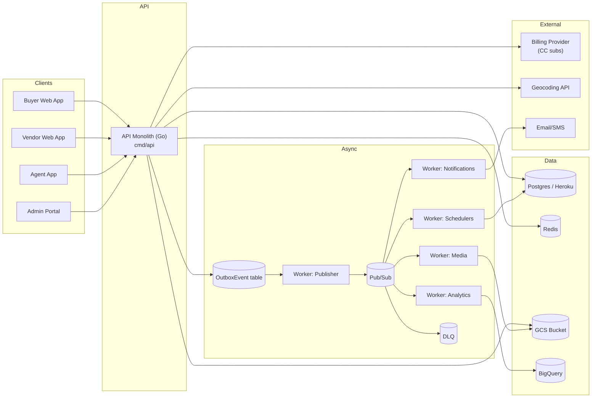
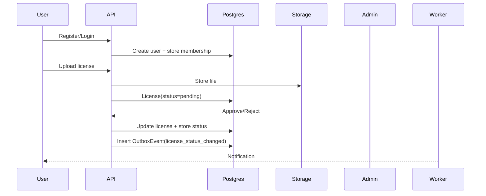
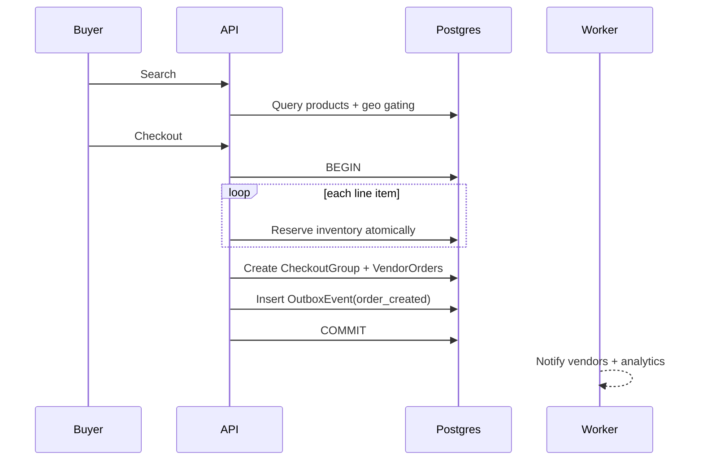
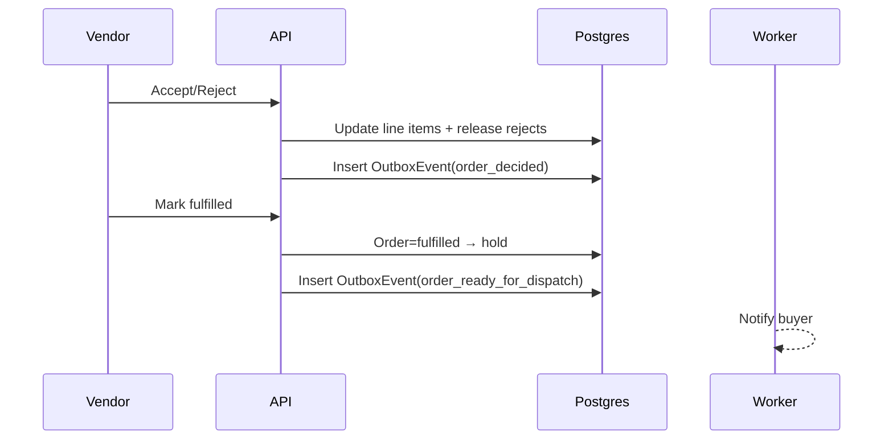
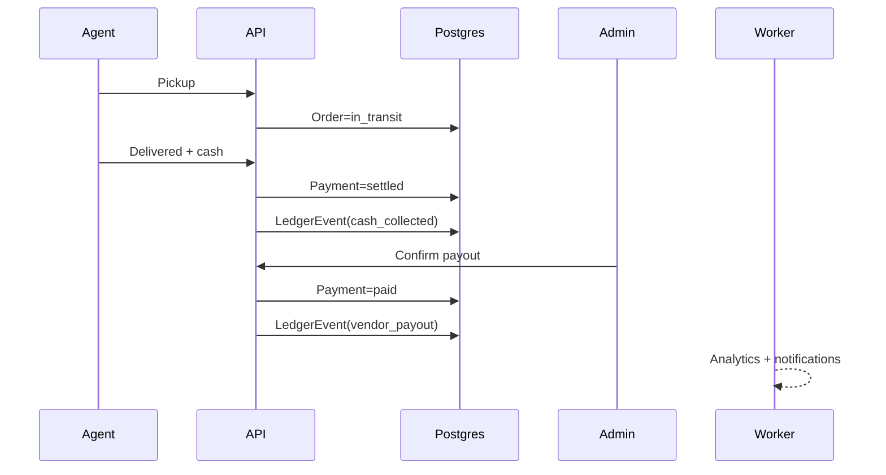
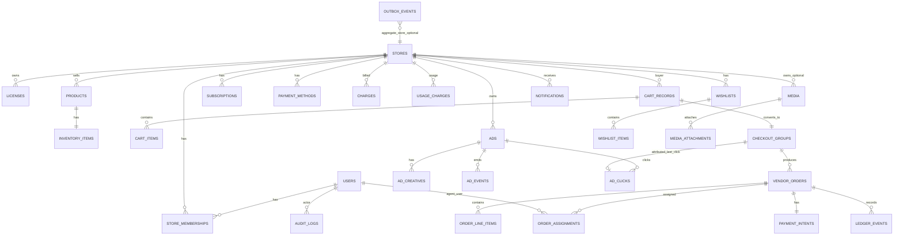

# MASTER CONTEXT — PackFinderz B2B Cannabis Marketplace (v1.6 — FINAL / DOC-STARTER)

## 0) Glossary (canonical nouns)

* **Store (Tenant):** One buyer location (each dispensary location is its own Store) OR one vendor entity per state.
* **StoreType:** `vendor | buyer`
* **User:** can belong to multiple Stores.
* **Active Store:** current Store selected; stored in JWT as `activeStoreId`.
* **Cart:** client-side cart (MVP) until checkout; becomes a server-side `CartRecord` at checkout-time only.
* **CheckoutGroup:** a grouping ID tying together the N per-vendor orders created from one checkout.
* **Order (VendorOrder):** per-vendor order created from a multi-vendor checkout.
* **LineItem:** within an Order; accepted/rejected/fulfilled per item.
* **Agent:** internal transporter; updates delivery + cash collection.
* **Admin:** internal operator; compliance approvals + payouts + overrides.
* **LedgerEvent:** append-only financial event record (cash collected, vendor payout, later refunds/adjustments).
* **OutboxEvent:** DB row written in same transaction as business changes; published to Pub/Sub by worker.

---

## 1) Product Scope & Market

* Two-sided **B2B** marketplace for regulated cannabis commerce.
* Launch: **Oklahoma (OMMA)** only; built for multi-state later.
* Participants:

  * Vendors: growers, brands, distributors, producers (no brokers).
  * Buyers: dispensaries (primary).
  * Future: allow distributors/producers to buy.
* Visibility:

  * **Login required** to view catalog/pricing.
  * Buyer verification gates purchasing actions.
* Commerce flow (MVP = cash at delivery):

  1. browse/search
  2. cart (client-side; shows pricing + discounts)
  3. checkout (server creates `CartRecord` + `CheckoutGroup`)
  4. split into N vendor orders (`VendorOrder`)
  5. vendor accepts/rejects line items
  6. packed/ready (`fulfilled`)
  7. agent dispatch → `in_transit` → `delivered`
  8. **cash collected at delivery** → payment `settled`
  9. payout recorded → payment `paid` → order `closed`

Future (ACH):

* adds settlement/payout nuance (`hold` used when needed).

---

## 2) Tenancy, Identity & Access

### Tenancy (LOCKED)

* Canonical tenant = **Store**.
* Buyers: each dispensary location is its own Store.
* Vendors: one Store per state.
* `store.type = vendor | buyer`

  * Vendor stores have buyer privileges.
  * Buyer stores never have vendor privileges.

### Users + store switching

* Multi-store users.
* Shopify-style:

  * login → choose store → JWT includes `activeStoreId`
  * switching store refreshes token.
* JWT contains:

  * `userId`, `activeStoreId`, `role` (optional `storeType` convenience)

### Authorization

* RBAC: roles imply permissions.
* Store membership may include `permissions[]` as future override.
* Token carries role; server resolves effective permissions.

### Access rules (MVP)

* Buyer Store:

  * Unverified: can browse/search + see prices/vendor names.
  * Verified: can checkout/view orders/track delivery.
* Vendor Store:

  * Can manage listings anytime.
  * Search visibility requires: license verified AND subscription active.
* Anti-scraping: not prioritized day 1.

---

## 3) Compliance & Licensing (OMMA)

* Upload license PDF/image.
* Extract minimum: license #, business name, address, issue date, expiry date, type.
* Verification:

  * Manual initially; automation later via scraping/API.
* Licenses:

  * Vendors may have multiple; buyers usually one.
* Store status:

  * `pending_verification → verified | rejected → expired | suspended`
* Expiry:

  * daily scheduler queries expiring in 14d + expired today, notifies + flips status (indexed query assumed cheap).
* Spoof mitigation (MVP):

  * manual approval + name/address match vs OMMA.

---

## 4) Inventory, Pricing, Checkout, Concurrency

### Inventory model

* Track:

  * `availableQty`
  * `reservedQty`
* Reservation decreases available and increases reserved.
* Completion reduces reserved (available already reduced at reserve time).

### Units (canonical)

* Inventory is per-product:

  * **count-based** items (bags/jars/joints/carts/etc.)
  * **weight-based** stored in **grams** (UI converts to oz/lb)

### Pricing model (LOCKED)

* Pricing is “per unit” (or per gram for flower).
* **Volume-based discounts per product**, evaluated by quantity thresholds:

  * `>= 5 lbs → x% off`, `>= 20 lbs → y% off`
  * `>= 5 units → x% off`, `>= 20 units → y% off`
* Discount computed in **cart UI** and re-validated at **checkout**.
* MOQ:

  * enforced client-side AND validated server-side at checkout (and any server-side cart ops).
* Future (not MVP): store-wide promo codes/discounts.

### Concurrency model (LOCKED)

* **Optimistic update + transaction + retry**.
* Reserve per line item with atomic conditional update (`available >= qty`).
* If reserve fails → reject that line item (partial accept supported).

---

## 5) Orders, Payments, Refunds (State Machines)

### Order status (VendorOrder)

* `created_pending`
* `accepted` | `partially_accepted` | `rejected`
* `fulfilled` (packed/ready)
* `hold` (optional; ACH or vendor policy)
* `in_transit`
* `delivered`
* `closed`
* `canceled` (buyer pre-transit)
* `expired` (system TTL after repeated nudges)

### LineItem status

* `pending`
* `accepted` | `rejected`
* `fulfilled`
* `hold` (optional)

### Payment status

* `unpaid/pending`
* `settled` (cash collected at delivery)
* `paid` (vendor payout recorded)

### Refund status

* `none` | `partial` | `full`

Partial accept semantics (LOCKED)

* Vendor partially accepts → buyer proceeds automatically with accepted items.
* Cash MVP: buyer/agent sees **updated amount due immediately** after vendor decision.

---

## 6) Vendor-as-Buyer + Subscription Gating (LOCKED)

### Order perspective permissions

Actions depend on relationship to the order:

* Buyer perspective: `activeStoreId == buyerStoreId`
* Vendor perspective: `activeStoreId == vendorStoreId`
  A store can be buyer on some orders and vendor on others, but never both roles on the same order.

### Subscription gating (LOCKED)

If a **vendor subscription is inactive/canceled**:

* The store is reduced to **buyer-only** capabilities.
* Selling features disabled:

  * no product visibility in search
  * no ads
  * no vendor analytics
  * no listing visibility (drafts may remain privately)
* Buying features remain (can still browse/order as buyer).

---

## 7) Reservation TTL + Nudge/Retry (LOCKED)

* Reservation TTL: 5 days.
* If vendor doesn’t respond by TTL:

  * system auto-nudges vendor + extends TTL once more (another 5 days)
  * buyer can also manually “nudge vendor” any time during pending
* After the second TTL window expires (10 total days with no response):

  * order becomes `expired` and effectively canceled
  * inventory reservation released
  * buyer can “retry order” from expired order (creates a new checkout attempt)
* Future ACH note: if buyer was charged, refund flow applies; for cash MVP no refund needed.

---

## 8) Delivery & Agents

* Delivery handled by internal PackFinderz agents.
* Agent assignment: random auto-assign (MVP).
* Agent actions:

  * set order `in_transit`
  * set order `delivered`
  * mark `cash_collected`
* Credentials stored (name/phone/license identifiers).
* Future: GPS, QR/scanning.

---

## 9) Ledger & Billing

* Ledger tracks buyer/vendor money lifecycle even in cash MVP.
* Separate billing history for subscriptions/ads.

Ledger event types (MVP):

* `cash_collected`
* `vendor_payout`
* (later) adjustments/refunds

Timestamps:

* `cashCollectedAt`
* `vendorPaidAt`

Payout authority (MVP):

* Admin marks payout complete in admin panel (preferred).
* Vendor may also “confirm paid” as a secondary signal (logged + auditable).
* Future ACH: payout confirmed via provider webhook; system updates order + ledger automatically.

---

## 10) Search & Geo

* Search origin = buyer store lat/lng.
* Vendor delivery radius per vendor store (statewide option later).
* PostGIS used for geo filtering (later phases add on)

Store address mutability (MVP policy):

* Address is set at registration.
* Treat as **effectively immutable** in-app for MVP (reduces fraud + geo confusion).
* If needed, changes are handled by admin override (audited).
* Geocoding occurs on create (and on admin override if changed).

---

## 11) Async Architecture & Eventing

Day-1 async:

* order events / orchestration
* notifications (in-app; email soon via Twilio/SendGrid)
* BigQuery analytics ingestion
* media processing
* license expiry checks

Outbox pattern: YES:

* write business change + outbox row in same DB transaction
* worker publishes to Pub/Sub
* consumers idempotent + retry-safe

---

## 12) Analytics & Ads

Marketplace events (BigQuery):

* `order_created` (checkout)
* `cash_collected` (delivery)
* `order_paid` (vendor payout recorded)
* optional: `order_canceled`, `refund_initiated`

KPIs:

* total orders, AOV, gross/net revenue
* geo by ZIP
* top products/categories
* returning buyers

Ads (Phase 2)
Attribution: last-click within 30 days.

Ad click tracking model (chosen for safety + correctness):

* Store **every ad click** as a row with TTL semantics:

  * `ad_click` rows keyed by `buyerStoreId` + `buyerUserId` (if available) + timestamp
  * clicks expire logically after 30d (DB TTL via scheduled cleanup or partitioned table)
* At checkout time:

  * assign the **most recent eligible click** (last-click) to the `CheckoutGroup` and propagate to each `VendorOrder` as `attributedAdClickId` (optional)
* On `cash_collected` / `order_paid` events:

  * analytics pipeline uses `attributedAdClickId` to compute ROAS/spend attribution.

Rationale:

* Buyers can click many ads and place many orders; storing all clicks avoids losing attribution data.
* Persisting attribution at checkout prevents later ambiguity if click history changes.

---

## 13) Transport manifests + docs (LOCKED)

Stored in cloud storage bucket:

* Licenses (store)
* COAs (product)
* Transport manifests (order)

Manifest approach (MVP):

* Prefer **generated PDF** (template) stored in bucket and attached to order.
* Allow **manual upload override** (vendor/admin).

---

## 14) Infra & Deployment

* MVP: Heroku for API + workers + Redis.
* GCP: Pub/Sub, Storage, BigQuery.
* Single repo, multiple binaries under `cmd/*`.
* Local: Docker Compose.
* Environments: dev + prod; staging later.
* `pkg/redis` boots go-redis with well-scoped prefixes for idempotency, rate limits, counters, and refresh tokens while adding Redis to the `/health/ready` dependency check.
* `pkg/db` governs the GORM bootstrap for API/worker, exposing pooled connections and the `Ping` helper used by readiness probes.
* The base repository pattern (`internal/repo.Base`) ensures domain repos always accept the injected `*gorm.DB`, stay context-aware, and tap into `pkg/db` helpers for transactions/raw SQL.
* GitHub Actions workflow (`.github/workflows/ci.yml`) now enforces gofmt, `golangci-lint`, `go test`, `go build`, and gitleaks secret scanning on PRs and `main` pushes; DB tests must use `//go:build db` so they stay excluded until the infra is ready.
* Heroku release wiring (`heroku.yml`) binds `./bin/api` to the web dyno and `./bin/worker` to the worker dyno; refer to `docs/heroku_deploy.md` for the release checklist, readiness, and hybrid migration policy.  Postgres (heroku) & Redis (heroku)

---

## 15) Security & Ops (modular)

* Current: custom auth (email/password) + JWT + refresh tokens.
* Soon:

  * email link or code verification
  * MFA capability
* Auth swappable later via adapter layer:

  * Cognito/Firebase/GCP Identity supported later.
* Audit log (append-only):

  * order state transitions
  * admin actions (license approve, payout)
* Logging redlines:

  * never log passwords
  * never log JWT/refresh tokens
  * never log raw license docs or extracted doc text
  * never log sensitive cash notes beyond status/timestamps

---

## 16) Observability & Logging

* Use `pkg/logger` to emit structured JSON logs across API and worker binaries, configured via `PACKFINDERZ_LOG_LEVEL` and `PACKFINDERZ_LOG_WARN_STACK`.
* HTTP middleware must mint a `request_id`, attach it to the `X-Request-Id` response header, and log the lifecycle events (`request.start`, `request.complete`) with method, path, status, and duration fields so traces stay correlatable.
* Workers reuse the same logger, seed contexts with job metadata, and propagate upstream `request_id`s (e.g., from outbox payloads) before emitting logs.
* `Error` logs always include stack traces while warnings include them when debug mode is enabled via the warn-stack flag.

---

## 17) HTTP Routing & Validation

* The API boots `api/routes.NewRouter` (chi) with route groups for `/health`, `/api/public`, `/api`, `/api/admin`, and `/api/agent`, each wired with the middleware chain (recoverer → request_id → logging → auth/store context → role guard → idempotency → rate-limit placeholders).
* Controllers under `api/controllers` get validated inputs from `api/validators` (e.g., `DecodeJSONBody`, `ParseQueryInt`, `SanitizeString`) before any business logic runs; validation failures surface as `pkg/errors.CodeValidation`.
* Validation errors (malformed JSON, missing required fields, query params out of bounds) map to the canonical error envelope so clients always receive `400` + `{ "error": { "details": {...} } }`.
* Each route group enforces its own auth/role requirements and should be covered by tests for 401/403, plus validation tests that assert the 400 envelope contains field-level messages.

---

## 18) Error Handling (Canonical)
* A global `pkg/errors` package holds typed `Code` values plus metadata (`http_status`, `retryable`, `public_message`, `details_allowed`); domain services must build errors with `pkg/errors.New`/`Wrap` so API handlers can rely on known semantics instead of ad-hoc strings.
* `pkg/types` defines `SuccessEnvelope`, `APIError`, and `ErrorEnvelope` while `api/responses.WriteSuccess` / `WriteError` set HTTP headers/status and wrap payloads into the canonical envelope (`{"data":…}` or `{"error":{…}}`).
* Metadata drives canonical mapping: validation → `400`, authentication/authorization → `401`/`403`, not found → `404`, conflicts/state → `409`/`422`, and all unknown/internal errors → `500` with the safe public message defined in metadata.
* Only expose `details` when `details_allowed` is true to avoid leaking internal diagnostics, and default untrusted errors to `INTERNAL_ERROR` so clients never see raw stacks.
* A `/demo-error` handler exists as a working example; future controllers should reuse `api/responses.WriteError` so the API remains the authoritative source of synchronous decisions.

---

## Checkout grouping decision (chosen)

We will use a **CheckoutGroup** (recommended) rather than only a cart flag.

Why:

* You currently delete the cart after creating orders; you still need a durable “this checkout produced these orders” key.
* Improves UX (single “checkout receipt” view), analytics, retries, and debugging.
* Allows order retries/nudges to reference the group coherently.

MVP behavior:

* Client cart → checkout creates `CartRecord` + `CheckoutGroup`.
* N `VendorOrder`s reference `checkoutGroupId`.
* After order intents are created successfully, `CartRecord` may be deleted (or marked `converted`), but the `CheckoutGroup` remains as the stable link.

Got it — I will treat **your “SOURCE OF TRUTH VERSION”** as canonical.

Below is that same document **re-issued as the consolidated Source of Truth**, with **only additive, relevant missing details** merged in from the other versions (notably: the **JWT claims block**, a clearer definition of **partial success**, and a couple of **small clarifications** around vendor-as-buyer + retention). I did **not** change any of your core structure or meaning.

---

# Doc 1: PRD + Scope + NFRs — PackFinderz (MVP+ / Architecture-Locked)

---

## 1. Problem Statement & Goals

### Problem

Licensed cannabis operators lack a **robust, compliant B2B operating system** that:

* Supports multi-vendor ordering with clear fulfillment ownership
* Handles cash-at-delivery (and later ACH) with auditability
* Enforces licensing without blocking legitimate commerce
* Acts as a **primary system of record** for inventory, pricing, orders, and payouts
* Can expand to ads, analytics, payments, and multi-state commerce without re-architecture

---

### Goals (MVP)

The system MUST:

* Enable **verified buyers** to place multi-vendor orders in one checkout
* Enable **vendors** to:

  * Create/manage products
  * Upload images, videos, COAs
  * Manage inventory, MOQs, and volume discounts
  * Use PackFinderz as their **primary inventory source of truth**
* Enable **vendors** to create and manage ads:

  * Hero banner
  * Promoted store
  * Promoted products
* Enable **vendors and buyers** to:

  * Upload/manage licenses
  * Manage users and roles
  * Add/manage billing methods (CC now, ACH later)
  * View billing and transaction history
  * Modify store storefront information
* Enable **agents** to:

  * Deliver orders
  * Record cash collection
  * Confirm delivery
* Enable **admins** to:

  * Verify licenses
  * Reset passwords / assist store recovery
  * Oversee payouts
  * Audit all system activity
* Preserve **correctness over speed**

  * No overselling
  * Explicit order & payment state machines
  * Append-only financial records

---

### Non-Goals (MVP)

* Consumer marketplace
* Buyer↔vendor chat or negotiation
* Automated OMMA verification
* Guaranteed customer SLAs
* Real-time GPS tracking

---

## 2. Personas

### Buyer (Dispensary)

* Roles: `owner`, `manager`, `staff`
* Capabilities:

  * Owners/managers can checkout
  * Staff can create carts only
* Requirements:

  * Must upload license
  * Must be approved before checkout

---

### Vendor (Grower / Producer / Brand)

* Roles: `owner`, `manager`, `ops`
* Capabilities:

  * Product + inventory management
  * Ads creation
  * Order fulfillment
* Rules:

  * Subscription required to sell
  * ≥1 active license required for visibility
  * If subscription lapses but license remains valid → vendor may still act as buyer

---

### Agent (Internal)

* Role: `agent`
* Capabilities:

  * View assigned deliveries
  * View buyer/vendor contact info
  * Confirm delivery
  * Record cash collected
  * Capture delivery confirmation
* Future (planned):

  * Signature capture
  * GPS tracking

---

### Admin (Internal)

* Role: `admin`
* Capabilities:

  * License approval/rejection
  * Store overrides
  * Password resets / store recovery
  * Payout confirmation
  * Full audit access

---

## 3. MVP Scope

### In Scope (MVP)

* Register/login
* License upload & verification
* Subscription billing
* Product creation & inventory updates
* Client-side cart → server checkout
* CheckoutGroup + VendorOrders
* Vendor accept/reject + fulfillment
* Internal delivery + cash-at-delivery
* Ads (limited)
* Store & ad analytics
* Admin portal
* Internal notifications (toolbar popout)

---

### Explicitly Out of Scope (MVP)

* Negotiated pricing
* Buyer↔vendor chat
* ACH/card payments (Phase 2)
* Automated disputes
* Self-editable store address
* External SLA guarantees

---

## 4. Core User Journeys

### Buyer Journey

1. Register/login
2. Upload license
3. Await admin approval
4. Select buyer store
5. Browse/search vendors
6. Add items to cart (client-side)
7. Checkout → create `CheckoutGroup`
8. Vendors accept/reject
9. If accepted:

   * Delivery scheduled
10. Buyer MAY:

    * Cancel order before `in_transit`

      * If unpaid → canceled
      * If paid (ACH later) → refund initiated
11. Order delivered → closed

---

### Vendor Journey (Orders)

1. Login → select vendor store
2. Manage inventory & pricing
3. Receive order
4. Accept/reject:

   * Entire order OR
   * Individual line items
5. Fulfill accepted items
6. Initiate dispatch (agent assignment)
7. Order enters **hold** while agent en route
8. Delivery completed → payout pending

---

### Vendor Journey (Ads)

1. Select ad type:

   * Banner
   * Promote store
   * Promote product(s)
2. Set:

   * Budget
   * Bid price
3. Activate ad
4. Manage ad:

   * Modify bid/budget
   * Pause/delete
5. View analytics by date range

---

### Buyer / Vendor (Shared)

* Upload/delete licenses
* Manage users
* View notifications
* Add billing methods (CC now, ACH later)
* View billing history (vendors only)
* View transaction history:

  * Orders
  * Payouts
  * Refunds
* Modify store storefront info
* Manage security settings (MFA later)

---

### Agent Journey

1. Login
2. View assigned delivery
3. Pick up product
4. Deliver to buyer
5. Confirm:

   * Delivered
   * Cash amount
   * Buyer acknowledgment
6. Complete delivery

---

### Admin Journey

1. Review licenses
2. Approve/reject stores
3. Monitor orders & ledger
4. Confirm payouts
5. Reset passwords / recover stores
6. Audit system actions

---

## 5. Functional Requirements

### Identity & Access

* Multi-store users supported
* JWT MUST include `activeStoreId`
* Store switching MUST refresh token

**JWT Claims (canonical) — additive detail:**

```json
{
  "user_id": "uuid",
  "active_store_id": "uuid",
  "role": "owner | manager | staff | ops | agent | admin",
  "store_type": "buyer | vendor",
  "kyc_status": "pending_verification | verified | suspended",
  "iat": 0,
  "exp": 0
}
```

Notes:

* `store_type` MAY be derived server-side from `active_store_id`, but including it in the token is allowed as a convenience.
* Tokens are minted with a TTL configured via `PACKFINDERZ_JWT_EXPIRATION_MINUTES` and must respect signature/expiry validation on every parse.

---

### Catalog & Inventory

* Vendors control pricing, MOQs, discounts
* Inventory uses optimistic locking
* Overselling prevented at checkout
* PackFinderz is canonical inventory source

---

### Cart & Checkout

* Cart remains client-side until checkout
* Checkout MUST:

  * Create server cart
  * Validate pricing/MOQs
  * Create `CheckoutGroup`
  * Create N `VendorOrder`s

**Partial success supported — clarified meaning (additive detail):**

* If checkout involves multiple vendors, the system MUST allow creation of vendor orders to succeed for some vendors and fail for others.
* Buyer proceeds with the successfully-created vendor orders; failed vendor orders MUST be reported clearly to the buyer.

---

### Orders & Fulfillment

* Vendors MUST accept/reject order
* Vendors MUST accept/reject line items
* Vendors MUST initiate dispatch
* Order states:

  * `fulfilled` (vendor packed)
  * `hold` (awaiting pickup or payment)
* ACH case (future):

  * Order remains `hold` until payment settles

---

### Payments & Billing

* MVP default: cash-at-delivery
* Checkout MAY allow payment method selection (cash / ACH future)
* Agent MUST input collected amount
* Platform MAY apply:

  * Transport fee
  * Platform fee (configurable, nullable)
* Vendors billed for:

  * Subscriptions
  * Ads (see below)

---

### Ads & Billing Model

* Ads accrue cost based on impressions/clicks
* Billing cadence (TBD, but designed for):

  * Daily settlement
  * Budget exhaustion
* Ad spend MUST be auditable per day

---

### Compliance

* License upload required
* Manual verification required
* 7-day expiry grace period
* Store valid if ≥1 active license
* Expired licenses deleted after 30 days (DB + storage)

---

### Admin & Audit

* Admin actions logged (required)
* Critical user actions logged (orders, products, ads)
* Ledger is append-only
* Vendors/buyers can export financial summaries

---

### Analytics

* Store-level analytics:

  * AOV
  * Gross/net sales
  * Orders
  * Top products/categories/strains
  * Fulfillment times
  * Expiry rates
* Ad analytics:

  * Views
  * Clicks
  * Attributed orders
* Aggregation server-side
* BigQuery pagination handled safely

---

## 6. Acceptance Criteria

MVP is complete when:

* Buyers can register, verify, and checkout
* Vendors manage inventory, orders, ads
* Agents deliver and record cash
* Admins verify licenses and payouts
* Store & ad analytics are available
* Subscriptions and ad billing function
* All state transitions are auditable

---

## 7. Success Metrics

### Admin Dashboard

* Total GMV
* Orders/week
* Platform revenue
* Expiry rates
* Delivery success rate

### Vendor Dashboard

* Orders
* AOV
* Revenue
* Ad performance
* Fulfillment speed

---

## 8. Rollout Plan

### Phase 0 (MVP)

* OK only
* Register/login
* License verification
* Subscriptions
* Product & inventory
* Orders & delivery
* Cash-at-delivery
* Store & ad analytics
* Internal notifications

---

### Phase 1

* Ads (expanded)
* Email & SMS notifications
* Transport fees
* Platform fees
* Improved agent/admin tooling

---

### Phase 2

* ACH payments
* Advanced analytics
* Multi-state (NM, CO)
* External integrations

---

## 9. Non-Functional Requirements (NFRs)

### Performance

* API P95:

  * Reads < 400ms
  * Writes < 700ms
* Search P95 < 800ms

### Reliability

* 99.5% uptime
* Graceful degradation

### Scalability

* ≤2k stores
* ≤10k MAU
* ≤50k products
* ≤5k orders/month

### Security & Privacy

* No sensitive data in logs
* RBAC enforced server-side
* Agent access scoped

### Observability

* Logs + metrics
* Slack/SMS alerts for failures

### Data Retention

* Orders + ledger: indefinite
* Clickstream: 30 days
* Notifications: 30 days

---

## 10. Integrations & Future-Proofing (Expanded)

### Seed-to-Sale Systems (Phase 3+)

* Sync inventory, batch IDs, compliance data
* One-way or bidirectional adapters
* Vendor-configurable mappings

### Accounting Exports

* Export:

  * Orders
  * Payouts
  * Fees
  * Refunds
* Formats:

  * CSV
  * JSON
* Filters by date, store, product

### ACH Providers

* Abstracted payment adapter
* Supports holds, partial refunds, failures

### Analytics Pipelines

* Event-based ingestion
* Pre-aggregated rollups
* Vendor & admin scoped access

### Blockchain (Optional / Experimental)

* Product NFTs
* On-chain transaction hashes
* Off-chain canonical data
* Optional anchoring for auditability

**All external systems MUST be adapter-based and swappable.**

---

# DOC 2: — Architecture Overview (PackFinderz)

**Version:** v1 (FINAL)
**Scope:** MVP+ (Architecture-Locked)
**Constraints:** Single repo, multiple binaries, Heroku MVP, GCP Pub/Sub / BigQuery / Storage / Heroku SQL / Heroku Redis
**Goal:** Define system structure, workflows, async/eventing, failure handling, and architectural tradeoffs.

---

## 1) Architecture Principles (LOCKED)

1. **Postgres is the authoritative system of record** for:

   * inventory
   * orders
   * payments
   * licenses
   * ads
   * subscriptions
   * ledger events
2. **The API monolith owns all synchronous decisions**:

   * validation
   * permissions
   * state transitions
   * inventory reservation
   * ad eligibility
3. **Workers perform side effects only**:

   * notifications
   * analytics ingestion
   * media processing
   * schedulers
4. **Time-based rules are scheduler-driven**, never request-time.
5. **Event delivery is at-least-once**; all consumers MUST be idempotent.
6. **Correctness is prioritized over performance**.

---

## 2) System Component Diagram



### Diagram Explanation

* **API Monolith**: all authoritative business logic and DB writes.
* **OutboxEvent table**: guarantees reliable event publication.
* **Workers**: async fan-out and schedulers.
* **Redis**: fast, ephemeral counters and tokens only.
* **BigQuery**: analytics only; never a source of truth.

---

## 3) Service Boundaries & Deployment

### 3.1 Binaries

**`cmd/api` (Heroku `web`) MUST:**

* authenticate users
* enforce RBAC + `activeStoreId`
* manage inventory reservations
* create orders and CheckoutGroups
* enforce ad eligibility and budget gating
* write ledger + outbox events

**`cmd/worker` (Heroku `worker`) MUST:**

* publish outbox events
* consume Pub/Sub topics
* run schedulers (TTL, expiry, cleanup)

---

### 3.2 GCP Resources

* **Pub/Sub:** event transport + DLQ
* **BigQuery:** analytics warehouse
* **GCS:** licenses, COAs, manifests, media

### 3.3 GCP Resources
* **Heroku Redis (Redis):**  Idempotency, rate limiting, JWT refreshing, etc 
* **Heroku SQL (Postgres):** authoritative data

---

## 4) Primary Workflows

### 4.1 Onboarding & License Verification



**Rules**

* Buyers MUST be verified to checkout.
* Vendors MUST be licensed + subscribed to appear in search.
* License expiry is handled by scheduler, not API requests.

---

### 4.2 Browse → Checkout → Split Orders



**LOCKED**

* Inventory reservation is synchronous.
* Partial checkout success is allowed.

---

### 4.3 Inventory TTL, Nudge, Expire

```mermaid
flowchart TD
  O[Order pending] --> R[Reserved (5d TTL)]
  R -->|Vendor responds| D[Accepted / Rejected]
  R -->|No response| N[Nudge + extend]
  N -->|Still no response| X[Expired]
  X --> U[Release inventory]
  X --> C[Buyer retry]
```

* Scheduler MUST:

  * nudge once
  * expire after second TTL
  * release reservations idempotently

---

### 4.4 Vendor Fulfillment → Dispatch



---

### 4.5 Delivery → Cash → Payout



---

## 5) Async Architecture (Outbox → Pub/Sub)

### 5.1 Outbox Contract (LOCKED)

API MUST write OutboxEvent in the same DB transaction as business state.

Required fields:

* `id`
* `eventType`
* `aggregateType`
* `aggregateId`
* `payload`
* `createdAt`
* `publishedAt`
* `attempts`
* `lastError`

---

### 5.2 Publisher Loop (NOT cron)

* Long-running loop
* Small batches
* `FOR UPDATE SKIP LOCKED`
* Retry on failure
* Mark published only after Pub/Sub success

---

### 5.3 Consumers

* MUST be idempotent
* MUST tolerate duplicates
* MUST DLQ after max retries
* Replay MAY be manual for MVP

---

### 5.4 Retention

* Published outbox rows retained **30 days**
* Cleanup via scheduler

---

## 6) Ads & Subscriptions

### 6.1 Placement Model

* Each surface has **K slots**.
* Selection is **request-time**.

Eligibility requires:

* license verified
* subscription active
* ad active
* budget remaining

---

### 6.2 Spend Enforcement

* Redis counters per ad per day:

  * spend
  * impressions
  * clicks
* Increment on confirmed impression/click.
* Hard-stop when budget exceeded.

---

### 6.3 Attribution

* All ad clicks stored (30d TTL).
* At checkout:

  * last eligible click attached to CheckoutGroup
  * propagated to VendorOrders.

---

### 6.4 Billing Rollups

* Scheduler writes daily rollups to Postgres.
* Billing reads from Postgres, not BigQuery.

---

## 7) Failure Modes & Mitigations (Top 10)

1. Duplicate events → idempotent consumers
2. Worker crash → outbox retry
3. Overselling → atomic conditional updates
4. Partial checkout → transactional cleanup
5. License drift → nightly reconciliation
6. Budget overspend → Redis gating
7. Poison events → DLQ
8. Orphaned media → GC + lifecycle rules
9. Store leakage → enforce `activeStoreId`
10. Missed schedulers → idempotent reruns + alerts

---

## 8) Key Design Decisions

* **Monolith + workers**: fewer failure modes
* **Outbox pattern**: no silent failures
* **Redis for ads**: avoids DB hotspots
* **CheckoutGroup**: analytics + retries
* **Last-click attribution**: correctness
* **Cash MVP**: avoids banking blockers

---

# Doc 3: Domain Model + API Contract (PackFinderz)

## API Versioning Strategy (LOCKED)

* All endpoints MUST be under: `/api/v1/...`
* Backwards-incompatible changes MUST bump to `/api/v2/...`
* All responses MUST be JSON (`application/json`) except presigned upload targets (GCS URL) returned as JSON.

---

## 1) Glossary (additional domain terms only)

* **StoreMembership:** join between `User` and `Store`, containing role + status.
* **KYCStatus:** store-level compliance state mirrored from license outcomes.
* **LicenseStatus:** license-level verification state (source of truth).
* **CartRecord:** server-side “checkout staging” record created at checkout confirmation step.
* **CheckoutAttempt:** (conceptual) the act of converting `CartRecord` into `CheckoutGroup` + `VendorOrder`s. (Not necessarily a table.)
* **HoldForPickup:** order is packed/ready and waiting for agent pickup.
* **HoldForPayment:** order is waiting for ACH settlement (future) or payment completion.
* **MediaAttachment:** link row attaching a `Media` object to a domain entity (product/license/ad/order).
* **IdempotencyKey:** caller-provided request key used to guarantee exactly-once effects for POST actions.
* **VendorVisibility:** whether a vendor appears in buyer search; requires license verified + subscription active.

---

## 2) Entity Model Overview

* **User**
* **Store**
* **StoreMembership**
* **License**
* **Media** + **MediaAttachment**
* **Product** + **ProductMedia**
* **InventoryItem**
* **CartRecord** + **CartItem**
* **CheckoutGroup**
* **VendorOrder** + **LineItem**
* **PaymentIntent** (created at checkout; offline/cash default; ACH later)
* **LedgerEvent**
* **Notification**
* **Wishlist** + **WishlistItem**
* **Ad** + **AdCreative**
* **AdClick** (attribution rows; 30d TTL semantics)
* **CustomerCRM** (vendor-local “customer list” view derived from orders; deletable without affecting orders)

Ownership rules (high level):

* Store is the canonical tenant for all buyer/vendor resources.
* `VendorOrder` is owned by both stores (buyerStoreId + vendorStoreId) with **perspective-based authorization**.
* Licenses belong to a Store; store KYC is mirrored but License is source of truth.
* Media is globally addressable but attachable to multiple entities (many-to-many).

---

## 3) Multi-tenancy + RBAC Rules

### 3.1 Tenancy enforcement

* For buyer/vendor endpoints, API MUST enforce `activeStoreId` from JWT:

  * Most reads/writes MUST be scoped to `activeStoreId`.
  * Cross-store reads MUST be explicitly “directory/search” endpoints (e.g., browse vendors/products).
* Agents and admins:

  * MAY authenticate without `activeStoreId` and `storeType`.
  * Their access is scoped by role + assignment rules.

### 3.2 Store switching

* Login:

  * If user has exactly 1 store membership, API MUST auto-select that store and issue JWT with `activeStoreId`.
  * If user has >1 store membership, API MUST return `stores[]` and either:

    * issue a JWT with no `activeStoreId` (**ASSUMPTION**: allowed), requiring switch before protected actions, OR
    * issue a JWT with a default store (not chosen yet).
  * **ASSUMPTION (minimal):** v1 will still issue a token, but any endpoint requiring store context MUST reject if `activeStoreId` is missing.
* Switching store MUST mint a new access token containing the new `activeStoreId`.

### 3.3 Role enums (v1 canonical)

* Store member roles: `owner | manager | staff | ops`
* System roles: `agent | admin`

### 3.4 Permission matrix (v1)

**Buyer store (`store.type=buyer`)**

* `owner/manager`

  * MUST: checkout, cancel (pre-transit), view orders, manage users, manage licenses, manage wishlist
* `staff`

  * MUST: browse/search, view products, manage wishlist
  * MUST NOT: checkout, manage users
* `ops` (**ASSUMPTION**: buyer ops behaves like manager for MVP unless restricted later)

**Vendor store (`store.type=vendor`)**

* `owner/manager/ops`

  * MUST: manage products/inventory, accept/reject, fulfill, request dispatch, ads, analytics, manage users, manage licenses
* `staff`

  * MUST: view orders, assist fulfillment
  * MUST NOT: ads/subscription/billing changes (**ASSUMPTION**)

**Agent**

* MUST: view assigned orders + orders pending pickup (dispatch queue)
* MUST: pickup, deliver, record cash
* MUST NOT: modify products/ads/subscriptions

**Admin**

* MUST: approve/reject license, confirm payouts, reset store password, override assignment
* MAY: override address (future), view global order lists

### 3.5 Order “perspective” authorization (LOCKED)

* Buyer perspective permissions apply when `activeStoreId == VendorOrder.buyerStoreId`
* Vendor perspective permissions apply when `activeStoreId == VendorOrder.vendorStoreId`
* A store MUST NOT act as buyer and vendor on the same order.

---

## 4) API Resource List (REST)

### Common conventions (apply to all endpoints)

* Auth:

  * Access token: `Authorization: Bearer <jwt>`
  * **Idempotency**: `Idempotency-Key: <string>` header where required.
* Pagination (list endpoints):

  * MUST support `limit` (default 25, max 100)
  * MUST support cursor pagination: `cursor` (opaque string)
  * Response MUST include: `items[]`, `nextCursor` (nullable)
* Filtering:

  * Use query params; avoid request bodies for GET.
* Standard error envelope:

  ```json
  {
    "error": {
      "code": "string",
      "message": "string",
      "details": { "any": "json" }
    }
  }
  ```
* Common error codes:

  * `400` validation
  * `401` unauthenticated
  * `403` unauthorized
  * `404` not found
  * `409` conflict (state transition, inventory contention)
  * `422` semantic (MOQ, gating, invalid state)
  * `429` rate limited
  * `500` server error

---

## 5) Endpoint Groups (success/errors + short description)

### 5.1 Auth

**Register**

* `POST /api/v1/auth/register`

  * Creates user + first store + membership (owner).
  * **Idempotent:** YES (required)
  * Success: `201`
  * Errors: `400, 409`

**Login**

* `POST /api/v1/auth/login`

  * Email/password login.
  * Returns tokens + store list; auto-picks `activeStoreId` if only 1 store.
  * Success: `200`
  * Errors: `400, 401`

**Logout**

* `POST /api/v1/auth/logout`

  * Revokes refresh token (and optionally access token via allowlist/denylist) (**ASSUMPTION**: refresh-token revoke only).
  * Success: `200`
  * Errors: `401`

**Refresh**

* `POST /api/v1/auth/refresh`

  * Exchanges refresh token for new access token.
  * Success: `200`
  * Errors: `401`

**Switch store**

* `POST /api/v1/auth/switch-store`

  * Mints new access token with provided storeId (must be member).
  * Success: `200`
  * Errors: `401, 403, 404`

**Forgot password**

* `POST /api/v1/auth/forgot-password`

  * MVP: returns “not supported” unless SendGrid integrated (**ASSUMPTION**: returns 501).
  * Success: `501`
  * Errors: `501`

**Update password**

* `POST /api/v1/auth/update-password`

  * Requires authenticated user; changes password.
  * Success: `200`
  * Errors: `400, 401, 403`

**Admin reset store/user password**

* `POST /api/v1/admin/users/{userId}/reset-password`

  * Sets a temp password (e.g., `pass1234!`) and flags must-change-on-next-login (**ASSUMPTION**).
  * Success: `200`
  * Errors: `401, 403, 404`

---

### 5.2 Stores

**Get active store**

* `GET /api/v1/stores/me`

  * Returns active store profile.
  * Success: `200`
  * Errors: `401, 403`

**Patch active store**

* `PATCH /api/v1/stores/me`

  * Update storefront fields (NOT address in MVP).
  * Success: `200`
  * Errors: `400, 401, 403`

**Delete store (GDPR)**

* `DELETE /api/v1/stores/me`

  * Soft delete + lock access for 30d; then hard delete by scheduler.
  * Success: `202`
  * Errors: `401, 403`

**List my stores**

* `GET /api/v1/stores/my`

  * Returns memberships for logged-in user (for fast client switching).
  * Success: `200`
  * Errors: `401`

**Vendor directory (buyer search)**

* `GET /api/v1/stores/vendors`

  * Buyer-facing list of vendor stores (filtered by visibility rules).
  * Success: `200`
  * Errors: `401`

**Vendor store detail (buyer view)**

* `GET /api/v1/stores/vendors/{storeId}`

  * Buyer-facing store profile + public fields.
  * Success: `200`
  * Errors: `401, 404`

---

### 5.3 Users (Store members)

**List users for active store**

* `GET /api/v1/stores/me/users`

  * Memberships for active store only.
  * Success: `200`
  * Errors: `401, 403`

**Invite user**

* `POST /api/v1/stores/me/users/invite`

  * Adds membership; MVP: manual temp password conveyed out-of-band.
  * **Idempotent:** YES (required)
  * Success: `201`
  * Errors: `400, 401, 403, 409`

**Delete user from store**

* `DELETE /api/v1/stores/me/users/{userId}`

  * Removes membership (cannot remove last owner) (**ASSUMPTION**).
  * Success: `204`
  * Errors: `401, 403, 404, 409`

---

### 5.4 Licenses

**Create license (metadata)**

* `POST /api/v1/licenses`

  * Creates license row in `pending` and returns upload requirements (or mediaId link).
  * **Idempotent:** YES (required)
  * Success: `201`
  * Errors: `400, 401, 403`

**List licenses for active store**

* `GET /api/v1/licenses`

  * Success: `200`
  * Errors: `401, 403`

**Delete license**

* `DELETE /api/v1/licenses/{licenseId}`

  * Deletes license + detaches media if no longer referenced.
  * Success: `204`
  * Errors: `401, 403, 404`

**Admin verify license**

* `POST /api/v1/admin/licenses/{licenseId}/verify`

  * Approve/reject + updates store KYC mirror.
  * **Idempotent:** YES (required)
  * Success: `200`
  * Errors: `401, 403, 404, 409`

---

### 5.5 Media

**Presign upload**

* `POST /api/v1/media/presign`

  * Returns GCS signed URL + required headers.
  * **Idempotent:** YES (required)
  * Success: `200`
  * Errors: `400, 401, 403`

**Finalize upload**

* `POST /api/v1/media/finalize`

  * Confirms upload; creates/updates Media row; sets `processing` if worker tasks exist.
  * **Idempotent:** YES (required)
  * Success: `201`
  * Errors: `400, 401, 403, 409`

**List media**

* `GET /api/v1/media`

  * Supports `type`, `ownerType`, `search`, pagination.
  * Success: `200`
  * Errors: `401, 403`

**Delete media**

* `DELETE /api/v1/media/{mediaId}`

  * Deletes if no attachments remain, otherwise removes attachment only (**ASSUMPTION**: hard delete allowed only when unreferenced).
  * Success: `204`
  * Errors: `401, 403, 404, 409`

**Attach media to product**

* `POST /api/v1/products/{productId}/media/attach`

  * **Idempotent:** YES (required)
  * Success: `201`
  * Errors: `400, 401, 403, 404, 409`

---

### 5.6 Products (buyer browsing + vendor management)

**Buyer: list products**

* `GET /api/v1/products`

  * Filters: `state` (required), `query`, `category`, `strain`, `priceMin/Max`, `vendorStoreId`, pagination.
  * Enforces vendor visibility: license verified + subscription active.
  * Success: `200`
  * Errors: `401, 422`

**Buyer: product detail**

* `GET /api/v1/products/{productId}`

  * Success: `200`
  * Errors: `401, 404`

**Vendor: create product**

* `POST /api/v1/vendor/products`

  * **Idempotent:** YES (required)
  * Success: `201`
  * Errors: `400, 401, 403, 409`

**Vendor: update product**

* `PATCH /api/v1/vendor/products/{productId}`

  * Success: `200`
  * Errors: `400, 401, 403, 404, 409`

**Vendor: delete product**

* `DELETE /api/v1/vendor/products/{productId}`

  * Hard delete (as requested).
  * Success: `204`
  * Errors: `401, 403, 404, 409`

---

### 5.7 Inventory (vendor-only, separate from products)

**Get inventory**

* `GET /api/v1/inventory`

  * Returns inventory rows for active vendor store only.
  * Success: `200`
  * Errors: `401, 403`

**Set inventory**

* `PUT /api/v1/inventory/{productId}`

  * Set-only update for `availableQty` (ints).
  * **Idempotent:** YES (required)
  * Success: `200`
  * Errors: `400, 401, 403, 404, 409`

---

### 5.8 Cart (checkout confirmation staging)

**Create/Upsert cart record**

* `PUT /api/v1/cart`

  * Created at checkout confirmation step; supports upsert.
  * **Idempotent:** YES (required)
  * Success: `200`
  * Errors: `400, 401, 403`

**Get cart record**

* `GET /api/v1/cart`

  * Returns active CartRecord for buyer store (if present).
  * Success: `200`
  * Errors: `401, 403, 404`

**Delete cart record (internal/tooling)**

* `DELETE /api/v1/cart`

  * Success: `204`
  * Errors: `401, 403`

---

### 5.9 Checkout

**Submit checkout**

* `POST /api/v1/checkout`

  * Converts CartRecord into CheckoutGroup + VendorOrders (including vendor “rejected” orders if vendor fails).
  * **Idempotent:** YES (required)
  * Success: `201`
  * Errors: `400, 401, 403, 409, 422`

---

### 5.10 Orders

**List orders (buyer/vendor perspective)**

* `GET /api/v1/orders`

  * Buyer: orders where `buyerStoreId == activeStoreId`
  * Vendor: orders where `vendorStoreId == activeStoreId`
  * Filters: `status`, `dateFrom/dateTo`, `fulfillmentStatus`, pagination.
  * Success: `200`
  * Errors: `401, 403`

**Order detail**

* `GET /api/v1/orders/{orderId}`

  * Success: `200`
  * Errors: `401, 403, 404`

**Buyer cancel**

* `POST /api/v1/orders/{orderId}/cancel`

  * Allowed before `in_transit`.
  * **Idempotent:** YES (required)
  * Success: `200`
  * Errors: `401, 403, 404, 409, 422`

**Buyer nudge vendor**

* `POST /api/v1/orders/{orderId}/nudge`

  * Sends notification (email later).
  * **Idempotent:** YES (required)
  * Success: `202`
  * Errors: `401, 403, 404, 409`

**Buyer retry**

* `POST /api/v1/orders/{orderId}/retry`

  * Allowed only if `expired`.
  * **Idempotent:** YES (required)
  * Success: `201`
  * Errors: `401, 403, 404, 409, 422`

**Vendor accept/reject order**

* `POST /api/v1/vendor/orders/{orderId}/decision`

  * Accept/reject at order level; line items may be decided later.
  * **Idempotent:** YES (required)
  * Success: `200`
  * Errors: `401, 403, 404, 409, 422`

**Vendor decide line items**

* `POST /api/v1/vendor/orders/{orderId}/line-items/decision`

  * Accept/reject specific line items.
  * **Idempotent:** YES (required)
  * Success: `200`
  * Errors: `401, 403, 404, 409, 422`

**Vendor mark fulfillment**

* `POST /api/v1/vendor/orders/{orderId}/fulfill`

  * Marks line items fulfilled; sets `fulfillmentStatus` to partial/fulfilled.
  * Moves order into `hold_for_pickup` when packed/ready.
  * **Idempotent:** YES (required)
  * Success: `200`
  * Errors: `401, 403, 404, 409, 422`

**Manifest generate**

* `POST /api/v1/orders/{orderId}/manifest/generate`

  * Generates PDF, stores in GCS, attaches to order.
  * **Idempotent:** YES (required)
  * Success: `201`
  * Errors: `401, 403, 404, 409`

**Manifest upload override**

* `POST /api/v1/orders/{orderId}/manifest/upload-override`

  * Attaches uploaded manifest media to order; replaces previous.
  * **Idempotent:** YES (required)
  * Success: `201`
  * Errors: `401, 403, 404, 409`

---

### 5.11 Customers (vendor CRM view)

**List customers**

* `GET /api/v1/vendor/customers`

  * Derived from vendor orders; deletable from CRM view only.
  * Success: `200`
  * Errors: `401, 403`

**Customer detail**

* `GET /api/v1/vendor/customers/{buyerStoreId}`

  * Includes buyer store profile + orders list (paginated).
  * Success: `200`
  * Errors: `401, 403, 404`

**Delete customer (CRM remove)**

* `DELETE /api/v1/vendor/customers/{buyerStoreId}`

  * Soft delete from vendor CRM list, orders unchanged.
  * Success: `204`
  * Errors: `401, 403, 404`

---

### 5.12 Notifications

**List notifications**

* `GET /api/v1/notifications`

  * Filter: `unreadOnly=true|false`, pagination.
  * Success: `200`
  * Errors: `401`

**Mark read**

* `POST /api/v1/notifications/{notificationId}/read`

  * **Idempotent:** YES (required)
  * Success: `200`
  * Errors: `401, 404`

**Mark all read**

* `POST /api/v1/notifications/read-all`

  * **Idempotent:** YES (required)
  * Success: `200`
  * Errors: `401`

---

### 5.13 Wishlist

**Get wishlist**

* `GET /api/v1/wishlist`

  * Success: `200`
  * Errors: `401, 403`

**Get wishlist ids**

* `GET /api/v1/wishlist/ids`

  * Returns productIds only (for fast heart rendering).
  * Success: `200`
  * Errors: `401, 403`

**Add to wishlist**

* `POST /api/v1/wishlist/items`

  * **Idempotent:** YES (required)
  * Success: `201`
  * Errors: `401, 403, 409`

**Remove from wishlist**

* `DELETE /api/v1/wishlist/items/{productId}`

  * Success: `204`
  * Errors: `401, 403, 404`

---

### 5.14 Analytics (vendor only)

**Get vendor analytics**

* `GET /api/v1/vendor/analytics`

  * Query: `from`, `to`, optional `granularity`, preset alias supported.
  * Success: `200`
  * Errors: `401, 403, 422`

---

### 5.15 Ads

**Create ad**

* `POST /api/v1/vendor/ads`

  * Types: banner | promote_store | promote_product
  * **Idempotent:** YES (required)
  * Success: `201`
  * Errors: `400, 401, 403, 409`

**List ads**

* `GET /api/v1/vendor/ads`

  * Success: `200`
  * Errors: `401, 403`

**Ad detail**

* `GET /api/v1/vendor/ads/{adId}`

  * Includes SQL metadata + analytics (BQ rollups).
  * Success: `200`
  * Errors: `401, 403, 404`

**Update ad (budget/bid/status)**

* `PATCH /api/v1/vendor/ads/{adId}`

  * Success: `200`
  * Errors: `400, 401, 403, 404, 409`

**Delete ad**

* `DELETE /api/v1/vendor/ads/{adId}`

  * Success: `204`
  * Errors: `401, 403, 404`

---

### 5.16 Subscriptions + Billing (vendor only)

**Choose subscription**

* `POST /api/v1/vendor/subscriptions`

  * Integrates Stripe CC; ties subscription to vendor store.
  * **Idempotent:** YES (required)
  * Success: `201`
  * Errors: `400, 401, 403, 409`

**Cancel subscription**

* `POST /api/v1/vendor/subscriptions/cancel`

  * Cancellation removes selling visibility immediately.
  * **Idempotent:** YES (required)
  * Success: `200`
  * Errors: `401, 403, 409`

**Get active subscription**

* `GET /api/v1/vendor/subscriptions/active`

  * Success: `200`
  * Errors: `401, 403, 404`

**Billing history (charges only)**

* `GET /api/v1/vendor/billing/charges`

  * Ads/subscriptions only. Payouts live in ledger/order views.
  * Success: `200`
  * Errors: `401, 403`

---

### 5.17 Payments (linking methods; ACH later)

**Link CC payment method**

* `POST /api/v1/vendor/payment-methods/cc`

  * Stripe setup intent flow.
  * **Idempotent:** YES (required)
  * Success: `201`
  * Errors: `400, 401, 403, 409`

**Get CC payment method**

* `GET /api/v1/vendor/payment-methods/cc`

  * Success: `200`
  * Errors: `401, 403, 404`

**Unlink CC payment method**

* `DELETE /api/v1/vendor/payment-methods/cc`

  * Success: `204`
  * Errors: `401, 403, 404`

---

### 5.18 Agents

**Dispatch queue (hold_for_pickup orders)**

* `GET /api/v1/agent/orders/queue`

  * Orders waiting for pickup assignment.
  * Success: `200`
  * Errors: `401, 403`

**My assigned orders**

* `GET /api/v1/agent/orders`

  * Success: `200`
  * Errors: `401, 403`

**Confirm pickup**

* `POST /api/v1/agent/orders/{orderId}/pickup`

  * Sets order `in_transit`.
  * **Idempotent:** YES (required)
  * Success: `200`
  * Errors: `401, 403, 404, 409`

**Confirm delivery**

* `POST /api/v1/agent/orders/{orderId}/deliver`

  * Sets order `delivered`.
  * **Idempotent:** YES (required)
  * Success: `200`
  * Errors: `401, 403, 404, 409`

**Confirm cash collected**

* `POST /api/v1/agent/orders/{orderId}/cash-collected`

  * Creates `LedgerEvent(cash_collected)` + sets payment `settled`.
  * **Idempotent:** YES (required)
  * Success: `200`
  * Errors: `401, 403, 404, 409`

---

### 5.19 Admin

**Approve/reject license**

* `POST /api/v1/admin/licenses/{licenseId}/verify`

  * (Same as above; admin-only)
  * Success: `200`
  * Errors: `401, 403, 404, 409`

**Orders pending payout**

* `GET /api/v1/admin/orders/payout-queue`

  * Returns delivered+settled orders awaiting payout confirmation.
  * Success: `200`
  * Errors: `401, 403`

**Confirm payout**

* `POST /api/v1/admin/orders/{orderId}/confirm-payout`

  * Creates `LedgerEvent(vendor_payout)` + sets payment `paid` + order `closed`.
  * **Idempotent:** YES (required)
  * Success: `200`
  * Errors: `401, 403, 404, 409`

**Override agent assignment**

* `POST /api/v1/admin/orders/{orderId}/assign-agent`

  * Assigns agent for an order (override auto-assign).
  * **Idempotent:** YES (required)
  * Success: `200`
  * Errors: `401, 403, 404, 409`

**Reset store/user password**

* `POST /api/v1/admin/users/{userId}/reset-password`

  * Success: `200`
  * Errors: `401, 403, 404`

---

## 6) Idempotency Rules (Redis)

### 6.1 Contract

* Requests marked “Idempotent: YES” MUST require `Idempotency-Key` header.
* Key scope MUST be:

  * `(userId, activeStoreId, method, path, idempotencyKey)`
  * For agents/admins without `activeStoreId`, use `activeStoreId = null`.
* Redis record MUST store:

  * HTTP status code
  * response body bytes
  * selected response headers (at minimum `Content-Type`)
* Replay behavior:

  * If same key is re-used with same scope, API MUST return the stored response exactly.
  * If same key is used with different request body hash (**ASSUMPTION**), API SHOULD return `409` with `error.code = "IDEMPOTENCY_KEY_REUSED"`.
* TTL:

  * Default TTL MUST be **24 hours**
  * For checkout + payment critical actions, TTL SHOULD be **7 days**.

### 6.2 Endpoints requiring idempotency

**24h TTL**

* `POST /auth/register`
* `POST /stores/me/users/invite`
* `POST /licenses`
* `POST /media/presign`
* `POST /media/finalize`
* `POST /products/{id}/media/attach`
* `PUT /cart`
* `POST /orders/{id}/nudge`
* `POST /notifications/{id}/read`
* `POST /notifications/read-all`
* `POST /vendor/products`
* `PUT /inventory/{productId}`
* `POST /vendor/ads`
* `POST /vendor/payment-methods/cc`
* `POST /vendor/subscriptions`
* `POST /vendor/subscriptions/cancel`
* All agent/admin order action endpoints

**7d TTL**

* `POST /checkout`
* `POST /orders/{id}/cancel`
* `POST /orders/{id}/retry`
* `POST /vendor/orders/{id}/decision`
* `POST /vendor/orders/{id}/line-items/decision`
* `POST /vendor/orders/{id}/fulfill`
* `POST /agent/orders/{id}/cash-collected`
* `POST /admin/orders/{id}/confirm-payout`


---

# Doc 4: Data Design — Postgres + PostGIS (later add on) + BigQuery (PackFinderz)

**Version:** v1.0 (MVP+, Architecture-Locked)
**Scope:** Postgres authoritative + PostGIS for geo (later phase add on) + BigQuery for analytics events
**Postgres readiness:** The earliest Goose migrations enable `pgcrypto` and `postgis` in Heroku SQL (later add on); they are idempotent (`CREATE EXTENSION IF NOT EXISTS`) so downstream schema work can rely on UUID helpers and geo queries without extra churn. Verify both extensions via `SELECT extname FROM pg_extension WHERE extname IN ('pgcrypto', 'postgis');`  (later add on postgis) before progressing with later migrations.
**ORM:** ignored for table shapes (per request)
**Principles:** normalize by default; use JSONB only where structurally justified.

---

## 1) ERD Overview (Mermaid)



**ASSUMPTION:** agents and admins are **system roles on `users`**, not separate identity systems. `ORDER_ASSIGNMENTS.agent_user_id` points to a `users` row with system role `agent`.

---

## 2) Table Catalog (Full Model Shapes)

### 2.0 Shared Types (Enums / composites)

#### Enums (Postgres `CREATE TYPE`)

* `store_type`: `buyer`, `vendor`
* `kyc_status`: `pending_verification`, `verified`, `rejected`, `expired`, `suspended`
* `license_status`: `pending`, `verified`, `rejected`, `expired`
* `member_role`: `owner`, `admin`, `manager`, `viewer`, `agent`, `staff`, `ops`
* `vendor_order_status` (LOCKED):
  `created_pending`, `accepted`, `partially_accepted`, `rejected`, `fulfilled`, `hold`, `in_transit`, `delivered`, `closed`, `canceled`, `expired`
* `line_item_status` (LOCKED): `pending`, `accepted`, `rejected`, `fulfilled`, `hold`
* `payment_method`: `cash`, `ach` (**ASSUMPTION:** keep enum now; ach future)
* `payment_status` (LOCKED): `unpaid`, `pending`, `settled`, `paid`
* `refund_status`: `none`, `partial`, `full`
* `media_kind`: `image`, `video`, `gif`, `pdf`, `license_doc`, `coa`, `manifest`
* `ad_type`: `banner`, `promote_store`, `promote_product`
* `ad_status`: `draft`, `active`, `paused`, `expired`, `archived`
* `ad_event_type`: `impression`, `click`
* `billing_provider`: `stripe` (**ASSUMPTION:** CC subs via Stripe), `ach_provider` future
* `charge_type`: `subscription`, `ad_spend`, `other`
* `charge_status`: `pending`, `paid`, `failed`, `canceled`
* `notification_type`: `system_announcement`, `market_update`, `security_alert`, `order_alert`, `compliance`

#### Composite types (use `CREATE TYPE ... AS (...)`)

**`address_t`**

* `line1 text`
* `line2 text` (nullable)
* `city text`
* `state text`
* `postal_code text`
* `country text` (default `US`)
* `lat double precision`
* `lng double precision`
* `geohash text` (optional; PostGIS remains source for geo) (later add on)

**`social_t`**

* `twitter text` (nullable)
* `facebook text` (nullable)
* `instagram text` (nullable)
* `linkedin text` (nullable)
* `youtube text` (nullable)
* `website text` (nullable)

---

### 2.1 `users`

**Purpose:** identity; system roles embedded here.

Fields

* `id uuid pk`
* `email text not null`
* `password_hash text not null`
* `first_name text not null`
* `last_name text not null`
* `phone text null`
* `is_active boolean not null default true`
* `last_login_at timestamptz null`
* `system_role text null` (**ASSUMPTION:** null for normal users; `agent|admin` for system users)
* `store_ids uuid[] not null default ARRAY[]::uuid[]` (user’s store memberships for fast joins)
* `created_at timestamptz not null default now()`
* `updated_at timestamptz not null default now()`

> **Note:** `store_ids` is deprecated in favor of the canonical `store_memberships` join table (PF-103). Do not attempt to keep the array synchronized with the join table; resolve memberships from `store_memberships` and treat the array as legacy-only until it can be removed.

Indexes

* `unique(email)`
* `(system_role)` partial index where `system_role is not null`

FKs

* none

---

### 2.2 `stores`

**Purpose:** canonical tenant (LOCKED).

Fields

* `id uuid pk`
* `type store_type not null`
* `company_name text not null`
* `dba_name text null`
* `description text null`
* `phone text null`
* `email text null`
* `kyc_status kyc_status not null default 'pending_verification'`
* `subscription_active boolean not null default false` (LOCKED semantics: if false => buyer-only)
* `delivery_radius_meters int not null default 0`
* `address address_t not null`
* `geom geography(Point,4326) not null`
* `social social_t null`
* `created_at timestamptz not null default now()`
* `updated_at timestamptz not null default now()`
* `last_active_at timestamptz null`

Indexes

* `gist(geom)`
* `(type, kyc_status)`
* `(subscription_active)` (vendor gating checks)

FKs

* none

Constraints

* `CHECK ((address).lat is not null and (address).lng is not null)`
* `CHECK ((type='buyer') OR (type='vendor'))` (redundant with enum)

---

### 2.3 `store_memberships`

**Purpose:** multi-store RBAC anchor that captures invite lifecycle data.

Fields

* `id uuid pk`
* `store_id uuid not null`
* `user_id uuid not null`
* `role member_role not null`
* `status membership_status not null`
* `invited_by_user_id uuid null`
* `created_at timestamptz not null default now()`
* `updated_at timestamptz not null default now()`

Indexes

* `unique(store_id, user_id)`
* `(user_id)`
* `(store_id, role)`
* `(store_id, status)`

FKs

* `store_id -> stores(id) on delete cascade`
* `user_id -> users(id) on delete cascade`
* `invited_by_user_id -> users(id) on delete set null`

**Note:** `member_role` captures store-scoped permissions; it is distinct from `users.system_role` (platform-level `admin`).

`member_role` values: `owner`, `admin`, `manager`, `viewer`, `agent`, `staff`, `ops`.

`membership_status` values: `invited`, `active`, `removed`, `pending` (invites start `invited`, transition to `active`, `removed` represents explicit removals, and `pending` covers in-flight approvals).

---

### 2.4 `licenses`

**Purpose:** compliance source of truth; store mirrors KYC.

Fields

* `id uuid pk`
* `store_id uuid not null`
* `type text not null` (**ASSUMPTION:** store/license type as text; can enum later)
* `number text not null`
* `issuing_state text not null` (e.g., `OK`)
* `issue_date date not null`
* `expiration_date date not null`
* `status license_status not null default 'pending'`
* `media_id uuid null` (license doc attachment)
* `created_at timestamptz not null default now()`
* `updated_at timestamptz not null default now()`

Indexes

* `(store_id, status)`
* `(expiration_date)`
* `unique(issuing_state, number)` (**ASSUMPTION:** global uniqueness per state)

FKs

* `store_id -> stores(id) on delete cascade`
* `media_id -> media(id) on delete set null`

---

### 2.5 `products`

**Purpose:** vendor listings.

Fields

* `id uuid pk`
* `store_id uuid not null` (vendor store owner)
* `sku text not null`
* `title text not null`
* `subtitle text null`
* `description text null`
* `category text not null` (**ASSUMPTION:** normalized `categories` table later; MVP text)
* `strain text null`
* `classification text null` (sativa/hybrid/indica etc)
* `unit text not null` (**ASSUMPTION:** `g|lb|unit|oz`; consider enum later)
* `moq int not null default 1`
* `price_cents int not null`
* `compare_at_price_cents int null`
* `is_active boolean not null default true`
* `is_featured boolean not null default false`
* `thc_percent numeric(5,2) null`
* `cbd_percent numeric(5,2) null`
* `created_at timestamptz not null default now()`
* `updated_at timestamptz not null default now()`

Indexes

* `(store_id, is_active)`
* `(category)`
* `(price_cents)`
* `(title)` (btree; optional trigram later)

FKs

* `store_id -> stores(id) on delete cascade`

---

### 2.6 `product_tags`

**Purpose:** normalized tags.

Fields

* `product_id uuid not null`
* `tag text not null`

PK

* `primary key(product_id, tag)`

Indexes

* `(tag)`

FKs

* `product_id -> products(id) on delete cascade`

---

### 2.7 `product_volume_discounts`

**Purpose:** normalize volume tiers (avoid JSONB).

Fields

* `id uuid pk`
* `product_id uuid not null`
* `min_qty int not null`
* `unit_price_cents int not null` (**ASSUMPTION:** store discount as explicit unit price; alternative: percent_off)
* `created_at timestamptz not null default now()`

Indexes

* `unique(product_id, min_qty)`
* `(product_id, min_qty desc)`

FKs

* `product_id -> products(id) on delete cascade`

---

### 2.8 `inventory_items`

**Purpose:** supports optimistic reservation (LOCKED).

Fields

* `product_id uuid pk`
* `available_qty int not null default 0`
* `reserved_qty int not null default 0`
* `updated_at timestamptz not null default now()`

Indexes

* none (pk)

FKs

* `product_id -> products(id) on delete cascade`

Constraints

* `CHECK (available_qty >= 0)`
* `CHECK (reserved_qty >= 0)`

---

### 2.9 `cart_records`

**Purpose:** server-side staging created at checkout confirm (LOCKED).

Fields

* `id uuid pk`
* `buyer_store_id uuid not null`
* `session_id text null` (**ASSUMPTION:** supports guest-ish continuity; still login-gated for catalog)
* `status text not null` (**ASSUMPTION:** `active|converted`; keep simple)
* `coupon_code text null` (**ASSUMPTION:** future)
* `shipping_address address_t null` (**ASSUMPTION:** in B2B usually store address; can be null)
* `subtotal_cents int not null`
* `total_cents int not null`
* `created_at timestamptz not null default now()`
* `updated_at timestamptz not null default now()`

Indexes

* `(buyer_store_id, status)`
* `(session_id)` (nullable)

FKs

* `buyer_store_id -> stores(id) on delete cascade`

---

### 2.10 `cart_items`

**Purpose:** normalized cart lines; snapshot enough fields to survive price changes.

Fields

* `id uuid pk`
* `cart_id uuid not null`
* `product_id uuid not null`
* `vendor_store_id uuid not null`
* `qty int not null`
* `unit text not null`
* `unit_price_cents int not null`
* `compare_at_unit_price_cents int null`
* `moq int null`
* `thc_percent numeric(5,2) null`
* `cbd_percent numeric(5,2) null`
* `created_at timestamptz not null default now()`
* `updated_at timestamptz not null default now()`

Indexes

* `(cart_id)`
* `(vendor_store_id)`

FKs

* `cart_id -> cart_records(id) on delete cascade`
* `product_id -> products(id) on delete restrict`
* `vendor_store_id -> stores(id) on delete restrict`

---

### 2.11 `checkout_groups`

**Purpose:** stable “receipt” linking N vendor orders (LOCKED).

Fields

* `id uuid pk`
* `buyer_store_id uuid not null`
* `cart_id uuid null` (**ASSUMPTION:** keep reference for debugging even if cart later deleted)
* `attributed_ad_click_id uuid null` (**ASSUMPTION:** persisted last-click)
* `created_at timestamptz not null default now()`

Indexes

* `(buyer_store_id, created_at desc)`

FKs

* `buyer_store_id -> stores(id) on delete restrict`
* `cart_id -> cart_records(id) on delete set null`
* `attributed_ad_click_id -> ad_clicks(id) on delete set null`

---

### 2.12 `vendor_orders`

**Purpose:** per-vendor order (LOCKED state machine).

Fields

* `id uuid pk`
* `checkout_group_id uuid not null`
* `buyer_store_id uuid not null`
* `vendor_store_id uuid not null`
* `status vendor_order_status not null default 'created_pending'`
* `refund_status refund_status not null default 'none'`
* `subtotal_cents int not null`
* `discount_cents int not null default 0`
* `tax_cents int not null default 0`
* `transport_fee_cents int not null default 0`
* `total_cents int not null`
* `balance_due_cents int not null` (updated after partial accept)
* `notes text null` (buyer notes)
* `internal_notes text null` (vendor/admin)
* `created_at timestamptz not null default now()`
* `updated_at timestamptz not null default now()`
* `fulfilled_at timestamptz null`
* `delivered_at timestamptz null`
* `canceled_at timestamptz null`
* `expired_at timestamptz null`

Indexes

* `(buyer_store_id, created_at desc)`
* `(vendor_store_id, created_at desc)`
* `(status)`
* `unique(checkout_group_id, vendor_store_id)` (**ASSUMPTION:** one per vendor per checkout)

FKs

* `checkout_group_id -> checkout_groups(id) on delete cascade`
* `buyer_store_id -> stores(id) on delete restrict`
* `vendor_store_id -> stores(id) on delete restrict`

Constraints

* `CHECK (buyer_store_id <> vendor_store_id)` (LOCKED: cannot be both roles on same order)

---

### 2.13 `order_line_items`

**Purpose:** item-level acceptance + fulfillment (LOCKED).

Fields

* `id uuid pk`
* `order_id uuid not null`
* `product_id uuid null` (set null if product deleted)
* `name text not null` (snapshot)
* `category text not null` (snapshot)
* `strain text null`
* `classification text null`
* `unit text not null`
* `unit_price_cents int not null`
* `qty int not null`
* `discount_cents int not null default 0`
* `total_cents int not null`
* `status line_item_status not null default 'pending'`
* `notes text null`
* `created_at timestamptz not null default now()`
* `updated_at timestamptz not null default now()`

Indexes

* `(order_id)`
* `(product_id)`
* `(status)`

FKs

* `order_id -> vendor_orders(id) on delete cascade`
* `product_id -> products(id) on delete set null`

---

### 2.14 `payment_intents`

**Purpose:** payment state machine per vendor order (cash MVP; ACH later).

Fields

* `id uuid pk`
* `order_id uuid not null`
* `method payment_method not null default 'cash'`
* `status payment_status not null default 'unpaid'`
* `amount_cents int not null`
* `cash_collected_at timestamptz null`
* `vendor_paid_at timestamptz null`
* `created_at timestamptz not null default now()`
* `updated_at timestamptz not null default now()`

Indexes

* `unique(order_id)`
* `(status)`

FKs

* `order_id -> vendor_orders(id) on delete cascade`

---

### 2.15 `ledger_events`

**Purpose:** append-only money lifecycle (LOCKED).

Fields

* `id uuid pk`
* `order_id uuid not null`
* `type text not null` (`cash_collected|vendor_payout|adjustment|refund` future)
* `amount_cents int not null`
* `metadata jsonb null` (**JUSTIFIED JSONB:** small freeform details per event)
* `created_at timestamptz not null default now()`

Indexes

* `(order_id, created_at)`
* `(type, created_at)`

FKs

* `order_id -> vendor_orders(id) on delete restrict`

---

### 2.16 `order_assignments`

**Purpose:** agent assignment and reassignment history.

Fields

* `id uuid pk`
* `order_id uuid not null`
* `agent_user_id uuid not null`
* `assigned_by_user_id uuid null` (admin override)
* `assigned_at timestamptz not null default now()`
* `unassigned_at timestamptz null`
* `active boolean not null default true`

Indexes

* `(agent_user_id, active)`
* `(order_id)`
* `unique(order_id) where active = true` (**ASSUMPTION:** only one active agent at a time)

FKs

* `order_id -> vendor_orders(id) on delete cascade`
* `agent_user_id -> users(id) on delete restrict`
* `assigned_by_user_id -> users(id) on delete set null`

---

### 2.17 `media`

**Purpose:** globally addressable media objects.

Fields

* `id uuid pk`
* `store_id uuid null` (owner)
* `user_id uuid null` (uploader)
* `kind media_kind not null`
* `url text not null`
* `file_name text not null`
* `mime_type text not null`
* `size_bytes bigint not null`
* `is_compressed boolean not null default false`
* `created_at timestamptz not null default now()`

Indexes

* `(store_id, created_at desc)`
* `(kind)`
* `(user_id)`

FKs

* `store_id -> stores(id) on delete set null`
* `user_id -> users(id) on delete set null`

---

### 2.18 `media_attachments`

**Purpose:** many-to-many attaching media to domain entities.

Fields

* `id uuid pk`
* `media_id uuid not null`
* `owner_type text not null` (e.g., `product|license|ad|order`)
* `owner_id uuid not null`
* `created_at timestamptz not null default now()`

Indexes

* `unique(media_id, owner_type, owner_id)`
* `(owner_type, owner_id)`

FKs

* `media_id -> media(id) on delete cascade`
* **ASSUMPTION:** no FK to polymorphic owner; enforced app-side.

---

### 2.19 `ads`

**Purpose:** ad campaigns (Phase 2 per context, but table defined now).

Fields

* `id uuid pk`
* `store_id uuid not null` (vendor store)
* `type ad_type not null`
* `status ad_status not null default 'draft'`
* `destination_type text not null` (`store|product`)
* `destination_id uuid not null`
* `bid_cents int not null` (CPM)
* `daily_budget_cents int not null`
* `total_budget_cents int null`
* `start_at timestamptz not null`
* `end_at timestamptz null`
* `geo_target text null` (**ASSUMPTION:** future)
* `created_at timestamptz not null default now()`
* `updated_at timestamptz not null default now()`

Indexes

* `(store_id, status)`
* `(type, status)`
* `(destination_type, destination_id)`

FKs

* `store_id -> stores(id) on delete cascade`

---

### 2.20 `ad_creatives`

**Purpose:** ad assets / variants.

Fields

* `id uuid pk`
* `ad_id uuid not null`
* `media_id uuid not null`
* `device text not null` (`desktop|mobile`)
* `created_at timestamptz not null default now()`

Indexes

* `unique(ad_id, device)`

FKs

* `ad_id -> ads(id) on delete cascade`
* `media_id -> media(id) on delete restrict`

---

### 2.21 `ad_events`

**Purpose:** raw ad telemetry (Postgres for billing rollups safety).

Fields

* `id uuid pk`
* `ad_id uuid not null`
* `type ad_event_type not null`
* `buyer_store_id uuid null`
* `buyer_user_id uuid null`
* `request_meta jsonb null` (**JUSTIFIED JSONB:** headers/device/utm/placement)
* `occurred_at timestamptz not null default now()`

Indexes

* `(ad_id, occurred_at)`
* `(type, occurred_at)`
* `(buyer_store_id, occurred_at desc)`

FKs

* `ad_id -> ads(id) on delete cascade`
* `buyer_store_id -> stores(id) on delete set null`
* `buyer_user_id -> users(id) on delete set null`

---

### 2.22 `ad_clicks`

**Purpose:** attribution rows with 30d TTL semantics (LOCKED model).

Fields

* `id uuid pk`
* `ad_id uuid not null`
* `buyer_store_id uuid not null`
* `buyer_user_id uuid null`
* `clicked_at timestamptz not null default now()`
* `expires_at timestamptz not null` (computed = clicked_at + 30d)

Indexes

* `(buyer_store_id, clicked_at desc)`
* `(expires_at)`
* `(ad_id, clicked_at desc)`

FKs

* `ad_id -> ads(id) on delete cascade`
* `buyer_store_id -> stores(id) on delete cascade`
* `buyer_user_id -> users(id) on delete set null`

---

### 2.23 `subscriptions`

**Purpose:** vendor subscription gating (LOCKED behavior).

Fields

* `id uuid pk`
* `store_id uuid not null`
* `provider billing_provider not null default 'stripe'`
* `provider_subscription_id text not null`
* `status text not null` (**ASSUMPTION:** `active|canceled|past_due|incomplete`)
* `current_period_end timestamptz null`
* `canceled_at timestamptz null`
* `created_at timestamptz not null default now()`
* `updated_at timestamptz not null default now()`

Indexes

* `unique(store_id)` (**ASSUMPTION:** one active sub record at a time; status changes in-row)
* `(status)`

FKs

* `store_id -> stores(id) on delete cascade`

---

### 2.24 `payment_methods`

**Purpose:** vendor billing payment methods (CC now).

Fields

* `id uuid pk`
* `store_id uuid not null`
* `provider billing_provider not null default 'stripe'`
* `provider_payment_method_id text not null`
* `brand text null`
* `last4 text null`
* `exp_month int null`
* `exp_year int null`
* `is_default boolean not null default true`
* `created_at timestamptz not null default now()`

Indexes

* `unique(store_id, provider_payment_method_id)`
* `(store_id, is_default)`

FKs

* `store_id -> stores(id) on delete cascade`

---

### 2.25 `charges`

**Purpose:** billing charges for subscriptions/ads (authoritative).

Fields

* `id uuid pk`
* `store_id uuid not null`
* `type charge_type not null`
* `amount_cents int not null`
* `currency text not null default 'USD'`
* `status charge_status not null default 'pending'`
* `provider billing_provider not null default 'stripe'`
* `provider_charge_id text null`
* `description text null`
* `attempt_count int not null default 0`
* `last_attempt_at timestamptz null`
* `paid_at timestamptz null`
* `created_at timestamptz not null default now()`
* `updated_at timestamptz not null default now()`

Indexes

* `(store_id, created_at desc)`
* `(status, created_at desc)`
* `(type, created_at desc)`

FKs

* `store_id -> stores(id) on delete cascade`

---

### 2.26 `usage_charges`

**Purpose:** ad spend rollups / usage-based line items (daily settlement).

Fields

* `id uuid pk`
* `store_id uuid not null`
* `charge_id uuid null` (linked when invoiced)
* `type text not null` (`ad_spend_daily` etc)
* `amount_cents int not null`
* `description text null`
* `for_date date not null`
* `created_at timestamptz not null default now()`

Indexes

* `(store_id, for_date)`
* `unique(store_id, type, for_date)`

FKs

* `store_id -> stores(id) on delete cascade`
* `charge_id -> charges(id) on delete set null`

---

### 2.27 `wishlists`

Fields

* `id uuid pk`
* `store_id uuid not null`
* `created_at timestamptz not null default now()`

Indexes

* `unique(store_id)`

FKs

* `store_id -> stores(id) on delete cascade`

---

### 2.28 `wishlist_items`

Fields

* `wishlist_id uuid not null`
* `product_id uuid not null`
* `created_at timestamptz not null default now()`

PK

* `primary key(wishlist_id, product_id)`

Indexes

* `(product_id)`

FKs

* `wishlist_id -> wishlists(id) on delete cascade`
* `product_id -> products(id) on delete cascade`

---

### 2.29 `notifications`

Fields

* `id uuid pk`
* `store_id uuid not null`
* `type notification_type not null`
* `title text not null`
* `message text not null`
* `link text null`
* `read_at timestamptz null`
* `created_at timestamptz not null default now()`

Indexes

* `(store_id, created_at desc)`
* `(store_id, read_at)` (for unread filter)
* `(created_at)` (for TTL deletions)

FKs

* `store_id -> stores(id) on delete cascade`

---

### 2.30 `audit_logs`

**Purpose:** append-only audit of admin + critical actions (NFR).

Fields

* `id uuid pk`
* `actor_user_id uuid not null`
* `actor_store_id uuid null` (if action scoped to store)
* `actor_role text not null` (store role or system role)
* `action text not null`
* `target_type text not null`
* `target_id uuid not null`
* `payload jsonb null` (**JUSTIFIED JSONB:** action details snapshot)
* `created_at timestamptz not null default now()`

Indexes

* `(actor_user_id, created_at desc)`
* `(target_type, target_id)`
* `(created_at)`

FKs

* `actor_user_id -> users(id) on delete restrict`
* `actor_store_id -> stores(id) on delete set null`

---

### 2.31 `outbox_events`

**Purpose:** outbox pattern (LOCKED).

Fields

* `id uuid pk`
* `event_type text not null`
* `aggregate_type text not null`
* `aggregate_id uuid not null`
* `aggregate_store_id uuid null` (**ASSUMPTION:** helpful for partitioning/debugging)
* `payload jsonb not null`
* `created_at timestamptz not null default now()`
* `published_at timestamptz null`
* `attempts int not null default 0`
* `last_error text null`

Indexes

* `(published_at)` (null = pending)
* `(created_at)`
* `(aggregate_type, aggregate_id)`

FKs

* `aggregate_store_id -> stores(id) on delete set null`

---

## 3) Multi-Tenancy Strategy (store_id patterns)

* **Canonical tenant = `stores.id`** (LOCKED).
* Any “store-scoped” row MUST include `store_id` (or `buyer_store_id`/`vendor_store_id` for orders).
* API MUST enforce `activeStoreId` in JWT for all store-scoped endpoints.
* Cross-tenant reads MUST be explicit “directory/search” endpoints:

  * product browse/search (`/products`) is cross-tenant but must enforce vendor visibility gating.
* Orders are dual-owned:

  * `vendor_orders.buyer_store_id`
  * `vendor_orders.vendor_store_id`
  * Authorization MUST be perspective-based (LOCKED).

---

## 4) Indexing Strategy + Query Patterns

### 4.1 Search + Geo + Filters

**Vendor visibility gating (LOCKED):**

* vendor stores appear in search only if:

  * `stores.kyc_status='verified'`
  * `stores.subscription_active=true`

**Geo query (buyer origin = active buyer store location):**

```sql
SELECT s.*
FROM stores s
WHERE s.type = 'vendor'
  AND s.kyc_status = 'verified'
  AND s.subscription_active = true
  AND ST_DWithin(
        s.geom,
        ST_SetSRID(ST_MakePoint(:buyer_lng, :buyer_lat), 4326)::geography,
        s.delivery_radius_meters
      )
ORDER BY ST_Distance(
        s.geom,
        ST_SetSRID(ST_MakePoint(:buyer_lng, :buyer_lat), 4326)::geography
      )
LIMIT :limit OFFSET :offset;
```

**Product browse filters (typical):**

* filters: `category`, `strain`, `price range`, `vendor_store_id`
* indexes used:

  * `products(category)`, `products(price_cents)`, `products(store_id,is_active)`

**Optional (later)**

* trigram index for product title search:

  * `CREATE EXTENSION pg_trgm;`
  * `CREATE INDEX products_title_trgm ON products USING gin (title gin_trgm_ops);`

### 4.2 Checkout + Reservation Atomic Update (LOCKED)

**Atomic reserve per line item (optimistic update + tx + retry):**

```sql
UPDATE inventory_items
SET available_qty = available_qty - :qty,
    reserved_qty  = reserved_qty + :qty,
    updated_at    = now()
WHERE product_id = :product_id
  AND available_qty >= :qty;
```

Rules

* API MUST run the above inside a DB transaction that also creates:

  * `checkout_groups`
  * `vendor_orders`
  * `order_line_items`
  * `payment_intents`
  * `outbox_events` (order_created)
* If any line item reserve fails:

  * that line item MUST be rejected (partial accept supported) **OR**
  * checkout fails with `409` if policy is “all-or-nothing” for that vendor.
    **ASSUMPTION:** follow MASTER CONTEXT: partial success allowed across vendors; within a vendor order, rejected line items are allowed.

### 4.3 Order Dashboards

**Buyer orders list**

```sql
SELECT *
FROM vendor_orders
WHERE buyer_store_id = :active_store_id
ORDER BY created_at DESC
LIMIT :limit;
```

Index: `(buyer_store_id, created_at desc)`

**Vendor orders list**

```sql
SELECT *
FROM vendor_orders
WHERE vendor_store_id = :active_store_id
ORDER BY created_at DESC
LIMIT :limit;
```

Index: `(vendor_store_id, created_at desc)`

**“Needs action” vendor queue**

* `status in ('created_pending','accepted','partially_accepted')`
* index: `(vendor_store_id, status, created_at desc)` (**ASSUMPTION:** add composite index)

**Agent queue**

* orders waiting pickup = `status='hold'` (hold_for_pickup)

```sql
SELECT vo.*
FROM vendor_orders vo
WHERE vo.status = 'hold'
ORDER BY vo.updated_at ASC
LIMIT :limit;
```

Index: `(status, updated_at)` (**ASSUMPTION:** add)

---

## 5) Migrations Strategy (Goose) + Conventions

### 5.1 Tooling

* Use Goose with SQL migrations as the source of truth.
* Every migration MUST be reversible where feasible, but schema evolutions MAY be forward-only if reversal is unsafe (**ASSUMPTION**: allow forward-only for enum changes).

### 5.2 Conventions

* filenames: `0001_init.sql`, `0002_add_postgis.sql`, etc.
* rules:

  * `CREATE EXTENSION IF NOT EXISTS postgis;` in early migration
  * define enums upfront to avoid later churn
  * add indexes in same migration as table creation
  * avoid `DROP COLUMN` in MVP; prefer deprecation + backfill then later removal
* id generation:

  * use `gen_random_uuid()`; require `pgcrypto` extension:

    * `CREATE EXTENSION IF NOT EXISTS pgcrypto;`

### 5.3 Enum evolution

* `ALTER TYPE ... ADD VALUE` only (safe).
* Never remove enum values in place; migrate to new enum type if needed (**ASSUMPTION**).

### 5.4 Execution policy

* Migration files live under `migrations/` and `cmd/migrate` (reachable via `make migrate-up`) is the single CLI entry point for Goose (`up`, `down`, `status`, etc.).
* API + worker binaries MAY auto-run migrations when `PACKFINDERZ_APP_ENV=dev` **and** `PACKFINDERZ_AUTO_MIGRATE=true`; the startup sequence fails if Goose cannot apply the pending steps. This keeps the dev loop fast without hiding schema drift.
* In `prod` mode the auto-run path is disabled so schema changes must be applied manually (local machine or CI job) ahead of deploying related code. `cmd/migrate` targets the same DSN/configuration the services use, and Heroku deployments should keep it around for manual invocation rather than spinning up a dedicated migrate dyno.

---

## 6) BigQuery Event Schema

### 6.1 Design requirements

* BigQuery is analytics-only; never source of truth (LOCKED).
* Events are **append-only**.
* Every row MUST include:

  * `event_id` (UUID string)
  * `event_type`
  * `occurred_at` (timestamp)
  * `buyer_store_id` / `vendor_store_id` when relevant
  * `order_id` / `checkout_group_id` when relevant
  * `payload` (JSON) for optional event-specific data

### 6.2 Tables

#### Dataset

* `packfinderz`

#### Table: `marketplace_events`

**Partition:** `DATE(occurred_at)`
**Cluster:** `event_type, buyer_store_id, vendor_store_id`
**Retention:** 2 years (**ASSUMPTION:** adjustable)

Columns

* `event_id STRING REQUIRED`
* `event_type STRING REQUIRED`

  * allowed (MVP): `order_created`, `cash_collected`, `order_paid`
  * optional: `order_canceled`, `refund_initiated`
* `occurred_at TIMESTAMP REQUIRED`
* `checkout_group_id STRING NULL`
* `order_id STRING NULL`
* `buyer_store_id STRING NULL`
* `vendor_store_id STRING NULL`
* `attributed_ad_click_id STRING NULL`
* `payload JSON NULL`

#### Table: `ad_events`

**Partition:** `DATE(occurred_at)`
**Cluster:** `ad_id, buyer_store_id, type`
**Retention:** 90 days (raw) (**ASSUMPTION:** can be 30–180d)

Columns

* `event_id STRING REQUIRED`
* `occurred_at TIMESTAMP REQUIRED`
* `ad_id STRING REQUIRED`
* `vendor_store_id STRING REQUIRED`
* `buyer_store_id STRING NULL`
* `buyer_user_id STRING NULL`
* `type STRING REQUIRED` (`impression|click`)
* `payload JSON NULL`

**Note (billing correctness):** Postgres remains the authority for daily rollups; BigQuery is for analytics dashboards.

---

## 7) Data Retention + Cleanup Jobs

Schedulers MUST be idempotent (LOCKED). Prefer partitioning/time filters.

### 7.1 Notifications TTL (30d)

* Delete notifications older than 30 days:

```sql
DELETE FROM notifications
WHERE created_at < now() - interval '30 days';
```

### 7.2 Ad click TTL (30d) (LOCKED)

* Clicks expire logically after 30d; cleanup job hard-deletes:

```sql
DELETE FROM ad_clicks
WHERE expires_at < now();
```

### 7.3 Outbox retention (30d) (LOCKED)

* Delete published outbox rows after 30 days:

```sql
DELETE FROM outbox_events
WHERE published_at IS NOT NULL
  AND published_at < now() - interval '30 days';
```

### 7.4 License expiry scheduler (from MASTER CONTEXT)

* Daily:

  * find licenses expiring in 14d (notify)
  * find expired today (flip status, update store kyc mirror)
  * emit outbox events for notifications/analytics

### 7.5 Orphaned media GC

**ASSUMPTION:** allow media deletion only when no attachments exist.

* daily:

  * find media with zero attachments and older than N days
  * delete db row + delete object in bucket (idempotent)

---

## Follow-up Questions (to finalize the draft)

1. **Order “hold” split:** do you want `hold_for_pickup` vs `hold_for_payment` as separate statuses, or keep single `hold` with a reason field?
2. **Volume discounts:** do you prefer `unit_price_cents` tiers (current) or `percent_off` tiers?
3. **Vendor types:** do you want a normalized `vendor_profile` table (producer/grower/distributor), or keep `stores` as the only entity?
4. **Store address immutability:** do you want an explicit `address_locked boolean` field to enforce policy at DB/app level?
5. **Ads Phase 2:** should `ad_events` live only in BigQuery, or do you want to keep **both** Postgres raw events + BigQuery mirror (current doc assumes both for billing safety)?


---


# Doc 5: Security + Ops

> **Scope:** MVP+ (Architecture-Locked).
> **Source of truth:** MASTER CONTEXT.
> **Notation:** MUST / SHOULD / MAY are normative.

---

## 1) Threat Model (Top Risks + Mitigations)

### 1.1 Identity & Access

**Threats**

* Credential stuffing / brute force
* Token theft (XSS, logs, leaks)
* Cross-store access via forged `activeStoreId`
* Privilege escalation (role confusion)

**Mitigations**

* Passwords MUST be hashed with **Argon2id** (memory-hard, per-env params).
* Login MUST be rate-limited (IP + account).
* Access tokens MUST be short-lived (≤15 min); refresh tokens rotated.
* JWT MUST be validated server-side for:

  * signature
  * expiry
  * `userId` + `activeStoreId` membership
* Authorization MUST resolve permissions server-side; never trust client role claims alone.
* Store switching MUST mint a new JWT.

---

### 1.2 Data Integrity & Commerce

**Threats**

* Overselling via race conditions
* Replay / double-submit (checkout, cash collection, payout)
* Event duplication (async)

**Mitigations**

* Inventory reservation MUST use atomic conditional updates inside DB transactions.
* All money-adjacent POSTs MUST require **Idempotency-Key**.
* Outbox pattern MUST be used; consumers MUST be idempotent.
* Ledger MUST be append-only; no updates/deletes.

---

### 1.3 Compliance & Sensitive Docs

**Threats**

* License/COA leakage
* Logging extracted document text
* Unauthorized access to storage URLs

**Mitigations**

* Media MUST be uploaded via short-lived presigned URLs.
* Buckets MUST be private; access only via signed URLs.
* Logs MUST NOT include raw documents or extracted text.
* Media deletion MUST clean up both DB row and object (idempotent).

---

### 1.4 Infrastructure & Ops

**Threats**

* Secret leakage
* Misconfigured envs
* Worker failures causing silent data loss

**Mitigations**

* Secrets MUST be managed via platform secret store (no `.env` in repo).
* CI MUST block plaintext secrets.
* Workers MUST DLQ after bounded retries.
* Alerts MUST exist for scheduler failures.

---

## 2) AuthN / AuthZ Design

### 2.1 Current Custom Auth (MVP)

**Authentication**

* Email + password.
* Access JWT + refresh token.
* Refresh token stored server-side (Redis or DB), hashed at rest.

**JWT Claims (minimum)**

```json
{
  "user_id": "uuid",
  "active_store_id": "uuid",
  "role": "owner|manager|staff|ops|agent|admin",
  "store_type": "buyer|vendor",
  "kyc_status": "pending_verification|verified|suspended",
  "iat": 0,
  "exp": 0
}
```

Tokens MUST be signed with the configured secret, expire per `PACKFINDERZ_JWT_EXPIRATION_MINUTES`, and be rejected if the signature/expiry validation fails.

**Refresh tokens**

* Stored in Redis under keys named `pf:session:access:<jwt_jti>` so the access token identifier serves as the lookup key.
* TTL is configured via `PACKFINDERZ_REFRESH_TOKEN_TTL_MINUTES`, which must exceed the access TTL (`PACKFINDERZ_JWT_EXPIRATION_MINUTES`).
* Rotation replaces the stored value and invalidates the prior key so that every refresh attempt issues a new pair.
* Helpers derive the Redis key directly from the JWT `jti` claim to keep the flow consistent.

**Rules**

* API MUST reject requests requiring store context if `active_store_id` missing.
* Agents/Admins MAY operate without `active_store_id`.

---

### 2.2 Authorization

* Canonical tenant = **Store**.
* API MUST enforce:

  * store scope via `activeStoreId`
  * perspective-based order access (buyer vs vendor)
* RBAC:

  * roles map to permission sets server-side.
  * fine-grained overrides MAY be added later.

---

### 2.3 Verification + MFA Roadmap

**Phase 1 (Soon)**

* Email verification (magic link or code).
* Login notifications on new device/IP.

**Phase 2**

* MFA (TOTP):

  * OPTIONAL for buyers
  * REQUIRED for vendors/admins
* Backup codes (single-use, hashed).

---

### 2.4 External Auth Adapter (Future-Proofing)

Define an interface:

```go
type IdentityProvider interface {
  CreateUser(email, password) (UserRef, error)
  Authenticate(email, password) (UserRef, error)
  VerifyToken(token string) (Claims, error)
  RotateRefreshToken(userID string) error
}
```

**Rules**

* Core app MUST depend only on this interface.
* Implementations MAY be:

  * Custom (current)
  * Cognito
  * Firebase Auth

---

## 3) Secrets Management + Config

### 3.1 Secrets

* Secrets MUST live in:

  * Heroku config vars (MVP)
  * GCP Secret Manager (preferred)
* Examples:

  * DB credentials
  * JWT signing keys (rotatable)
  * Stripe keys
  * GCS service account keys (prefer workload identity)

### 3.2 Config

* App MUST be configurable via env vars only.
* No secrets in code, logs, or build artifacts.
* Separate configs for `dev` and `prod`.

---

## 4) Audit Logging Spec

### 4.1 Principles

* Append-only.
* Immutable.
* Queryable by admin.

### 4.2 Audit Log Table (Authoritative)

Fields (minimum):

* `id`
* `actor_user_id`
* `actor_store_id` (nullable)
* `actor_role`
* `action`
* `target_type`
* `target_id`
* `payload` (JSON snapshot; no secrets)
* `created_at`

### 4.3 Events That MUST Be Audited

* Auth:

  * login success/failure
  * password reset (admin)
* Compliance:

  * license upload
  * license approve/reject
* Orders:

  * accept/reject
  * fulfill
  * cancel
  * expire
* Money:

  * cash collected
  * payout confirmed
* Admin overrides (any)

---

## 5) Logging Redlines + PII Classification

### 5.1 MUST NOT Log

* Passwords or hashes
* JWTs or refresh tokens
* License/COA files or extracted text
* Full payment details
* Cash notes beyond status/timestamp

### 5.2 PII Classes

* **Restricted:** passwords, tokens, license docs → never log
* **Sensitive:** names, phone, email → log only IDs
* **Operational:** IDs, statuses, timestamps → allowed

---

## 6) Observability

### 6.1 Metrics (Minimum Viable)

**API**

* request_count (by route, status)
* latency_p95
* auth_failures
* rate_limit_hits

**Commerce**

* inventory_reserve_failures
* checkout_conflicts
* order_state_transitions

**Async**

* outbox_pending_count
* pubsub_publish_errors
* worker_retry_count
* dlq_count

---

### 6.2 Logs

* Structured JSON logs.
* Include:

  * request_id
  * user_id (if any)
  * store_id (if any)
  * action
  * error_code

---

### 6.3 Traces

* Distributed tracing MAY be added later.
* For MVP: request_id propagated to workers.

---

### 6.4 Alerts (Top 10)

1. API error rate > 2%
2. Auth failures spike
3. Outbox backlog > threshold
4. DLQ non-zero
5. Scheduler missed run
6. Inventory reserve conflicts spike
7. Checkout conflict rate spike
8. Payment state stuck > SLA
9. Worker crash loop
10. DB connection saturation

---

## 7) Environments + Deployment

### 7.1 Environments

* **dev:** local + sandbox data
* **prod:** live
* **staging:** later

Isolation:

* Separate DBs
* Separate buckets
* Separate secrets

---

### 7.2 Backups & Restore

* Postgres:

  * automated daily backups
  * PITR enabled
* Restore runbook MUST exist and be tested quarterly.

---

### 7.3 Migrations & Rollback

* SQL migrations via Goose.
* Migrations MUST be forward-compatible.
* Rollback strategy:

  * app deploy rollback first
  * DB rollback only if safe (no data loss)
* Feature flags SHOULD be used for risky changes.
