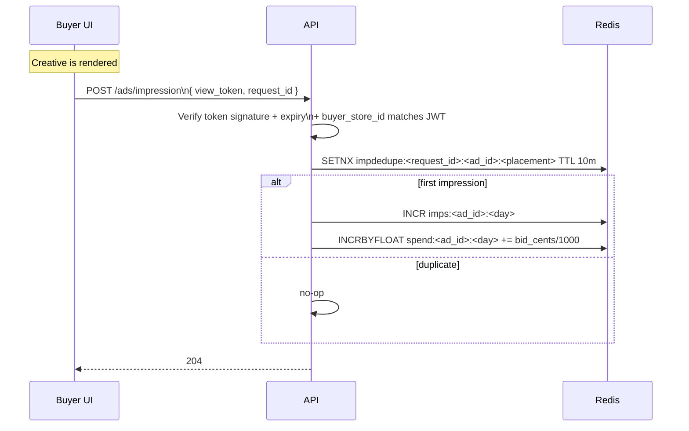
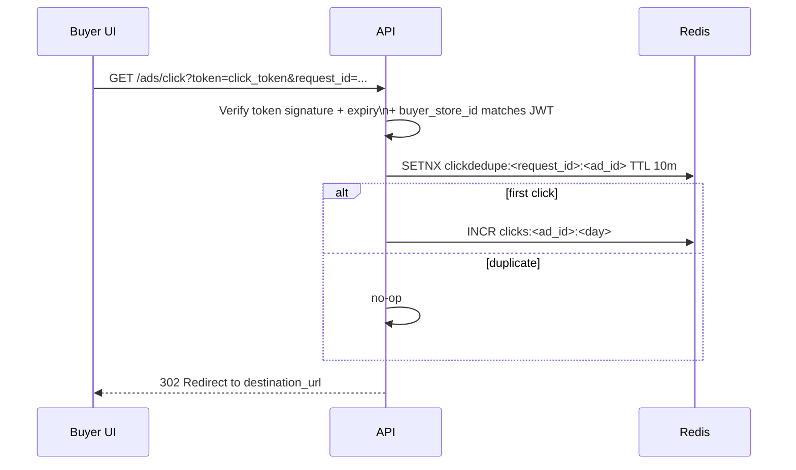

````md
# PackFinderz Ads Engine — Hybrid Attribution + Server-Truth Billing (Phase 19 Source of Truth)

This document defines the **ad serving + tracking + attribution + billing** mental model for PackFinderz Phase 19.

**Non-negotiables:**
- **Postgres** remains the **source of truth** for Ads/Creatives/Budgets/Status + rollups + billing artifacts.
- **Redis** remains the **source of truth for realtime pacing** (impressions/clicks/spend counters + dedupe guards).
- **Attribution (ROAS credit)** uses a **hybrid approach**:
  - server issues **signed attribution tokens** on serve/click
  - client stores tokens (30d sliding window)
  - server **materializes attribution at checkout validation** into **vendor_orders + vendor_order_line_items**
- We DO NOT require a separate `ad_clicks` table for attribution in MVP (can be added later if needed).

---

## 0) Core idea (so the diagrams make sense)

You’re building **request-time ad serving** (pick a winner when the buyer loads a page), with:

- **Postgres = truth**  
  Ads, creatives, bids, budgets, state machine, rollups, usage charges.
- **Redis = realtime counters + guards**  
  Daily impressions/clicks/spend per ad, budget gating, idempotency/dedupe keys.
- **Scheduler/worker = deterministic settlement**  
  Read Redis daily counters → write `ad_daily_rollups` + `usage_charges` → outbox → pubsub → BigQuery/Stripe bridge.

**Key design principle:**  
You do NOT charge per event row in Postgres in realtime. You count fast in Redis and settle daily into Postgres.

---

## 1) Ad state machine (Phase 19A)

```mermaid
stateDiagram-v2
  [*] --> draft
  draft --> active: vendor activates\n(valid license + subscription)
  active --> paused: vendor pauses
  paused --> active: resume
  active --> exhausted: daily budget spent\n(or total budget spent)
  exhausted --> active: next day starts\n(daily budget resets)
  active --> expired: end_at reached\n(ASSUMPTION)
  paused --> expired: end_at reached\n(ASSUMPTION)
  expired --> archived: cleanup/admin\n(ASSUMPTION)
````

**Serving logic only considers:** `status=active` + time window.
“Exhausted” is effectively computed via Redis budget gating.

---

## 2) Serving + token issuance flow (Phase 19B)

This is the request-time engine: buyer opens a page, API selects an eligible ad, returns creative + signed tokens.

**Important modeling constraint:**

* **Hero banners** are not a special target type.
* Every served ad must resolve to:

  * `target_type=store` + `target_id=store_id` (promote_store), OR
  * `target_type=product` + `target_id=product_id` (promote_product)

```mermaid
sequenceDiagram
  participant UI as Buyer UI
  participant API as API (Go)
  participant PG as Postgres
  participant R as Redis

  UI->>API: GET /ads/serve?placement=hero_home&state=OK&...
  API->>PG: Query candidates\n(status=active, placement)\n+ store gating\n(subscription_active + kyc verified)\n+ time window
  PG-->>API: candidate_ads[]

  API->>R: Budget gate each candidate\nGET spend/imps/clicks by adId+day
  R-->>API: counters

  API->>API: Pick winner\n(highest CPM bid)\n+ deterministic tie-break
  API->>API: Mint signed tokens\n(view token + click token)\n(event_type=view/click)\n(target_type+target_id included)\n(expires_at = now + 30d)

  API-->>UI: creative payload\n+ view_token + click_token\n+ tracking URLs (optional)
```

### Winner selection policy (MVP)

* **Highest `bid_cents` (CPM) wins**
* Deterministic tie-breaker:

  * `hash(request_id + placement + YYYYMMDD + ad_id)` (lowest hash wins)

**ASSUMPTION:** one winner per placement request. (Multi-slot can be added later.)

---

## 3) Impression + click tracking (server-truth counters)

Even though attribution is client-carried, **counters remain server-truth** for billing + pacing.

### Impression counting

* Impression is counted when the creative is actually rendered (client fires).
* Server verifies token and increments Redis.



### Click counting + redirect

* Click goes through the server redirect endpoint.
* Server verifies token, increments Redis clicks, then redirects.
* No click row required in Postgres for attribution.



---

## 4) The hybrid attribution model (client-carried, server-materialized)

### What the client stores (30d sliding window)

Client stores a bounded list of the most recent tokens, not raw IDs.

* Storage: cookie or localStorage
* Window: 30 days (token `expires_at`)
* Bounded: e.g., max 50 tokens
* Dedup rule (recommended):

  * keep only the most recent token per `(event_type, target_type, target_id, ad_id)` (or per `(event_type, target_type, target_id)`)

### Token schema (server-signed “receipt”)

**Minimum required fields:**

* `token_id` (uuid)
* `ad_id`
* `creative_id`
* `placement`
* `target_type` (`store|product`)
* `target_id` (store_id|product_id)
* `buyer_store_id` (bind token to tenant)
* `event_type` (`impression|click`)
* `occurred_at`
* `expires_at` (occurred_at + 30d)
* `request_id` or `nonce` (for tie-break + debugging)
* `sig` (HMAC/JWT signature)

**Server acceptance rules:**

* signature valid
* not expired
* `buyer_store_id == JWT.activeStoreId`
* enums valid

---

## 5) Checkout-time materialization (MVP + v2) — **done during checkout validation**

### Core requirement

At checkout, the server must take the cart’s token bag and produce:

* **order-level store attribution** on each `vendor_order`
* **line-item product attribution** on each `vendor_order_line_item`

This is what makes analytics deterministic and ensures the consumer can attribute “EVERY ad associated with that order”.

---

## 6) Attribution decision rules (deterministic + explainable)

### 6.1 Token priority (global)

1. **click > impression**
2. **more recent wins**
3. tie-breaker: stable hash (e.g., `hash(token_id)` or `hash(request_id + token_id)`)

### 6.2 Order-level attribution (store-level only)

For each `vendor_order` (one per vendor in checkout):

* Consider tokens where:

  * `target_type=store`
  * `target_id == vendor_store_id`
* Choose best by:

  * click > impression
  * recency
  * tie-break hash
* Store as:

  * `vendor_orders.attribution` JSONB (order.primary_attributed_token)

### 6.3 Line-item attribution (product-level only)

For each `vendor_order_line_item`:

* Consider tokens where:

  * `target_type=product`
  * `target_id == line_item.product_id`
* Choose best by:

  * click > impression
  * recency
  * tie-break hash
* Store as:

  * `vendor_order_line_items.attribution` JSONB (line_item.attributed_token)
* If no matching product token exists:

  * line_item attribution is `null` in MVP (see v2 fallback below)

---

## 7) Checkout attribution computation flow

```mermaid
flowchart TD
  A[Checkout validation starts] --> B[Load CartRecord + line items grouped by vendor]
  B --> C[Load cart_record.attribution_tokens[]]
  C --> D[Validate tokens:\nsignature + expiry + buyer_store_id]
  D --> E[Group tokens by:\nstore target_id\nproduct target_id]

  E --> F[For each vendor_order:\ncompute order.primary_attributed_token\n(store tokens only)]
  E --> G[For each line_item:\ncompute line_item.attributed_token\n(product tokens only)]

  F --> H[Persist vendor_orders.attribution]
  G --> I[Persist vendor_order_line_items.attribution]

  H --> J[Checkout creates\ncheckout_group + vendor_orders + line_items]
  I --> J
```

---

## 8) MVP vs v2 rules (explicit)

### MVP (Phase 19 shipping target)

* Order-level attribution uses **store tokens only**
* Line-item attribution uses **product tokens only**
* If line item has no product token: `null`
* Analytics consumer emits:

  * per-order store attribution row (if present)
  * per-line-item product attribution row (if present)

### v2 upgrade (when you care)

Add a fallback rule for line items:

For each line item:

1. try product-match tokens first (click > impression)
2. else **fallback to the vendor order’s store token**
3. store both:

   * `line_item.attributed_token` (now never null if order has store attribution)
   * `order.primary_attributed_token`

```mermaid
flowchart LR
  LI[Line Item] --> P{Has product token?}
  P -->|Yes| P1[Pick best product token\n(click>impression, recency)]
  P -->|No| S{Order has store token?}
  S -->|Yes| S1[Fallback to order.primary_attributed_token]
  S -->|No| N1[Null attribution]
```

---

## 9) Daily rollup + billing bridge (Phase 19C)

Postgres becomes the auditable receipt via deterministic daily settlement.

```mermaid
flowchart TD
  subgraph Realtime (Day N)
    I[POST /ads/impression] --> R[(Redis counters)]
    C[GET /ads/click] --> R
    R -->|imps/clicks/spend by adId+day| R
  end

  subgraph Daily Scheduler (Nightly)
    S[ads_rollup_daily] --> R
    S --> PG[(Postgres)]
    S --> OUT[OutboxEvent: ad_spend_rolled_up]
  end

  subgraph Postgres Truth
    PG --> ROLL[ad_daily_rollups]
    PG --> UC[usage_charges (daily)]
  end

  OUT --> PS[(Pub/Sub)]
  PS --> A1[Analytics consumer] --> BQ[(BigQuery)]
  PS --> B1[Billing consumer] --> STRIPE[Stripe metered usage\n(ASSUMPTION)]
```

### Rollup behavior (deterministic, idempotent)

For each `ad_id`:

* Read from Redis:

  * `impressions_today`
  * `clicks_today`
  * `spend_today` (float)
* Write to Postgres:

  * upsert `ad_daily_rollups(ad_id, day)`
  * insert `usage_charges(store_id, type=ad_spend, for_date=day, amount_cents=round(spend_today))`

    * enforced by unique(store_id, type, for_date)

---

## 10) Analytics emission requirement (“EVERY ad associated with that order”)

Because attribution is stamped into order + line items at checkout time, the analytics consumer MUST:

* emit a store-attribution row for each `vendor_order` that has `order.primary_attributed_token`
* emit a product-attribution row for each `vendor_order_line_item` that has `line_item.attributed_token`

This allows ROAS calculations without reconstructing attribution later.

---

## 11) Redis vs Postgres responsibilities (clean separation)

### Redis (fast + ephemeral)

* `imps:<adId>:<YYYYMMDD>`
* `clicks:<adId>:<YYYYMMDD>`
* `spend:<adId>:<YYYYMMDD>`
* dedupe guards:

  * `impdedupe:<request_id>:<ad_id>:<placement>`
  * `clickdedupe:<request_id>:<ad_id>`

### Postgres (truth + audit + billing artifacts)

* ads / creatives / bids / budgets / status
* `cart_records.attribution_tokens` (validated “memory”)
* `vendor_orders.attribution` (order.primary_attributed_token)
* `vendor_order_line_items.attribution` (line_item.attributed_token)
* `ad_daily_rollups`
* `usage_charges`

---

## 12) Failure mode rules (must)

* If **Redis is unavailable**:

  * `/ads/serve` MUST fail closed (serve no ads)
  * `/ads/impression` and `/ads/click` MUST fail closed (no untracked billing)
* If token verification fails:

  * impression/click should be rejected (4xx) and not counted
* Checkout must not fail solely due to invalid tokens:

  * drop invalid tokens, proceed without attribution

---

## 13) Implementation notes (scope anchors)

* No separate `ad_clicks` attribution ledger in MVP.
* Attribution is determined **only** from:

  * signed tokens (validated)
  * cart contents (vendor grouping + product ids)
* Hero banners must resolve to `target_type + target_id` (store or product) at serve-time.

---

## 14) Open Questions (only if needed)

* (ASSUMPTION) Token signing format: HMAC payload vs JWT HS256 — choose one and standardize.
* (ASSUMPTION) Max token list size + dedupe rule — recommend max 50 + keep most recent per (event_type, target_type, target_id).
* (ASSUMPTION) Whether checkout stores raw token bag in checkout_group in addition to computed attributions (optional for debugging).

```
::contentReference[oaicite:0]{index=0}
```
