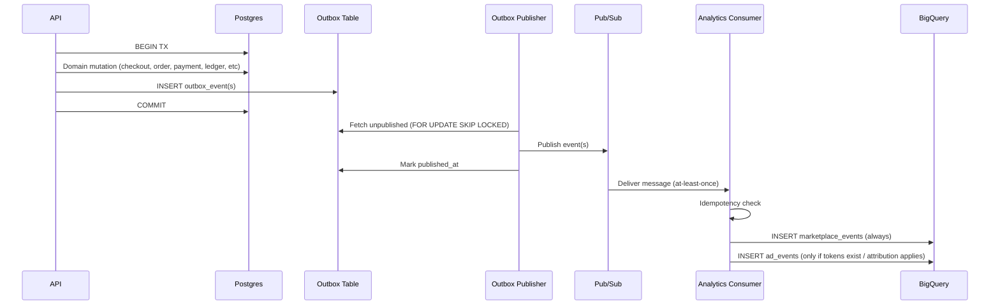

# 📊 PackFinderz — Analytics Service (Canonical Spec)

**Status:** LOCKED unless explicitly marked otherwise
**Audience:** Backend engineers, data engineers, LLM ticket generators
**Purpose:** Define the exact analytics event lifecycle, schemas, contracts, workers, routing rules, and edge cases for the MVP + the updated cart→order snapshot + ad token attribution model.

---

## 1. Analytics Philosophy (Non-Negotiable)

1. **Postgres is the source of truth**
2. **Analytics are derived, never authoritative**
3. **All analytics are event-driven**
4. **All events originate from domain commits**
5. **At-least-once delivery is expected**
6. **Consumers MUST be idempotent**
7. **BigQuery is append-only**
8. **Analytics never infer business correctness** — they persist what domain snapshots say

**Hard rules:**

* ❌ No request-time analytics writes
* ❌ No synchronous analytics mutations in the API
* ❌ No cron-generated “inferred” analytics facts (cron MAY drive domain state changes that emit events)

---

## 2. End-to-End Analytics Flow (Canonical)



---

## 3. Analytics Event Origin Rules (LOCKED)

Analytics events **MUST ONLY** be emitted from:

* domain services
* inside the **same DB transaction**
* that mutates authoritative state

❌ No API request logging as analytics events
❌ No consumer inventing events
❌ No “analytics-only” outbox rows created outside domain commits

---

## 4. Event Taxonomy (MVP) — Updated & Locked

### 4.1 Canonical Analytics Event Types

**All MVP analytics events are order-scoped.**
**Analytics never reference `cart_items` directly** — only **order snapshots derived from cart**.

| Event Type         | Aggregate    | Emitted When                              | References                                 |
| ------------------ | ------------ | ----------------------------------------- | ------------------------------------------ |
| `order_created`    | vendor_order | Vendor order snapshot committed from cart | `order_id`, `checkout_group_id`,           |
| `order_paid`       | vendor_order | Payment confirmed for an order            | `order_id`                                 |
| `cash_collected`   | vendor_order | Cash/settlement recorded (ledger-driven)  | `order_id`                                 |
| `order_canceled`   | vendor_order | Order canceled                            | `order_id`                                 |
| `order_expired`    | vendor_order | TTL expiry applied to order               | `order_id`                                 |
| `refund_initiated` | vendor_order | **FUTURE**                                | `order_id`                                 |

> Future event types can be added and should be able to be added without conflict

### 4.2 Notes on “paid” semantics

* `order_paid` **MUST reference the order** (`order_id`).
* If you later split “payment authorized” vs “captured” vs “payout”, those are **new event types**, not overloads.

---

## 5. Outbox → Analytics Routing Rules (Canonical)

### 5.1 Outbox is a fan-out intent log (LOCKED)

> **One domain transaction → many downstream intents**
> Each intent is its **own outbox row**, with:

* its own `event_type`
* its own consumer(s)
* its own delivery guarantee

**Example: checkout commit (one DB TX):**

```text
1) INSERT vendor_orders (N rows)
2) INSERT order_line_items (snapshot)
3) INSERT outbox_event (order_created → analytics)
4) INSERT outbox_event (order_created → notifications)
5) COMMIT
```

### 5.2 Publisher responsibilities (LOCKED)

* Publisher does **not** decide analytics meaning.
* Publisher only routes based on:

  * `event_type`
  * registry mapping
  * destination topic (or derived topic)

Unknown/invalid `event_type` **MUST be rejected** and DLQ’d.

### 5.3 Required registry mapping

```go
AnalyticsEventRegistry = map[string]string{
  "order_created":  "analytics.marketplace",
  "order_paid":     "analytics.marketplace",
  "cash_collected": "analytics.marketplace",
  "order_canceled": "analytics.marketplace",
  "order_expired":  "analytics.marketplace",
  // future:
  "refund_initiated": "analytics.marketplace",
}
```

**Important constraint (LOCKED):**
The **payload may differ per consumer**, but the **domain fact does not**.

---

## 6. Analytics Pub/Sub Envelope (LOCKED)

Every analytics message uses the same envelope:

```json
{
  "event_id": "uuid",
  "event_type": "order_created",
  "aggregate_type": "vendor_order",
  "aggregate_id": "uuid",
  "occurred_at": "2026-02-01T12:34:56Z",
  "payload": {}
}
```

Rules:

* `event_id` globally unique
* `occurred_at` reflects **domain time**, not publish time
* `payload` is event-specific (see below)

---

## 7. Event Payload Contracts (Exact) — Updated to Cart→Order Snapshot Model

### 7.0 Key rule (LOCKED)

> Analytics payloads are derived from **order snapshots**, not live cart tables.

Cart tables exist to:

* validate
* price
* group
* snapshot

After checkout commits, analytics reads **order snapshot state**.

### 7.1 `order_created` (authoritative)

**Emitted:** after checkout transaction commits
**Granularity:** one event per **VendorOrder**
**Source of payload:** cart snapshot flattened into vendor-order scope (derived from `cart_records`, `cart_items`, `cart_vendor_groups` at checkout time, then persisted as order snapshot tables)

```json
{
  "checkout_group_id": "uuid",
  "cart_id": "uuid",
  "order_id": "uuid",

  "buyer_store_id": "uuid",
  "vendor_store_id": "uuid",

  "currency": "USD",

  "subtotal_cents": 100000,
  "discounts_cents": 5000,
  "total_cents": 95000,

  "items": [
    {
      "product_id": "uuid",
      "quantity": 5,

      "moq": 1,
      "max_qty": null,

      "unit_price_cents": 20000,

      "applied_volume_tier_min_qty": 5,
      "applied_volume_tier_unit_price_cents": 19000,

      "line_subtotal_cents": 95000,

      "status": "ok",
      "warnings": []
    }
  ],

  "order_snapshot_status": "pending_vendor_approval",
  "attributed_ad_tokens": ["token_id_1", "token_id_2"]
}
```

**Notes (LOCKED):**

* `items[].status` reflects the snapshot outcome at checkout time (e.g. `ok`, `not_available`, `invalid`)
* `warnings` is persisted snapshot metadata
* Analytics does **not** revalidate pricing/availability
* `attributed_ad_tokens` comes from `cart_records.ad_tokens[]` and is copied into order snapshot

### 7.2 `cash_collected`

**Emitted:** when cash/settlement recorded in ledger
**Order-scoped.**

```json
{
  "order_id": "uuid",
  "buyer_store_id": "uuid",
  "vendor_store_id": "uuid",
  "amount_cents": 95000,
  "cash_collected_at": "timestamp"
}
```

### 7.3 `order_paid`

**Emitted:** when payment confirmed
**Order-scoped.**

```json
{
  "order_id": "uuid",
  "vendor_store_id": "uuid",
  "amount_cents": 95000,
  "paid_at": "timestamp"
}
```

### 7.4 `order_canceled`

```json
{
  "order_id": "uuid",
  "buyer_store_id": "uuid",
  "vendor_store_id": "uuid",
  "canceled_at": "timestamp",
  "reason": "buyer_cancel"
}
```

### 7.5 `order_expired`

```json
{
  "order_id": "uuid",
  "buyer_store_id": "uuid",
  "vendor_store_id": "uuid",
  "expired_at": "timestamp",
  "ttl_days": 10
}
```

---

## 8. Analytics Consumer Responsibilities (LOCKED)

### 8.1 Binary

* `cmd/analytics-worker`
* long-running
* subscribes to analytics Pub/Sub subscription(s)

### 8.2 Idempotency (REQUIRED)

Before any side effect:

```text
Redis Key:
pf:evt:processed:analytics:<event_id>
TTL: PACKFINDERZ_EVENTING_IDEMPOTENCY_TTL (default 720h)
```

If key exists → ACK without processing.

### 8.3 Write behavior (LOCKED)

For every message:

1. write **one row** to `marketplace_events`
2. then, **conditionally** write to `ad_events` based on tokens

---

## 9. BigQuery — Marketplace Events Table (REAL schema = source of truth)

Table: `packfinderz_analytics.marketplace_events` (name may vary; schema is locked)

```json
[
  { "name": "event_id", "type": "STRING" },
  { "name": "event_type", "type": "STRING" },
  { "name": "occurred_at", "type": "TIMESTAMP" },
  { "name": "checkout_group_id", "type": "STRING" },
  { "name": "order_id", "type": "STRING" },
  { "name": "buyer_store_id", "type": "STRING" },
  { "name": "vendor_store_id", "type": "STRING" },
  { "name": "attributed_ad_click_id", "type": "STRING" },
  { "name": "payload", "type": "JSON" }
]
```

Rules:

* append-only
* partition by `DATE(occurred_at)`
* analytics consumer writes only
* no updates
* no deletes

**Note on attribution column:** `attributed_ad_click_id` remains in schema even if attribution is now token-based.
**ASSUMPTION:** For MVP, set it to `NULL` (or populate later if you also mint/store click_id inside token claims).

---

## 10. Ads Attribution in Analytics (LOCKED) — Token Receipt Model

### 10.1 New invariant (LOCKED)

> Ad attribution is validated at checkout, not analytics time.
> Analytics **trusts tokens** and does **not validate ads**.

### 10.2 Token schema (server-signed receipt) — Minimum fields

* `token_id` (uuid)
* `ad_id`
* `creative_id`
* `placement`
* `target_type` (`store|product`)
* `target_id` (store_id|product_id)
* `buyer_store_id` (bind token to tenant)
* `event_type` (`impression|click`)
* `occurred_at`
* `expires_at` (occurred_at + 30d)
* `request_id` or `nonce`
* `sig` (HMAC/JWT signature)

### 10.3 Server acceptance rules (checkout time)

* signature valid
* not expired
* `buyer_store_id == JWT.activeStoreId`
* enums valid

### 10.4 Attribution flow

```mermaid
flowchart LR
  Click[Ad Click] --> Token[Server-signed token]
  Token --> Cart[cart_records.ad_tokens[]]
  Cart --> Order[order snapshot]
  Order --> AnalyticsConsumer
```

### 10.5 Analytics consumer behavior (LOCKED)

1. Always write marketplace event
2. Only process ad events if `attributed_ad_tokens` exist (non-empty)
3. Tokens are treated as receipts, not claims

### 10.6 Token → attribution logic (consumer)

For each token in `attributed_ad_tokens`:

* extract claims (do not revalidate signature in MVP unless required for security hardening)
* determine attribution:

  * `target_type == store` → attribute order total
  * `target_type == product` → attribute only matching line items by `product_id == target_id`
* emit `ad_event(type=conversion)` with attributed revenue cents

**ASSUMPTION:** If multiple tokens exist, attribution strategy is “last applicable token by occurred_at” per target. If you want a different rule (e.g., prefer click over impression; last-click overall; one token max at checkout), encode that in checkout and keep consumer dumb.

---

## 11. BigQuery — Ad Events Table (REAL schema = source of truth)

```json
[
  { "name": "event_id", "type": "STRING" },
  { "name": "occurred_at", "type": "TIMESTAMP" },
  { "name": "ad_id", "type": "STRING" },
  { "name": "vendor_store_id", "type": "STRING" },
  { "name": "buyer_store_id", "type": "STRING" },
  { "name": "buyer_user_id", "type": "STRING" },
  { "name": "type", "type": "STRING" },
  { "name": "payload", "type": "JSON" }
]
```

Payload SHOULD include:

* `order_id`
* `checkout_group_id`
* `target_type`
* `target_id`
* `attributed_revenue_cents`
* `token_id`
* `creative_id`
* `placement`

---

## 12. Failure & Edge Cases (MANDATORY)

### 12.1 Duplicate events

Handled by Redis idempotency.

### 12.2 Partial checkout (LOCKED)

Order snapshot is the source of truth. If:

* items rejected
* items clamped to MOQ
* vendor partially approves later

That must be visible in the snapshot payload fields (`status`, `warnings`, `order_snapshot_status`, etc).

### 12.3 Order retry

Retry creates **new checkout_group_id/cart_id/order_id** as applicable.
Analytics reflect new events; no mutation semantics.

### 12.4 Missing ad click / no tokens (LOCKED)

* Marketplace events always emitted
* Ad event processing only initiates if `ad_tokens` exist on the order snapshot
* No token → no attribution → no `ad_events` rows

### 12.5 Worker crash mid-processing

Safe due to:

* outbox retries
* Pub/Sub redelivery
* idempotency prevents double-writes

---

## 13. Explicit Non-Responsibilities (LOCKED)

Analytics do NOT:

* enforce billing
* trigger payouts
* affect order state
* drive product logic
* validate pricing, availability, inventory, or ad legitimacy

Analytics are observational only.

## 14. Summary Mental Model (LOCKED)

> **Domain commits truth → Outbox guarantees intent → Pub/Sub transports facts →
> Analytics writes immutable history → Ads attribution trusts server-signed receipts**
