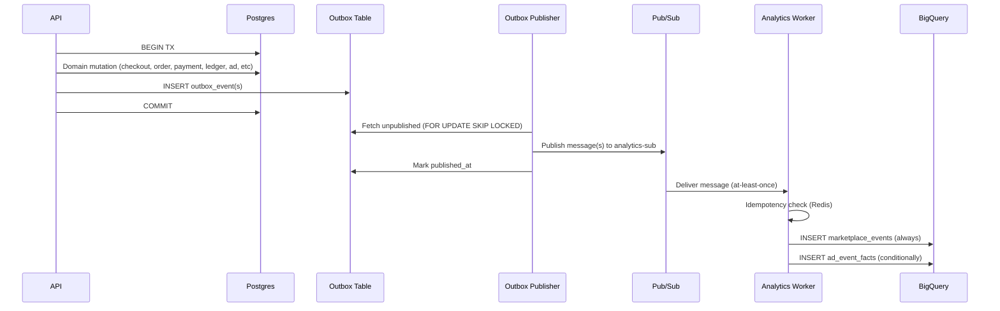

Absolutely. Here’s the **updated, consolidated Analytics doc** where the older “Canonical Spec” has been **brought up to date** using your **MOST UP TO DATE SOURCE OF TRUTH** (the draft you created).

Key changes applied (silently, in the content):

* Keeps the **Canonical Spec structure and “LOCKED” tone** where appropriate
* Aligns with the **new tables + fields** (flattened columns + embedded `items` JSON, `ad_event_facts`)
* Reconciles the **token attribution receipt model** with the **new draft attribution rules**
* Resolves conflicts like “BQ append-only” vs “consumer must be idempotent” by making **idempotency required** and **BQ append-only** still true
* Updates routing, payload contracts, and schemas to match the new document

---

# 📊 PackFinderz Analytics Engine — Architecture & Data Model (CANONICAL SPEC v1 — UPDATED)

**Status:** DRAFT – for review & correction (becomes LOCKED once approved)
**Audience:** Backend engineers, data engineers, LLM ticket generators
**Scope:** Marketplace Analytics + Ad Analytics (MVP)
**Source of Truth:** BigQuery (BQ)
**Processing Model:** Event-driven via Outbox → Pub/Sub → Dedicated Analytics Consumer

---

## 1. Analytics Philosophy (Non-Negotiable)

1. **Postgres is the transactional source of truth**
2. **BigQuery is the analytics source of truth**
3. **Analytics are derived and observational, never authoritative**
4. **All analytics are event-driven**
5. **All events originate from domain commits**
6. **At-least-once delivery is expected**
7. **Consumers MUST be idempotent**
8. **BigQuery is append-only**
9. **Analytics never infer business correctness** — they persist what domain snapshots say

**Hard rules:**

* ❌ No request-time analytics writes
* ❌ No synchronous analytics mutations in the API
* ❌ No consumer inventing events
* ✅ Cron MAY drive domain state changes that emit events (e.g., ad daily charge events)

---

## 2. End-to-End Analytics Flow (Canonical)



---

## 3. Analytics Event Origin Rules (LOCKED)

Analytics events MUST ONLY be emitted from:

* domain services
* inside the same DB transaction that mutates authoritative state

❌ No API request logging as analytics events
❌ No analytics-only outbox rows created outside domain commits
❌ No consumer creating “synthetic” events

---

## 4. Event Taxonomy (MVP) — Locked

### 4.1 Canonical Analytics Event Types

**All MVP analytics events are order-scoped.**
Analytics must not reference live cart item tables at query time; it relies on order snapshots.

| Event Type         | Aggregate      | Emitted When                              |
| ------------------ | -------------- | ----------------------------------------- |
| `order_created`    | `vendor_order` | Vendor order snapshot committed from cart |
| `order_paid`       | `vendor_order` | Payment confirmed for an order            |
| `cash_collected`   | `vendor_order` | Cash/settlement recorded (ledger-driven)  |
| `order_canceled`   | `vendor_order` | Order canceled                            |
| `order_expired`    | `vendor_order` | TTL expiry applied to order               |
| `refund_initiated` | `vendor_order` | **FUTURE**                                |

### 4.2 Notes on paid semantics

* `order_paid` MUST reference `order_id`
* If later splitting “authorized vs captured vs payout,” those are NEW event types

---

## 5. Outbox → Analytics Routing Rules (Canonical)

### 5.1 Outbox is an intent log (LOCKED)

One domain transaction may produce multiple outbox rows, each routed independently.

### 5.2 Publisher responsibilities (LOCKED)

Publisher does not decide analytics meaning. It only routes based on:

* `event_type`
* registry mapping
* destination topic/subscription

Unknown/invalid `event_type` MUST be rejected and DLQ’d.

### 5.3 Required registry mapping

```go
AnalyticsEventRegistry = map[string]string{
  "order_created":    "analytics.marketplace",
  "order_paid":       "analytics.marketplace",
  "cash_collected":   "analytics.marketplace",
  "order_canceled":   "analytics.marketplace",
  "order_expired":    "analytics.marketplace",
  // future:
  "refund_initiated": "analytics.marketplace",
  // ads:
  "ad_impression":            "analytics.ads",
  "ad_click":                 "analytics.ads",
  "ad_daily_charge_recorded": "analytics.ads",
}
```

> Canonical event types for this registry live under `pkg/enums/analytics_event_type.go` (ad-specific fact types land in `pkg/enums/ad_event_fact_type.go` so the BigQuery insert helpers only emit valid `type` values).

**Note:** Topic/subscription naming may be collapsed to one `analytics-sub` in MVP. The registry still exists for future fan-out.

---

## 6. Analytics Pub/Sub Envelope (LOCKED)

Every analytics message MUST use the same envelope:

```json
{
  "event_id": "uuid",
  "event_type": "order_created",
  "aggregate_type": "vendor_order",
  "aggregate_id": "uuid",
  "occurred_at": "2026-02-01T12:34:56Z",
  "payload": {}
}
```

> The Go consumer enforces this contract via `internal/analytics/types.Envelope` so every handler receives the same, typed metadata before routing into BigQuery.

Rules:

* `event_id` globally unique
* `occurred_at` reflects domain time, not publish time
* `payload` is event-specific (see below)

---

## 7. Event Payload Contracts (Order Snapshot Model)

### 7.0 Key Rule (LOCKED)

Analytics payloads are derived from **order snapshots**, not live cart tables.

### 7.1 `order_created` payload (authoritative)

Emitted after checkout commit. One event per `VendorOrder`.

```json
{
  "checkout_group_id": "uuid",
  "cart_id": "uuid",
  "order_id": "uuid",

  "buyer_store_id": "uuid",
  "vendor_store_id": "uuid",

  "currency": "USD",

  "subtotal_cents": 100000,
  "discounts_cents": 5000,
  "tax_cents": 0,
  "transport_fee_cents": 0,
  "total_cents": 95000,

  "shipping_address": {
    "postal_code": "73112",
    "lat": 35.52,
    "lng": -97.56
  },

  "items": [
    {
      "product_id": "uuid",
      "title": "Product Name",
      "category": "Flower",
      "classification": "Indica",

      "qty": 5,
      "moq": 1,
      "max_qty": null,

      "unit_price_cents": 20000,
      "line_subtotal_cents": 95000,
      "line_total_cents": 95000,
      "discount_cents": 0,

      "status": "ok",
      "warnings": []
    }
  ],

  "order_snapshot_status": "pending_vendor_approval",
  "attributed_ad_tokens": ["token_1", "token_2"]
}
```

**Notes (LOCKED)**

* `items[].status` reflects snapshot outcome at checkout time
* Analytics MUST NOT revalidate pricing/availability
* `attributed_ad_tokens[]` is copied from cart snapshot into the order snapshot

### 7.2 `order_paid`

```json
{
  "order_id": "uuid",
  "vendor_store_id": "uuid",
  "amount_cents": 95000,
  "paid_at": "timestamp"
}
```

### 7.3 `cash_collected`

```json
{
  "order_id": "uuid",
  "buyer_store_id": "uuid",
  "vendor_store_id": "uuid",
  "amount_cents": 95000,
  "cash_collected_at": "timestamp"
}
```

### 7.4 `order_canceled`

```json
{
  "order_id": "uuid",
  "buyer_store_id": "uuid",
  "vendor_store_id": "uuid",
  "canceled_at": "timestamp",
  "reason": "buyer_cancel"
}
```

### 7.5 `order_expired`

```json
{
  "order_id": "uuid",
  "buyer_store_id": "uuid",
  "vendor_store_id": "uuid",
  "expired_at": "timestamp",
  "ttl_days": 10
}
```

---

## 8. Analytics Worker (Dedicated Consumer)

### 8.1 Binary

* `cmd/analytics-worker`
* long-running
* subscribes to `analytics-sub`

> `internal/analytics/router` handles the canonical `event_type` routing and typed payload decoding before analytics handlers execute against the BigQuery writer interface.

> `cmd/analytics-worker` is the canonical analytics ingestion service; it points at `PACKFINDERZ_PUBSUB_ANALYTICS_SUBSCRIPTION`, decodes the canonical envelope described above, and relies on `PACKFINDERZ_EVENTING_IDEMPOTENCY_TTL` plus `pkg/outbox/idempotency.Manager` so duplicates are skipped before any handler runs.

### 8.2 Responsibilities

* Deserialize envelope
* Route by `event_type`
* Perform idempotency check
* Write analytics records to BigQuery

### 8.3 Idempotency (REQUIRED)

Before any side effect:

* Redis Key: `pf:evt:processed:analytics:<event_id>`
* TTL: `PACKFINDERZ_EVENTING_IDEMPOTENCY_TTL` (default 720h)

If key exists:

* ACK immediately (do not re-insert)

### 8.4 Write behavior (LOCKED)

For every message:

1. Write **one row** to `marketplace_events` (always)
2. Conditionally write to `ad_event_facts` if tokens exist / attribution applies

---

## 9. BigQuery Tables (BQ = analytics truth)

### 9.1 Marketplace Analytics Table (UPDATED SCHEMA)

**Table:** `packfinderz_analytics.marketplace_events`
**Write Mode:** append-only
**Partition:** `DATE(occurred_at)`

#### Columns (flattened + items JSON)

```text
event_id                STRING
event_type              STRING
occurred_at             TIMESTAMP

checkout_group_id       STRING
order_id                STRING
buyer_store_id          STRING
vendor_store_id         STRING

buyer_zip               STRING
buyer_lat               FLOAT
buyer_lng               FLOAT

subtotal_cents          INT64
discounts_cents         INT64
tax_cents               INT64
transport_fee_cents     INT64

gross_revenue_cents     INT64        -- = total_cents
refund_cents            INT64        -- future (default 0)
net_revenue_cents       INT64        -- = gross - refund

attributed_ad_id        STRING       -- nullable (derived from tokens if desired)

items                   JSON         -- array of line item snapshots (MVP)
payload                 JSON         -- optional raw payload copy for debugging
```

**Notes**

* This replaces the old minimal schema that only stored a `payload` blob.
* `attributed_ad_click_id` is deprecated.
  **ASSUMPTION:** keep it nullable if it still exists physically, but do not rely on it.

> Go code uses `internal/analytics/types.MarketplaceEventRow` to match this schema when inserting rows.

---

### 9.2 Embedded `items[]` JSON Shape (LOCKED for querying)

```json
{
  "product_id": "uuid",
  "title": "Product Name",
  "category": "Flower",
  "classification": "Indica",

  "qty": 10,
  "unit_price_cents": 1200,
  "line_total_cents": 12000,
  "discount_cents": 0,

  "attributed_ad_id": "ad_uuid | null"
}
```

---

### 9.3 Ad Analytics Table (UPDATED SCHEMA)

**Table:** `packfinderz_analytics.ad_event_facts`
**Write Mode:** append-only
**Partition:** `DATE(occurred_at)`

```text
event_id                STRING
occurred_at             TIMESTAMP

ad_id                   STRING
vendor_store_id         STRING
buyer_store_id          STRING       -- nullable
type                    STRING       -- impression | click | conversion | charge
cost_cents              INT64

attributed_order_id     STRING       -- nullable

buyer_zip               STRING       -- optional
buyer_lat               FLOAT
buyer_lng               FLOAT

payload                 JSON         -- structured attribution metadata
```

> Ad inserts rely on `internal/analytics/types.AdEventFactRow` so the table and enum contract stay aligned.

Payload SHOULD include:

* `order_id`
* `checkout_group_id`
* `target_type` (`store|product`)
* `target_id` (store_id|product_id)
* `attributed_revenue_cents`
* `token_id`
* `creative_id`
* `placement`

---

## 10. Timestamp Rules (LOCKED)

| Metric                  | Timestamp Source                                   |
| ----------------------- | -------------------------------------------------- |
| Orders over time        | `created_at` (from `order_created.occurred_at`)    |
| Revenue over time       | `paid_at` → `cash_collected_at` → fallback created |
| Discounts over time     | same as revenue                                    |
| AOV                     | same as revenue                                    |
| Top products/categories | same as revenue                                    |
| Fulfillment analytics   | deferred                                           |

> Revenue time series queries rely on the `event_type` column (`order_created`, `order_paid`, `cash_collected`) plus each row’s recorded `occurred_at` so the analytics worker can append the actual event timestamps rather than using publish time.

> The helper `internal/analytics/RevenueTimestamp` encodes the `paid_at → cash_collected_at → fallback` rule so ingestion handlers always pick the right timestamp when multiple fields are available.

---

## 11. KPI Definitions (LOCKED)

* `gross_revenue_cents = total_cents`
* `refund_cents = 0` (until refund events exist)
* `net_revenue_cents = gross - refund`
* AOV:

  ```text
  AOV = SUM(gross_revenue_cents) / COUNT(DISTINCT order_id)
  ```

**Orders Count**

* include `created_pending`
* exclude canceled/expired from revenue metrics

**Top Products/Categories**

* derived by `UNNEST(items)`
* ranked by revenue

**New vs Returning**

* identity = `buyer_store_id`
* returning if any paid order exists before timeframe start

---

## 12. Ad Attribution (UPDATED Receipt Token Model)

### 12.1 Invariant (LOCKED)

Ad attribution is validated at checkout, not analytics time. Analytics trusts the tokens.

### 12.2 Token minimum fields (receipt)

* `token_id` (uuid)
* `ad_id`
* `creative_id`
* `placement`
* `target_type` (`store|product`)
* `target_id` (store_id|product_id)
* `buyer_store_id`
* `event_type` (`impression|click`)
* `occurred_at`
* `expires_at`
* `sig` (JWT/HMAC)

### 12.3 Analytics worker behavior (LOCKED)

1. Always write marketplace event
2. If `attributed_ad_tokens[]` exists:

   * decode token(s)
   * derive `attributed_ad_id` for marketplace row if needed (optional)
   * emit ad conversion row(s) to `ad_event_facts` with attributed revenue

### 12.4 Attribution Logic (MVP)

For each token:

* if `target_type == store`:

  * attribute **order total cents**
* if `target_type == product`:

  * attribute **sum of matching line items** where `product_id == target_id`

**ASSUMPTION (needs explicit confirmation):**
If multiple tokens exist, use **last applicable token by token.occurred_at** per target.
Alternative is “prefer click over impression” — if you want that, encode it here.

---

## 13. Ad Spend + ROAS (UPDATED)

### Spend source of truth

* Nightly billing job calculates cost based on Redis counters (impressions/clicks)
* Nightly job emits `ad_daily_charge_recorded`
* Worker writes `ad_event_facts` with:

  * `type=charge`
  * `cost_cents` populated

### ROAS

```text
ROAS = SUM(attributed gross revenue) / SUM(cost_cents)
```

---

## 14. Query Layer (BigQuery)

### Marketplace Queries (MVP)

* orders over time
* revenue over time
* discounts over time
* net revenue over time
* top products
* top categories
* top ZIPs (bar chart MVP)
* AOV
* new vs returning customers

> Input/output DTOs for these queries live under `internal/analytics/types` (`MarketplaceQueryRequest/Response`) so the API and service operate on typed payloads.

### Ad Queries (MVP)

* spend
* impressions
* clicks
* CPM/CPC derived
* ROAS
* avg daily impressions/clicks

> Ad query helpers reuse `types.AdQueryRequest`/`types.AdQueryResponse` for the eventual analytics query service referenced in PF-XXX.

---

## 15. Failure & Edge Cases (MANDATORY)

* Duplicate events → Redis idempotency
* Worker crash mid-processing → Pub/Sub redelivery; idempotency prevents double-writes
* Missing tokens → no ad rows written; marketplace always written
* Partial checkout outcomes are preserved via `items[].status` + `warnings`
* Order retry creates new identifiers; analytics reflects immutable history

---

## 16. Explicit Non-Responsibilities (LOCKED)

Analytics do NOT:

* enforce billing
* trigger payouts
* affect order state
* validate ads, pricing, or inventory
* write to Postgres (analytics are observational only)

---

## 17. Summary Mental Model (LOCKED)

> Domain commits truth → Outbox guarantees intent → Pub/Sub transports facts →
> Analytics writes immutable history → Ads attribution trusts server-signed receipts →
> Dashboard queries BigQuery as analytics truth

---

## Open Questions (Explicitly Deferred)

* Refund events schema & amount fields
* Fulfillment dashboards
* Conversion funnel definition
* Whether to add a dedicated line-item BQ table later (if UNNEST JSON becomes costly)
