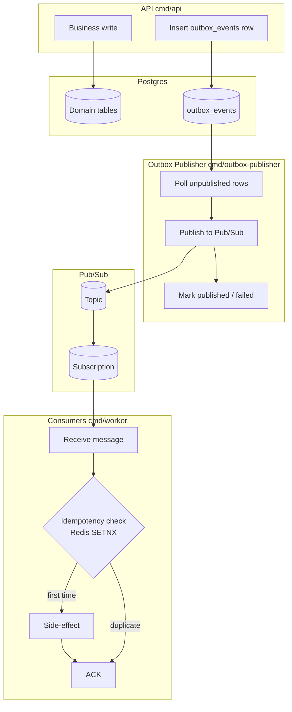
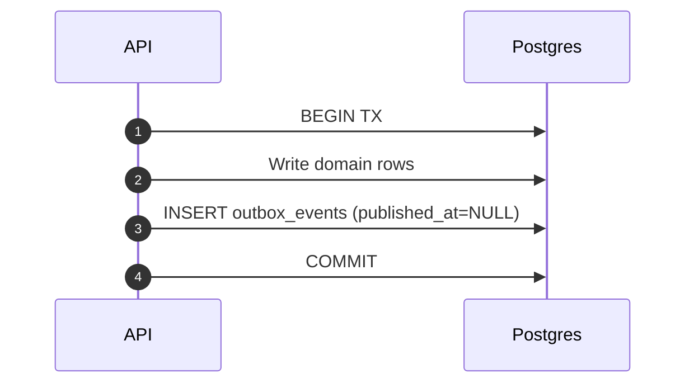
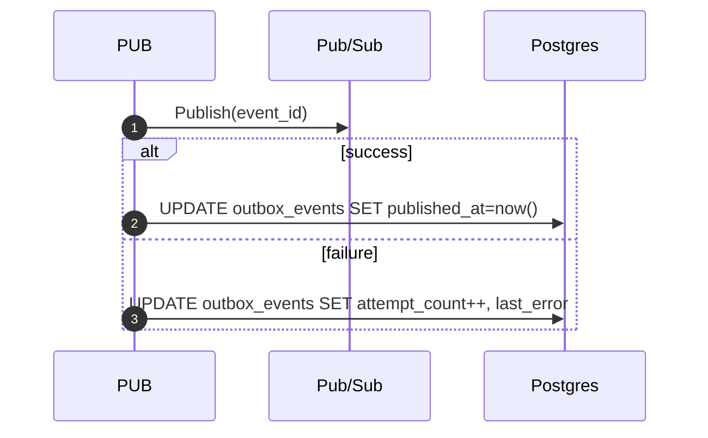
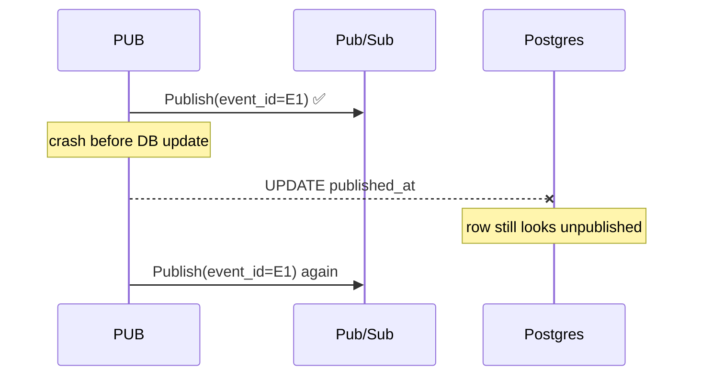
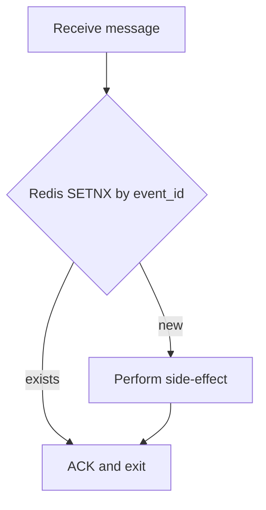
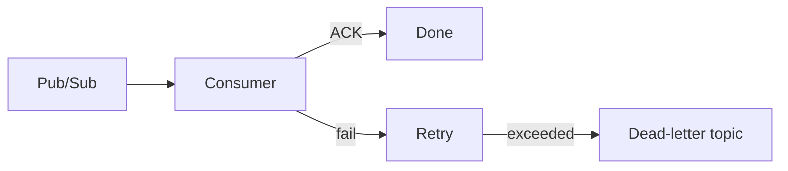

# Outbox Publisher

## Purpose

The outbox pattern keeps **domain truth in Postgres** while asynchronously publishing the same intent to Pub/Sub. Business code writes both the domain record and the matching `outbox_events` row in a **single database transaction**, so **Postgres remains the primary source of truth**, and every Outbox row is a **durable promise** that the event will eventually be published.

This document explains the **full lifecycle** of an Outbox event — from API write → publisher → Pub/Sub → consumer → idempotency — and clarifies **retries, duplicates, Redis idempotency, cleanup, and future DLQ integration**.

---

## High‑level architecture



---

## Transactional flow (authoritative truth)

1. Domain services build an `outbox.DomainEvent` and call `outbox.Service.Emit(tx, event)` **inside the same transaction** that mutates business tables.
2. The event is stored in `outbox_events` with:

   * immutable fields: `id`, `event_type`, `aggregate_type`, `aggregate_id`, `payload_json`, `created_at`
   * mutable fields: `published_at`, `attempt_count`, `last_error`
3. Once the transaction commits, **the business change is final** and the Outbox row is a durable promise that publishing will eventually happen.



If the transaction fails, **neither the domain change nor the Outbox row exists**.

---

## Publisher worker behavior (`cmd/outbox-publisher`)

The publisher is a **standalone binary** responsible only for reliably moving events **from Postgres to Pub/Sub**.

### Claiming rows safely

The worker continuously:

1. Starts a transaction
2. Selects unpublished rows:

   ```sql
   SELECT * FROM outbox_events
   WHERE published_at IS NULL
     AND attempt_count < MAX_ATTEMPTS
   ORDER BY created_at ASC
   FOR UPDATE SKIP LOCKED
   LIMIT N;
   ```
3. Commits immediately after claiming

This allows **multiple publisher instances** to run concurrently without double-publishing the same row.

### Publishing & marking results

For each claimed row:

* Publish `payload_json` as the **message body**
* Attach Pub/Sub attributes:

  * `event_id`
  * `event_type`
  * `aggregate_type`
  * `aggregate_id`
  * `created_at`

**On publish success** (Pub/Sub ACK):

* `published_at = now()`

**On publish failure**:

* `attempt_count += 1`
* `last_error = <truncated error>`
* row remains unpublished for retry



### Event registry validation

The publisher no longer guesses topics or payload contracts at runtime. Before constructing the Pub/Sub message it consults `pkg/outbox/registry`, which defines a single topic, the expected `aggregate_type`, and the typed payload struct (stored under `pkg/outbox/payloads`) for every `event_type`. The registry decodes the stored `payload_json`, ensures the payload is not `null`, and reinforces the envelope invariants (`aggregate_id` present, matching aggregate). Only then will the dispatcher fetch the publisher for the resolved topic and emit the unchanged row bytes to Pub/Sub. Unknown event types or invalid payloads become non-retryable failures (the future DLQ plumbing will capture them) so the job marks the row and moves on, keeping every dispatch scoped to the authoritative outbox row.

---

## Configuration knobs

| Env var                                 | Default            | Description                       |
| --------------------------------------- | ------------------ | --------------------------------- |
| `PACKFINDERZ_OUTBOX_PUBLISH_BATCH_SIZE` | `50`               | Rows claimed per poll             |
| `PACKFINDERZ_OUTBOX_PUBLISH_POLL_MS`    | `500`              | Base sleep between polls          |
| `PACKFINDERZ_OUTBOX_MAX_ATTEMPTS`       | `25`               | Rows at or above this are skipped |
| `PACKFINDERZ_PUBSUB_DOMAIN_TOPIC`       | `pf-domain-events` | Topic to publish to               |
| `PACKFINDERZ_EVENTING_IDEMPOTENCY_TTL`  | `720h`             | Redis TTL for processed events    |

---

## Messaging semantics (important separation of concerns)

**Outbox row lifecycle ≠ Consumer processing lifecycle**.

* The **publisher** updates `outbox_events.published_at` when **Pub/Sub accepts the message**.
* The **consumer** ACKs/NACKs Pub/Sub messages but **never touches the outbox table**.

This separation is intentional and required for scalability.

---

## Consumer idempotency (Redis)

### Why idempotency exists

There is an unavoidable crash window:



Duplicates are **expected**. Therefore consumers must be idempotent.

### Redis idempotency flow

Consumers must call the shared helper **before any side effect**:



* Redis key: `pf:evt:processed:<consumer>:<event_id>`
* Command: `SET key value NX EX <TTL>`
* TTL: `PACKFINDERZ_EVENTING_IDEMPOTENCY_TTL`

This guarantees **at-most-once side effects per consumer**, even with at-least-once delivery.

## License status changes & compliance notifications

Whenever a license is uploaded, approved, or rejected the domain service queues a `license_status_changed` outbox event whose payload contains `licenseId`, `storeId`, `status`, and an optional `reason`.

The publisher flows these envelopes through `PACKFINDERZ_PUBSUB_DOMAIN_TOPIC`, and the worker listens via `PACKFINDERZ_PUBSUB_DOMAIN_SUBSCRIPTION`. The compliance consumer invokes `pkg/outbox/idempotency.Manager.CheckAndMarkProcessed` with `PACKFINDERZ_EVENTING_IDEMPOTENCY_TTL`, then persists notifications:

* **Admin notice** – `status=pending` writes a `notifications` record (type `compliance`) so admins know a review ticket is waiting.
* **Store notice** – `status=verified` or `status=rejected` publishes the decision back to the originating store, linking the license and sharing any reason.

Failures remove the idempotency key (`Manager.Delete`) so Pub/Sub redelivers once the dependency recovers. Success simply ACKs the message and lets `notifications` remain the audit trail.

---

## Retries & success signals

### Publisher retries

* Retries are driven by Postgres state
* Success = Pub/Sub publish ACK → `published_at` set
* Failure = increment `attempt_count`

### Consumer retries

* Retries are driven by Pub/Sub
* Success = consumer ACK
* Failure = message redelivery

These retry loops are **independent by design**.

---

## Why rows are not deleted synchronously

Outbox rows are **not deleted by consumers** because:

1. Multiple consumers may exist
2. Rows provide audit/debug visibility
3. Rows enable replay if consumers are deployed later

### Cleanup strategy

A separate cleanup job deletes **published** rows after a retention window:

```sql
DELETE FROM outbox_events
WHERE published_at IS NOT NULL
  AND published_at < now() - interval '30 days';
```

---

## Failure handling & max-attempt rows

* Rows with `attempt_count >= PACKFINDERZ_OUTBOX_MAX_ATTEMPTS` are skipped
* These rows remain in Postgres for manual inspection
* Alerting should monitor:

  * backlog size
  * oldest unpublished age
  * rows at max attempts

---

## Dead Letter Queue (future)

DLQ applies **only to consumers**, not the publisher.



DLQ prevents poison messages from retrying forever and enables manual recovery.

---

## Key invariants (memorize these)

* Domain truth lives in Postgres
* Outbox rows guarantee events are not lost
* Publisher guarantees delivery to Pub/Sub
* Consumers guarantee idempotent side effects
* Duplicates are acceptable
* Cleanup is asynchronous

As long as consumers honor the idempotency contract, the system is **safe, observable, and retryable**.
