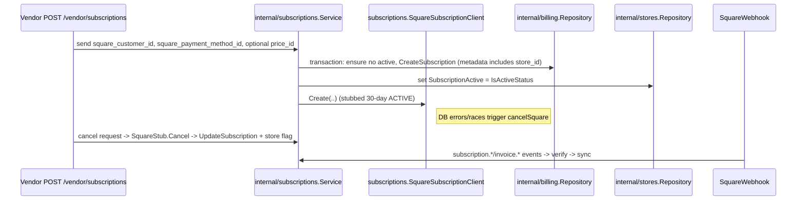
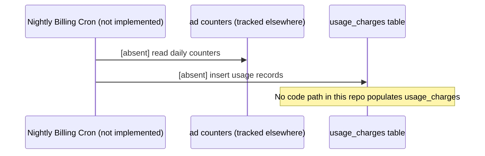

# BILLING — Current Implementation State

## 0) Summary
- Billing persistence currently centers on `internal/billing.Service` (`internal/billing/service.go:14`) storing `subscriptions` while the sibling `payment_methods`, `charges`, and `usage_charges` tables from the 20260201000000 migration (`pkg/migrate/migrations/20260201000000_create_billing_tables.sql:43`, `:61`, `:79`, `:97`) have no production writers.
- Square credentials are validated at boot (`cmd/api/main.go:54`, `cmd/worker/main.go:48`), but every downstream interaction funnels through the in-repo stub `subscriptions.SquareSubscriptionClient` (`internal/subscriptions/square_client.go:10`) and the webhook signature path (`api/controllers/webhooks/square.go:33`), so no real Square SDK calls are made.
- Vendor-facing billing endpoints live inside the `/api/v1/vendor` router (`api/routes/router.go:133`) that runs `StoreContext` (`api/routes/router.go:134`) and the Idempotency middleware (`api/routes/router.go:130`), forcing vendors to send `Idempotency-Key` for the subscription POSTs (`api/middleware/idempotency.go:37`, `:53`).

## 1) Inventory (Files + Modules)
- `cmd/api/main.go:54` boots `pkg/square.NewClient`, `cmd/api/main.go:136` wires `internal/subscriptions.NewService`, `cmd/api/main.go:145` wires `squarewebhook.NewService`, and `cmd/api/main.go:153` builds the Redis guard consumed by the webhook route.
- `cmd/worker/main.go:48` also requires `pkg/square.NewClient`, and `cmd/worker/service.go:95`/`:118` make sure the worker’s readiness probe enforces that the Square client exists before running.
- `api/routes/router.go:109` mounts `/api/v1/webhooks/square`, `api/routes/router.go:137` opens the `/api/v1/vendor` group, `api/routes/router.go:139` adds `/billing/charges`, and `api/routes/router.go:145` wires `/subscriptions` (POST, POST `/cancel`, GET).
- `api/middleware/idempotency.go:34` implements the middleware, `:37` lists the rules, and `:53` tracks the `/api/v1/vendor/subscriptions` POST endpoints with a 24h TTL.
- `api/controllers/vendorcontext/vendor_context.go:9` enforces that the store in context is a vendor before any billing handler executes.
- `api/controllers/subscriptions/vendor.go:18` declares the required `square_customer_id`/`square_payment_method_id` DTO, `:35` handles creation, `:73` handles cancellation, and `:95` fetches the current subscription.
- `api/controllers/billing/vendor.go:19` defines the charge DTOs and `:49` parses the vendor filters before calling the billing service.
- `api/controllers/webhooks/square.go:33` validates the `Square-Signature`, runs the idempotency guard, and dispatches the JSON body to `squarewebhook.Service.HandleEvent`.
- `internal/billing/repo.go:16` describes the repository interface while `:45`, `:78`, `:109`, and `:151` implement the CRUD helpers for `subscriptions`, `payment_methods`, `charges`, and `usage_charges`, respectively.
- `internal/billing/service.go:14` wraps the repository, `:71` handles `ListCharges` pagination, and `:105` exposes the unused `CreateUsageCharge` helper.
- `internal/subscriptions/service.go:24` defines the service and `:81`/`:186` implement the create and cancel flows that call Square and update `store.SubscriptionActive` via `internal/stores.Repository` (`internal/stores/repo.go:1`).
- `internal/subscriptions/mapper.go:15` builds `models.Subscription` from Square data, `:89` pulls `store_id` from metadata, and `:160` maps Square statuses into the Postgres enum.
- `internal/subscriptions/square_client.go:10` is the placeholder `SquareSubscriptionClient` that never talks to an HTTP API.
- `internal/webhooks/square/service.go:24` defines the webhook service, `:77` routes `subscription.*`/`invoice.*` events, and `:162` updates the store flag in-tx.
- `internal/webhooks/square/idempotency.go:12` defines the guard and `:35` shows the Redis `SETNX` usage.
- `pkg/db/models/subscription.go:12`, `payment_method.go:12`, `charge.go:12`, and `usage_charge.go:10` describe the Go models that map to the billing tables.
- `pkg/migrate/migrations/20260201000000_create_billing_tables.sql:4` creates the enums and `:43`, `:61`, `:79`, and `:97` create the `subscriptions`, `payment_methods`, `charges`, and `usage_charges` tables with FK/index constraints.
- `pkg/config/config.go:133` exposes `PACKFINDERZ_EVENTING_IDEMPOTENCY_TTL` and `:196` defines the Square config struct.
- `pkg/square/client.go:31` validates square credentials and normalizes the environment string.
- `pkg/redis/client.go:61` provides the `IdempotencyKey` helper used by the middleware and webhook guard.

## 2) Data Model
- `subscriptions` keeps one row per vendor subscription (`store_id`, `square_subscription_id`, `status`, `price_id`, period bounds, cancellation metadata, JSON `metadata`). The migration at `pkg/migrate/migrations/20260201000000_create_billing_tables.sql:43` creates the table/indexes, and `pkg/db/models/subscription.go:12` mirrors it with GORM tags; the repository (`internal/billing/repo.go:16` and `:45`) persists/fetches these rows.
- `payment_methods` mirrors Square instruments (`pkg/migrate/…:61`, `pkg/db/models/payment_method.go:12`) and is exposed via `internal/billing/repo.go:16`/`:94`, but no runtime path ever calls `CreatePaymentMethod` so the table stays empty.
- `charges` holds historical charges linked to `subscriptions`/`payment_methods` (`pkg/migrate/…:79`, `pkg/db/models/charge.go:12`) and is read through `internal/billing.re` ( `ListCharges` at `internal/billing/repo.go:113` and `internal/billing/service.go:71`), yet only tests invoke `CreateCharge` (`internal/billing/service_test.go:42`), so the table remains empty unless seeded.
- `usage_charges` stores metered spend (`pkg/migrate/…:97`, `pkg/db/models/usage_charge.go:10`), and although `internal/billing/repo.go:151` and `internal/billing/service.go:105` expose persistence helpers, no producer code calls them, leaving the table unused.

## 3) Square Integration
- `pkg/square.NewClient` runs in every binary (`cmd/api/main.go:54`, `cmd/worker/main.go:48`) to validate `PACKFINDERZ_SQUARE_ACCESS_TOKEN`, `PACKFINDERZ_SQUARE_WEBHOOK_SECRET`, and `PACKFINDERZ_SQUARE_ENV` (`pkg/square/client.go:31`), but only the signing secret is used at runtime (`api/controllers/webhooks/square.go:33`).
- Subscription creation/cancellation hits the placeholder `subscriptions.SquareSubscriptionClient` (`internal/subscriptions/square_client.go:10`) that fabricates `SquareSubscription` structs (30-day windows, static statuses) instead of calling the Square REST API.
- The webhook controller (`api/controllers/webhooks/square.go:33`) validates `Square-Signature`, deduplicates via `squarewebhook.IdempotencyGuard` (`internal/webhooks/square/idempotency.go:12`), and forwards the payload to `squarewebhook.Service.HandleEvent`.
- `squarewebhook.Service` (`internal/webhooks/square/service.go:24`) handles `subscription.*` and `invoice.*` events (`:77`), merges metadata (including `store_id` from `internal/subscriptions/mapper.go:89`), persists/updates the subscription (`internal/billing/repo.go:16`), and keeps `store.SubscriptionActive` aligned with `subscriptions.IsActiveStatus` (`internal/subscriptions/mapper.go:105`).
- The mapper builds period bounds from `ChargedThroughDate`/item periods, records Square `price_id` via `determinePriceID` (`internal/webhooks/square/service.go:182`), and maps Square statuses (`internal/subscriptions/mapper.go:160`) into the Postgres enum; unknown statuses raise errors.

## 4) API
- `POST /api/v1/vendor/subscriptions` is defined inside the vendor subrouter (`api/routes/router.go:145`), requires vendor context (`api/controllers/vendorcontext/vendor_context.go:9`), and requires `square_customer_id`/`square_payment_method_id` in the request DTO at `api/controllers/subscriptions/vendor.go:18`; the handler at `api/controllers/subscriptions/vendor.go:35` calls `subscriptions.Service.Create` and operates under the Idempotency middleware (`api/middleware/idempotency.go:37`, `:53`).
- `POST /api/v1/vendor/subscriptions/cancel` (`api/routes/router.go:146`, `api/controllers/subscriptions/vendor.go:73`) asks `subscriptions.Service.Cancel` to call `SquareSubscriptionClient.Cancel` and set `store.SubscriptionActive=false` even when no subscription exists.
- `GET /api/v1/vendor/subscriptions` (`api/routes/router.go:145`, `api/controllers/subscriptions/vendor.go:95`) returns the active subscription or `null`.
- `GET /api/v1/vendor/billing/charges` (`api/routes/router.go:139`, `api/controllers/billing/vendor.go:19`) parses `limit`, `type`, `status`, and `cursor` (`api/controllers/billing/vendor.go:49`), delegates to `internal/billing.Service.ListCharges` (`internal/billing/service.go:71`), and streams the `charges` plus pagination cursor.
- `POST /api/v1/webhooks/square` (`api/routes/router.go:109`, `api/controllers/webhooks/square.go:33`) validates the signature (HMAC-SHA256), deduplicates via the Redis guard, and returns `200 OK` even when an event already ran.

## 5) Subscription Lifecycle
- **Create:** `VendorSubscriptionCreate` (`api/controllers/subscriptions/vendor.go:35`) validates input and delegates to `internal/subscriptions.Service.Create` (`internal/subscriptions/service.go:81`), which calls `SquareSubscriptionClient.Create`, persists the subscription via `CreateSubscription` plus `BuildSubscriptionFromSquare` (`internal/subscriptions/mapper.go:15`), and flips `store.SubscriptionActive` in a transaction (`internal/subscriptions/service.go:129`). Failed transactions trigger `cancelSquare` (`internal/subscriptions/service.go:288`).
- **Cancel:** `VendorSubscriptionCancel` (`api/controllers/subscriptions/vendor.go:73`) calls `internal/subscriptions.Service.Cancel` (`internal/subscriptions/service.go:186`), which cancels the remote stub (`SquareSubscriptionClient.Cancel`), updates the row via `UpdateSubscriptionFromSquare` (`internal/subscriptions/mapper.go:57`), and clears the store flag inside the transaction.
- **Webhook reconciliation:** `/api/v1/webhooks/square` (`api/controllers/webhooks/square.go:33`) feeds events into `squarewebhook.Service.HandleEvent` (`internal/webhooks/square/service.go:77`), which handles `subscription.*`/`invoice.*`, reloads subscriptions if necessary, and keeps `store.SubscriptionActive` aligned with `IsActiveStatus` (`internal/subscriptions/mapper.go:105`).



## 6) Usage Billing (Ads)
- Although the schema includes `usage_charges` (`pkg/migrate/migrations/20260201000000_create_billing_tables.sql:97`) and the repo/service expose `CreateUsageCharge`/`ListUsageChargesByStore` (`internal/billing/repo.go:151`, `internal/billing/service.go:105`), there is no cron, worker, or controller that invokes them, so no metered ad spend is ever recorded.



## 7) DTOs & Validation
- `vendorSubscriptionCreateRequest` (`api/controllers/subscriptions/vendor.go:18`) requires `square_customer_id`/`square_payment_method_id` and optional `price_id`; `validators.DecodeJSONBody` enforces the schema.
- `vendorSubscriptionResponse` (`api/controllers/subscriptions/vendor.go:24`) mirrors `models.Subscription` fields such as period bounds and cancellation flags.
- `VendorBillingCharges` (`api/controllers/billing/vendor.go:56`) validates `limit`, `type`, `status`, and `cursor` using `enums.ParseChargeType`/`ParseChargeStatus` before calling the billing service.
- The Idempotency middleware (`api/middleware/idempotency.go:34`) requires `Idempotency-Key`, hashes the body, and caches the response for the vendor subscription POSTs (`api/middleware/idempotency.go:53`).

## 8) External Dependencies
- **Square:** The API and worker both instantiate `pkg/square.NewClient` (`cmd/api/main.go:54`, `cmd/worker/main.go:48`) to ensure the access token/webhook secret/environment are present (`pkg/square/client.go:31`), but tangible Square interactions are limited to the stub client (`internal/subscriptions/square_client.go:10`) and webhook signature validation (`api/controllers/webhooks/square.go:33`).
- **Redis:** The Idempotency middleware and the Square webhook guard both use `pkg/redis.Client` (`api/middleware/idempotency.go:34`, `internal/webhooks/square/idempotency.go:12`), with keys created via `pkg/redis/client.go:61` and TTL controlled by `PACKFINDERZ_EVENTING_IDEMPOTENCY_TTL` (`pkg/config/config.go:133`).
- **BigQuery / Pub/Sub / Email / Storage:** The billing service/module (`internal/billing/service.go:14`) imports only Go standard packages plus domain helpers; none of the billing controllers import `bigquery`, `pubsub`, email, or storage packages, so this domain has no integration with those external systems.

## 9) Edge Cases & Known Gaps
- **Charges/payment methods/usage charges are never written at runtime.** Only the repository/service definitions exist (`internal/billing/repo.go:21`, `internal/billing/service.go:14`), and in practice `CreateCharge`/`CreateUsageCharge` are invoked only by tests (`internal/billing/service_test.go:42`, `internal/billing/service_test.go:51`), so the corresponding tables remain empty unless seeded manually.
- **Square API integration is stubbed.** All subscription create/cancel/get workflows call `subscriptions.NewSquareClient()` (`cmd/api/main.go:136`), which is the placeholder in `internal/subscriptions/square_client.go:10`; no HTTP calls to the real Square SDK are implemented.
- **Customer/card capture is missing.** The create handler insists on receiving `square_customer_id` and `square_payment_method_id` (`api/controllers/subscriptions/vendor.go:18`), but no endpoint or worker logic exists to mint those IDs, so they must be provisioned externally.
- **Webhook metadata is brittle.** `squarewebhook.Service` requires the payload’s metadata to contain `store_id` (`internal/subscriptions/mapper.go:89`); if Square omits it and there is no stored subscription, the webhook returns a validation error.
- **Status mapping is limited.** `mapSquareStatus` (`internal/subscriptions/mapper.go:160`) knows only a fixed set of Square strings (`ACTIVE`, `PENDING`, `CANCELED`/`DEACTIVATED`/`PAUSED`/`COMPLETED`, `PAST_DUE`), so any new status from Square will surface as an error until explicitly handled.
- **Nightly usage billing is unimplemented.** There is no cron that reads Redis counters or writes to `usage_charges` (`internal/billing/service.go:105`), so usage-based ad billing does not exist despite the schema and DTOs.


---


LIST OF ITEMS NEEDED TO BE DONE:
* **[Billing/Square] Create Square client/helper wrapper**

  * Encapsulate auth, idempotency key generation, request logging/redaction, and error mapping
  * Expose methods (initial): `CreateCustomer`, `CreateCard`/`StoreCard`, `CreateSubscription`, `PauseSubscription`, `ResumeSubscription`, `CancelSubscription`, `RetrieveSubscription`, `CreateSubscriptionPlan` (billin plan used to create sub contracts w/ customers)

* **[Billing/Square] Add API endpoint to create Square customer**

  * Internal/service endpoint (or admin-only) to create a Square customer and return `square_customer_id`
  * Persist `square_customer_id` on Store (or BillingAccount) record

* **[Auth/Registration] Integrate Square customer creation into store registration**

  * Goose migration needed for store object to store the square meta data needed like `square_customer_id`
  * On store creation (`POST /api/v1/auth/register`): create Square customer (idempotent) and store `square_customer_id` 
  * Ensure rollback/compensation behavior if store creation fails after Square customer creation

* **[DB/Migrations] Add `billing_plans` table (Goose migration)**

  * Columns for local plan metadata + Square mapping:
  ```ts
    export type BillingInterval = "EVERY_30_DAYS" | "ANNUAL";
    export type BillingCurrencyCode = "USD" | "BRL" | "EUR" | "GBP" | string;


    export type PlanStatus = "active" | "deprecated" | "hidden";

    export interface Money {
        amount: string; // decimal as string to avoid float bugs ("9.99")
        currency_code: BillingCurrencyCode;
    }

    export interface Trial {
        days: number; // 0 means no trial
        require_payment_method?: boolean; // some apps still want card on file even during trial
        start_on_activation?: boolean; // usually true
    }

    export interface SubscriptionComponent {
        interval: BillingInterval;
        price: Money;
        // Optional: metadata for UI / feature gating
        features?: string[];
    }

    export interface BillingPlan {
    id: string; // internal stable plan id, e.g. "starter_v1"
    square_subscription_id: string;
    name: string; // merchant-facing
    status: PlanStatus;

    // Common toggles
    test?: boolean; // Shopify test charges in dev stores
    trial?: Trial;

    // Components
    subscription: SubscriptionComponent;

    // Plan selection / migration controls
    is_default?: boolean;
    created_at?: TimeStamp;
    updated_at?: TimeStamp;

    // Used by embed/config UI
    ui?: {
        badge?: "popular" | "best_value" | "new";
        description?: string;
        bullets?: string[];
    };
    }   
  ```
  * Add indexes for `status`, `id`, `square_subscription_id`, `is_default`
  * Model + repo/service for CRUD and list/query (admin + vendor views)

* **[Billing/Plans] Create Square Catalog subscription plan variation(s)**

  * create via Square API (Catalog) if possible otherwise Square GUI initially
  * Persist plan metadata in your DB regardless of creation path 


* **[API/Admin] Admin-only BillingPlan CRUD endpoints:** Enforce admin role/permission checks

  * Via manual or using the SDK if possibl: Create plan (stores Square IDs + metadata)
  * Via manual or using the SDK if possibl: Update plan (local metadata; Square plan updates optional/explicit)
  * Delete/disable plan (soft delete or `status=inactive`) || hard delete -> must remove from square as well.

* **[API/Vendor] Vendor BillingPlan list/read endpoints**

  * Read-only list of active plans available to vendors
  * Shared read endpoint for admin UI (or separate admin list with filters)

* **[Frontend/Payments] Integrate Square Web Payments SDK (Next.js) for card capture**

  * Secure context + CSP requirements (ignore for now)
  * Tokenize card for `STORE` intent and send token to backend by creating a new `payment_methods` record for the store (using activeStoreID) must be owner or manager role. 

* **[API/Billing] Card-on-file storage endpoint**

  * Accept tokenized `source_id` from frontend
  * Create card on file in Square (Cards API) linked to store’s `square_customer_id`
  * Upsert into existing `payment_methods` table: store `square_card_id` + last4/brand/exp + status
  * Enforce “one active card per store” policy (or allow multiple, pick default)

* **[Billing/Subscriptions] Add `subscriptions` table (Goose migration)**

  * Columns for 1:1 store subscription (ex: `id`, `store_id` unique, `billing_plan_id`, `square_subscription_id`, `square_customer_id`, `square_card_id`, `status`, `start_date`, `canceled_at`, `paused_at`, timestamps)
  * Unique index on `store_id`

* **[DB/Models] Add GORM model for Subscription**

  * Model + repo/service to enforce store has 0..1 subscription

* **[API/Vendor] Create subscription endpoint**

  * Requires: store has `square_customer_id` + active `payment_method` w/ `square_card_id`
  * Uses selected `billing_plan.square_plan_variation_id` + `location_id` + `card_id`
  * Persists `square_subscription_id` and local subscription record

* **[API/Vendor] Get current subscription endpoint**

  * Returns local subscription + Square status fields (optionally reconcile via RetrieveSubscription)

* **[API/Vendor] Cancel subscription endpoint**

  * Calls Square cancel using `square_subscription_id`
  * Updates local status

* **[API/Vendor] Pause subscription endpoint**

  * Calls Square pause using `square_subscription_id`
  * Updates local status

* **[API/Vendor] Resume subscription endpoint**

  * Calls Square resume using `square_subscription_id`
  * Updates local status

* **[Billing/Webhooks] Add Square webhook receiver for subscription lifecycle**

  * Handle `subscription.created` / `subscription.updated` (and any needed payment events)
  * Verify webhook signatures
  * Update local subscription state idempotently

* **[Billing/Usage Charges] Add `usage_charges` (or `charges`) table (Goose migration)**

  * Columns (ex: `id`, `store_id`, `date`, `amount`, `currency`, `square_payment_id`, `status`, `failure_reason`, timestamps)
  * Unique idempotency constraint per `store_id + date` (or `store_id + period_key`)

* **[Billing/Usage Charges] Implement nightly cron job for ad usage billing (stub for later)**

  * Computes daily spend per store
  * Creates Square payment using store `square_card_id`
  * Writes `usage_charges` record and failure handling (past_due / ads disabled)

* **[Security/Ops] Add billing permissions + guards**

  * Admin permissions for plan management
  * Vendor permissions for payment method + subscription actions
  * PII redaction rules in logs for billing payloads
