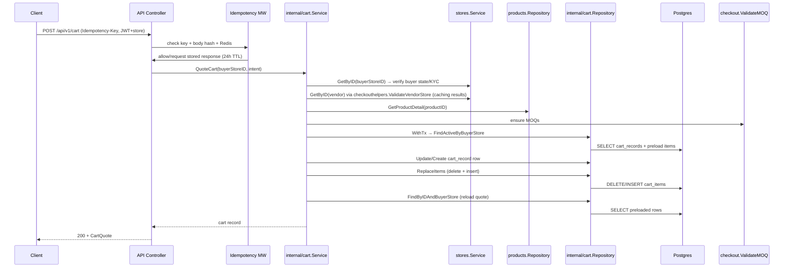
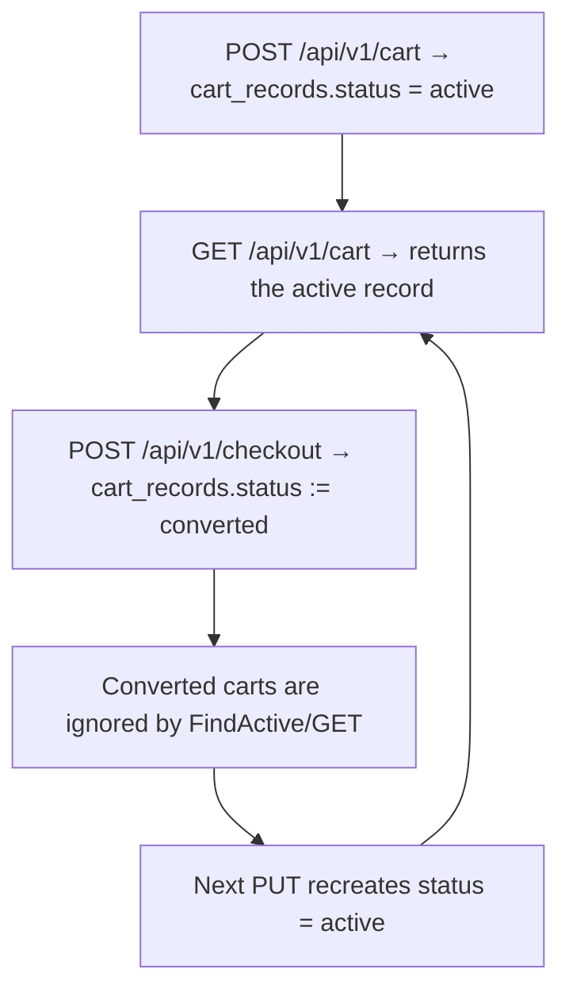

# CART — Current Implementation State

## 0) Summary
  - `POST /api/v1/cart` is the canonical way to persist the authoritative buyer cart quote: the request passes through `middleware.Idempotency`, `middleware.StoreContext`, validators, and `internal/cart.Service.QuoteCart` to validate the buyer (`internal/stores/service.go`), vendors (`internal/checkout/helpers/validation.go` + `pkg/visibility/visibility.go`), products (`internal/products/repository.go`), MOQ (`pkg/checkout/validation.go`), volume tiers, and total math before atomically writing `cart_records` + `cart_items` inside a transaction (`internal/cart/service.go`).
  - `GET /api/v1/cart` simply fetches the currently active `cart_records` row preloaded with `items` and `vendor_groups` (`internal/cart/cart_record_repo.go`) and renders it through `cartdto.CartQuote` (`api/controllers/cart/response.go`).
  - The checkout flow (`internal/checkout/service.go`) consumes that snapshot, reserves inventory, writes vendor orders, marks the cart `converted`, and emits the `EventOrderCreated` outbox event so downstream systems only work with staged cart data.
- What is missing / stubbed:
  - Vendor-level payloads (`cart_vendor_groups` table + repository) and auxiliary helpers like `CartRecordSnapshot` exist but are not wired anywhere, so `vendor_groups` is always empty and the extra metadata is only stored/returned but never acted upon.
  - Cart metadata such as `valid_until` and `ad_tokens` are captured and returned but nothing enforces expiration or consumes the ad attribution outside the cart API response, leaving those columns as passive metadata.

## 1) Inventory (Files + Modules)
- `cmd/api/main.go` — wires the `cart` repository/service into the API stack and reuses the same `db.Client`/`stores.Service`/`products` repo used by other domains.
- `api/routes/router.go` — mounts `/api/v1/cart` under `middleware.Auth`, `StoreContext`, `Idempotency`, and `RateLimit` so every request must be authenticated and carry a store context.
- `api/middleware/idempotency.go` — enforces the `Idempotency-Key` header for `POST /api/v1/cart`, hashes the body, scopes keys to `user|store|method|path`, and stores Redis entries with a 24h TTL (`pkg/redis/client.go`).
- `api/middleware/store.go` + `api/middleware/context.go` — surface helpers that guarantee a store ID is present in the request context before the controller runs.
- `api/validators/body.go` — decodes the JSON body, disallows unknown fields, and runs the `validator` tags declared on `cartdto.QuoteCartRequest` / `QuoteCartItem`.
- `api/controllers/cart/handlers.go` — handles the two endpoints, extracts the buyer store ID from context, and delegates to `cart.Service`.
- `api/controllers/cart/request.go` — maps `cartdto.QuoteCartRequest` into `cartsvc.QuoteCartInput` so the controller can hand off the minimal intent payload to the quote service.
- `api/controllers/cart/dto/cart_quote.go` — defines `CartQuote`, `CartQuoteItem`, and `CartQuoteVendorGroup` that mirror the persisted models and control what fields are serialized back to clients.
- `api/controllers/cart/response.go` — maps the GORM models (`pkg/db/models/cart_record.go`, `cart_item.go`, `cart_vendor_group.go`) into the DTOs used by the API.
- `internal/cart/service.go` — orchestrates validation, product/vendor lookups, MOQ/layered discounts, and the transactional persistence of the cart snapshot.
- `internal/cart/repo.go` + `cart_record_repo.go` + `cart_item_repo.go` + `cart_vendor_group_repo.go` — repository abstractions for inserting/updating the staging tables, including helpers such as `ReplaceItems` and the unused `ReplaceVendorGroups`.
- `internal/cart/interfaces.go` — service interface definition used by controllers and tests.
- `pkg/db/models/cart_record.go`, `cart_item.go`, `cart_vendor_group.go` — the GORM structs that mirror `cart_records`, `cart_items`, and `cart_vendor_groups`, including JSON/enum mappings for warnings/discounts.
- `pkg/migrate/migrations/20260124000003_create_cart_records.sql` and `20260306000000_cart_modifications.sql` — the Goose migrations that create the tables and enums (`cart_status`, `cart_item_status`, `vendor_group_status`, warning types, etc.) and later add the current columns/indexes.
- `pkg/enums/cart_status.go`, `cart_item_status.go`, `vendor_group_status.go`, `cart_item_warning_type.go`, `vendor_group_warning_type.go` — canonical enum values used by the models, service and DTOs.
- `pkg/types/address.go` and `pkg/types/cart_quote_types.go` — type-safe Postgres composite handling for `shipping_address`, `applied_volume_discount`, `warnings`, and `vendor_group` promos.
- `pkg/checkout/validation.go` — shared MOQ validation logic exercised by the cart service.
- `internal/checkout/helpers/validation.go` + `pkg/visibility/visibility.go` — exposes `ValidateVendorStore` to gate vendors by state, KYC, and subscription status before they can appear in a cart.
- `internal/products/repository.go` (`GetProductDetail`) — fetches product metadata, inventory, volume discounts and vendor summary used by cart validation.
- `internal/stores/service.go` — used by `cart.Service` to load buyer/vendor stores for eligibility checks.
- `pkg/redis/client.go` — Redis client that implements `IdempotencyStore` (used by the middleware) and namespaced key helpers.
- `pkg/errors/errors.go` — exposes HTTP metadata for each error code so `responses.WriteError` can respond with the right status message.
- `docs/LLM_ARCHITECTURE.md`, `docs/REUSABLE.md`, and `docs/phases/019.md` — living documentation that records PF-147/PF-149 requirements for the cart staging tables, the idempotent API surface, and the vendor-group metadata that the service currently aims to capture.

## 2) Data Model (DB Source of Truth)
### 2.1 Tables
#### `cart_records`
- Columns:
  - `id uuid PRIMARY KEY` — generated via `gen_random_uuid()`.
  - `buyer_store_id uuid NOT NULL` — FK to `stores(id)` with `ON DELETE CASCADE` so carts are deleted when a store is removed.
  - `status cart_status NOT NULL DEFAULT 'active'` — enum with values `active|converted` (`pkg/enums/cart_status.go`).
  - `shipping_address address_t` — composite type backed by `pkg/types.Address`.
  - `currency text NOT NULL DEFAULT 'USD'` — stored currency code (not otherwise validated).
  - `valid_until timestamptz NOT NULL DEFAULT now() + interval '15 minutes'` — metadata stored on every upsert.
  - `subtotal_cents int NOT NULL DEFAULT 0`, `discounts_cents int NOT NULL DEFAULT 0`, `total_cents int NOT NULL DEFAULT 0` — totals captured from the request and later returned to callers.
  - `ad_tokens text[]` — stored as `pq.StringArray`; currently only populated/returned by the cart API.
  - `checkout_group_id uuid NULL` — holds the eventual checkout reference but no FK constraint.
  - `created_at/updated_at timestamptz NOT NULL` — auto-populated timestamps.
- Indexes:
  - `idx_cart_records_buyer_status` on `(buyer_store_id, status)` for fast `FindActiveByBuyerStore`.
  - `idx_cart_records_checkout_group` on `(checkout_group_id)` to support future joins.
- Constraints / FKs:
  - `cart_records_buyer_fk` referencing `stores(id)` with cascade delete.

#### `cart_items`
- Columns:
  - `id uuid PRIMARY KEY` — `gen_random_uuid()`.
  - `cart_id uuid NOT NULL` — FK to `cart_records(id)` (`ON DELETE CASCADE`).
  - `product_id uuid NOT NULL` — FK to `products(id)` (`ON DELETE RESTRICT`).
  - `vendor_store_id uuid NOT NULL` — FK to `stores(id)` (`ON DELETE RESTRICT`).
  - `quantity int NOT NULL` — renamed from `qty` in the PF-147 migration.
  - `moq int NOT NULL DEFAULT 1` — enforced to be `>=1` by the migration.
  - `max_qty int NULL` — available for UI hinting but currently never set.
  - `unit_price_cents int NOT NULL`, `line_subtotal_cents int NOT NULL DEFAULT 0` — stored line totals, with `line_subtotal_cents` backfilled during migration.
  - `applied_volume_discount jsonb NULL` — stored via `pkg/types.AppliedVolumeDiscount`.
  - `status cart_item_status NOT NULL DEFAULT 'ok'` — enum values `ok|not_available|invalid` (`pkg/enums/cart_item_status.go`).
  - `warnings jsonb NULL` — `pkg/types.CartItemWarnings` holds warning objects; the service currently keeps this field nil.
  - `created_at/updated_at` timestamps.
- Indexes:
  - `idx_cart_items_cart_id` on `(cart_id)`.
  - `idx_cart_items_vendor_store` on `(vendor_store_id)`.
  - `idx_cart_items_product_id` on `(product_id)` (added in PF-147).
- Constraints / FKs:
  - `cart_items_cart_fk` → `cart_records(id)`.
  - `cart_items_product_fk` → `products(id)`.
  - `cart_items_vendor_fk` → `stores(id)`.

#### `cart_vendor_groups`
- Columns:
  - `id uuid PRIMARY KEY`, `cart_id uuid NOT NULL` → `cart_records(id)` cascade, `vendor_store_id uuid NOT NULL` → `stores(id)` restrict.
  - `status vendor_group_status NOT NULL DEFAULT 'ok'` — values `ok|invalid` (`pkg/enums/vendor_group_status.go`).
  - `warnings jsonb NULL` — `pkg/types.VendorGroupWarnings` with types from `pkg/enums/vendor_group_warning_type.go`.
  - `subtotal_cents int NOT NULL DEFAULT 0`, `promo jsonb NULL`, `total_cents int NOT NULL DEFAULT 0`.
  - timestamps.
- Indexes:
  - `idx_cart_vendor_groups_cart_id`, `idx_cart_vendor_groups_vendor_store_id`.
- Constraints:
  - Unique constraint `cart_vendor_groups_cart_vendor_uniq` on `(cart_id, vendor_store_id)`.
  - Cascading FK to `cart_records` ensures cleanup.
- Notes: although the table exists, no code populates it yet (`internal/cart` never calls `ReplaceVendorGroups`).

### 2.2 Persistence Code
- Models:
  - `models.CartRecord` (`pkg/db/models/cart_record.go`) tracks the buyer reference, totals, metadata, `pq.StringArray` for `ad_tokens`, and the preloaded slices `VendorGroups`/`Items`.
  - `models.CartItem` (`pkg/db/models/cart_item.go`) stores per-line snapshots, including tier status, JSON warnings, and applied discounts.
  - `models.CartVendorGroup` (`pkg/db/models/cart_vendor_group.go`) mirrors the vendor aggregate table with promo/warning JSON columns.
- Repositories/queries:
  - `CartRecordRepository` (`internal/cart/cart_record_repo.go`) exposes `FindActiveByBuyerStore`, `FindByIDAndBuyerStore`, `Create`, `Update`, `UpdateStatus`, and the unused `SaveAuthoritativeSnapshot` helper.
  - `CartItemRepository.ReplaceForCart` deletes all rows for a cart and bulk inserts the new slice inside the caller’s transaction (`internal/cart/cart_item_repo.go`).
  - `CartVendorGroupRepository` mirrors the same pattern but is currently unused (`internal/cart/cart_vendor_group_repo.go`).
  - `Repository` (`internal/cart/repo.go`) composes the three sub-repos and exposes `ReplaceItems`, `FindActiveByBuyerStore`, `ReplaceVendorGroups`, etc.
  - Transactions: `internal/cart/service.go` wraps every upsert in `txRunner.WithTx` (backed by `db.Client.WithTx`) so the cart record update/insert and `ReplaceItems` happen in one atomic transaction. `internal/checkout/service.go` reuses the same pattern when converting the cart and emitting the outbox event.

## 3) API (HTTP)
### 3.1 Endpoints
#### `GET /api/v1/cart`
- Auth: `middleware.Auth` + `StoreContext` ensure a valid JWT targeting a store; missing store context triggers `pkgerrors.CodeForbidden` (403) from `buyerStoreIDFromContext`.
- Request DTO: none (the endpoint is a simple fetch).
- Response DTO: `cartdto.CartQuote` (`api/controllers/cart/dto/cart_quote.go`) — contains `id`, `buyer_store_id`, optional `checkout_group_id`, `status`, `shipping_address`, `currency`, `valid_until`, `subtotal_cents`, `discounts_cents`, `total_cents`, optional `ad_tokens`, `vendor_groups`, and `items` (each item includes `quantity`, `moq`, `cur line subtotal`, `status`, `warnings`, timestamps).
- Status codes / error handling: 200 on success; 403 for missing store context; 404 (`pkgerrors.CodeNotFound`) when no active cart exists; 500/503 for dependency errors.

#### `POST /api/v1/cart`
- Auth: same as GET, plus the request must carry `Idempotency-Key` (middleware enforces this and responds with 400 if missing, 409 if the same key is reused with a different body, or replays the stored 200 response when the body matches) (`api/middleware/idempotency.go`).
- Request DTO (`cartdto.QuoteCartRequest`, plus `QuoteCartItem` and optional `QuoteVendorPromo`, defined in `api/controllers/cart/dto/quote_request.go`):
  ```json
  {
    "buyer_store_id": "buyer-uuid",
    "items": [
      {
        "product_id": "uuid",
        "vendor_store_id": "vendor-uuid",
        "quantity": 2
      }
    ],
    "vendor_promos": [
      {
        "vendor_store_id": "vendor-uuid",
        "code": "SAVE20"
      }
    ]
  }
  ```
  Validation tags require a non-empty `buyer_store_id`, at least one item, non-empty product/vendor IDs, and `quantity >= 1`. Unknown JSON fields are rejected (`json.Decoder.DisallowUnknownFields`), so legacy upsert payloads automatically trigger validation errors.
- Response DTO: same `cartdto.CartQuote` as GET, reflecting whatever record the quote flow persists.
- Status codes / error handling: 200 on success; 400 for validation errors or buyer-store mismatches; 403 for invalid buyer store context; 404 when referenced products/vendors are missing; 409 if the Idempotency-Key is reused with a different body; 500/503 for DB/Redis dependency failures.
- Notes: vendor promo warnings and normalized totals are computed during the quote flow so the API never trusts client-supplied pricing/totals; the `QuoteCart` service returns the authoritative snapshot serialized as `CartQuote`.

## 4) DTOs & Validation
- Request DTOs (`cartdto.QuoteCartRequest`, `QuoteCartItem`, `QuoteVendorPromo`, `api/controllers/cart/dto/quote_request.go`):
  - `QuoteCartRequest` captures the buyer store context, a list of items, optional vendor promo codes, and any ad tokens the client wants echoed back.
  - `QuoteCartItem` enforces `product_id`, `vendor_store_id`, and `quantity >= 1`. `QuoteVendorPromo` requires both `vendor_store_id` and `code`. The struct tags are validated by `api/validators/body.go` so missing fields, whitespace `code`, and empty item lists produce `pkgerrors.CodeValidation`.
  - Unknown JSON fields are rejected by `json.Decoder.DisallowUnknownFields`, which means legacy upsert payloads trigger validation errors automatically.
- Service-layer validation (`internal/cart/service.go`):
  - `QuoteCart` starts by validating the buyer store (`validateBuyerStore`) and preloading each vendor once via `ensureVendor`, so repeated items for the same vendor reuse cached eligibility checks.
  - Vendor promos are resolved through `promoLoader.GetVendorPromo`; invalid/missing promos append `VendorGroupWarningTypeInvalidPromo` and the quote continues without applying discounts.
  - Each item loads `productRepo.GetProductDetail`, ensures the SKU belongs to the requested vendor, and infers product metadata (inventory, MOQ, volume discounts).
  - Quantities are normalized (`normalizeQuantity`), availability is checked (`hasSufficientInventory`), and warnings are attached when inventory, vendor mismatch, or pricing changes occur.
  - Pricing uses `selectVolumeDiscount` and `resolvePricing` to compute `unit_price_cents`, `applied_volume_discount`, and `line_subtotal_cents`. Price changes from prior quotes surface as `CartItemWarningTypePriceChanged`.
  - Vendor groups aggregate the normalized items; they persist subtotals, promo metadata, and warning lists before `QuoteCart` writes the `cart_record`/`cart_items`/`cart_vendor_groups` snapshot inside the same transaction.
- Response DTO (`cartdto.CartQuote`): the controller flattens `models.CartRecord`/`CartItem`/`CartVendorGroup` into the DTO so clients always see `enums.CartStatus`, `enums.CartItemStatus`, `types.CartItemWarnings`, `types.VendorGroupWarnings`, and `types.VendorGroupPromo` serialized verbatim.

## 5) Flows
- **Primary flow (POST /api/v1/cart)**: the middleware stack enforces auth/store context + idempotency, the controller decodes/validates the quote payload, and `internal/cart.Service.QuoteCart` performs buyer/vendor/product validations before writing `cart_records`, `cart_items`, and `cart_vendor_groups` inside a transaction. The latest record is reloaded and returned as `CartQuote`.



- **State transitions**: carts start `active` after an upsert and stay `active` until the checkout service succeeds, at which point it sets `status = converted`. Once converted, the `GET` handler no longer finds the cart and a new `PUT` will create another `active` record.



- **Checkout interplay**: `internal/checkout/service.go` loads the active cart (`cartRepo.FindByIDAndBuyerStore`), reserves inventory (`reservation.ReserveInventory`), writes vendor orders/line items/payment intents, marks the cart `converted`, and emits an outbox event (`outbox.DomainEvent` with `EventOrderCreated`) all within one transaction. If reservations fail, the line-item status is marked `Rejected` and the transaction rolls back, leaving the cart `active` so buyers can retry.

## 6) Enums & State
- `enums.CartStatus`: `active`, `converted` (`pkg/enums/cart_status.go`). Active carts can be refreshed; converted carts are ignored by `FindActiveByBuyerStore` and signal checkout has already claimed that snapshot.
- `enums.CartItemStatus`: `ok`, `not_available`, `invalid` (`pkg/enums/cart_item_status.go`). The cart service always writes `ok`, but the column exists so downstream consumers can mark issues later.
- `enums.VendorGroupStatus`: `ok`, `invalid` (`pkg/enums/vendor_group_status.go`). Vendor groups default to `ok` in the schema; no code currently writes any other value.
- `enums.CartItemWarningType` & `enums.VendorGroupWarningType` (`pkg/enums/cart_item_warning_type.go`, `vendor_group_warning_type.go`): these are used by `types.CartItemWarnings`/`types.VendorGroupWarnings` but the cart service never appends warnings yet.
- `pkg/types.AppliedVolumeDiscount` + `types.VendorGroupPromo` (`pkg/types/cart_quote_types.go`) store tier labels/amounts as JSONB blobs with proper `Value`/`Scan` implementations.

## 7) Dependencies
- **Postgres (via GORM)** — the `cart` repository writes to `cart_records`, `cart_items`, and `cart_vendor_groups` tables with `ReplaceItems` inside transactions provided by `db.Client`/`txRunner` (`internal/cart/service.go`).
- **Redis** — `api/middleware/idempotency.go` uses `pkg/redis.Client` to persist idempotency lookups for 24h (`defaultIdempotencyTTL`). The key scope is `user|store|method|path`, and reuse with a different payload yields `pkgerrors.CodeIdempotency` (409).
- **stores.Service** (`internal/stores/service.go`) — used to validate the buyer (`upsert` requires store type `buyer`, verified KYC, and state) and to load vendors for visibility checks.
- **visibility.EnsureVendorVisible** (`pkg/visibility/visibility.go`) — ensures vendors are verified, subscribed, same state as the buyer, and have `StoreTypeVendor` before a line item can be persisted.
- **internal/products.Repository.GetProductDetail** — fetches inventory (`models.InventoryItem`), volume tiers, media, and vendor summary for each product ID; the cart service relies on this data to enforce availability and tier consistency.
- **pkg/checkout.ValidateMOQ** — ensures each requested quantity meets the product’s minimum order quantity (`pkg/checkout/validation.go`).
- **internal/checkout/service.go** — consumes the cart snapshot, reserves inventory (`reservation.ReserveInventory`), writes orders/payment intents, updates `cart_records.status` to `converted`, and emits `outbox.DomainEvent` (`EventOrderCreated`) so downstream consumers see the new checkout group.
- **pkg/errors** — error codes drive HTTP status responses via `responses.WriteError` so callers get 400/403/404/409/422/429/500/503 depending on the failure.
- **api/validators/body.go** — shared validator ensures unknown fields are rejected and struct tags such as `required`, `min=0`, and `dive` are honored.
- **pkg/types** — includes `Address`, `AppliedVolumeDiscount`, `CartItemWarnings`, `VendorGroupWarnings`, and `VendorGroupPromo` so JSONB fields round-trip correctly.

## 8) Edge Cases & Gaps
- **Idempotency behavior**: `POST /api/v1/cart` is guarded by the idempotency middleware (`api/middleware/idempotency.go`). The endpoint requires the `Idempotency-Key` header, hashes the request body (`sha256` + base64), and replays the stored response if the body has already succeeded; any reuse with a different body is translated to `pkgerrors.CodeIdempotency` (HTTP 409). Missing the header immediately yields `pkgerrors.CodeValidation` (400).
- **Inventory race window**: the cart service checks `product.Inventory.AvailableQty` but does not reserve inventory; `internal/checkout/service.go` later calls `reservation.ReserveInventory`. That step can reject line items (`LineItemStatusRejected`) if inventory changed between the `PUT` and the `checkout` request, leaving the cart `status = active` for the buyer to retry.
- **Metadata gaps**: `cart_records.valid_until` is only set in `internal/cart/service.go` and returned in `cartdto.CartQuote`, but neither `internal/cart/service.go`, `internal/checkout/service.go`, nor any other file enforces expiration, so the timestamp is passive metadata. Similarly, `ad_tokens` is persisted/returned but there is no consumer outside the cart API (the only occurrences of `AdTokens` are inside the cart controller, DTO, and service files).
- **Vendor groups / warnings**: `internal/cart/service.go` now persists `cart_vendor_groups` via `ReplaceVendorGroups`, and the aggregator emits vendor-level warnings (including `invalid_promo`) whenever promo validation fails or no valid items exist for a vendor. `CartQuote` surfaces those warnings alongside any persisted `models.CartItem` warnings so the client can render per-vendor issues while the quote remains successful.
- **Conversion transitions**: once checkout succeeds, `internal/checkout/service.go` runs `cartRepo.UpdateStatus(..., enums.CartStatusConverted)`. Subsequent `GET /api/v1/cart` calls fail with `pkgerrors.CodeNotFound`, and the next `PUT` creates a fresh `active` record. There is no background job pruning old `converted` carts, so older records linger until manual cleanup (the only cleanup hook is the FK cascade when stores are deleted).
- **Unused helpers**: `CartRecordRepository.SaveAuthoritativeSnapshot` and `Repository.ReplaceVendorGroups` exist but nothing invokes them; the only code paths that touch cart persistence are `Create`, `Update`, `FindActive`, `ReplaceItems`, and `UpdateStatus` within the service.
