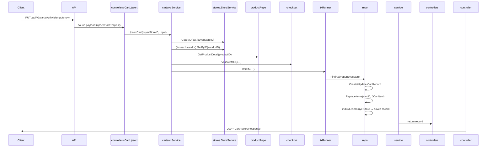

# CART — Current Implementation State

## 0) Summary
- **Existing:** Buyer carts are managed by `internal/cart.Service`, which validates every cart snapshot against store/product/state rules, persists `cart_records` + `cart_items` inside a transaction, and exposes `GET /api/v1/cart` + `PUT /api/v1/cart` behind auth/idempotency middleware (`api/controllers/cart.go` + `api/routes/router.go`).
- **Existing:** Persistence follows the repository/service pattern (`internal/cart/repo.go`, `pkg/db/models/cart_record.go`, `pkg/db/models/cart_item.go`). Totals/volume-tier logic, vendor validation, MOQ guard, and `checkout.ValidateMOQ` ensure the stored snapshot is consistent before replacing items atomically.
- **Missing / Stubbed:** Cart persistence now targets the authoritative quote schema (currency, valid_until, discounts_cents, item warnings, vendor warnings/promo). Most columns are in use, but vendor group rows (`cart_vendor_groups`) are persisted only when the quoting pipeline explicitly writes them, so the new table is read-only for now.

## 1) Inventory (Files + Modules)
- `api/controllers/cart.go` — controller/DTOs for `GET` + `PUT /api/v1/cart`, response shaping, validation tags, and conversion to `internal/cart.UpsertCartInput`.
- `api/routes/router.go` (within `/api` group) — enforces `middleware.Auth`, `middleware.Idempotency`, `middleware.RateLimit`, and `middleware.StoreContext`, then wires `/v1/cart` endpoints into `cartService`.
- `internal/cart/service.go` — business logic: buyer/store validation, vendor/product checks, subtotal/discount verification, MOQ/enums validation, transactional persistence, and cart item replacement.
- `internal/cart/repo.go` — repository implementing `CartRepository`, `WithTx`, and helpers (`FindActiveByBuyerStore`, `Create`, `ReplaceItems`).
- `internal/cart/interfaces.go` — service/repo interfaces exposed for DI/testing.
- `pkg/db/models/cart_record.go` / `cart_item.go` — GORM models matching `cart_records`/`cart_items`.
- `pkg/migrate/migrations/20260124000003_create_cart_records.sql` — initial schema for `cart_records` + `cart_items`.
- `pkg/migrate/migrations/20260306000000_cart_modifications.sql` — schema migration that adds `cart_item_status`/warning enums, adds `cart_vendor_groups`, renames columns, and adds the authoritative quote columns (`discounts_cents`, `currency`, `valid_until`, `ad_tokens`).
- `pkg/enums/cart_status.go` — cart status enum used by service/model.
- Supporting helpers: `internal/checkout/helpers.ValidateVendorStore`, `checkout.ValidateMOQ`, `types.AppliedVolumeDiscount`, `types.CartItemWarnings`, `types.VendorGroupWarnings`.

## 2) Data Model (DB Source of Truth)

### 2.1 Tables
#### `cart_records`
- Columns:
  - `id` `uuid` `NOT NULL` — PK, `gen_random_uuid()`.
  - `buyer_store_id` `uuid` `NOT NULL` — FK → `stores(id)` `ON DELETE CASCADE`.
  - `checkout_group_id` `uuid` `NULL` — FK → `checkout_groups(id)` `ON DELETE SET NULL`.
  - `status` `cart_status` `NOT NULL DEFAULT 'active'`.
  - `shipping_address` `address_t` `NULL`.
  - `currency` `text` `NOT NULL DEFAULT 'USD'`.
  - `valid_until` `timestamptz` `NOT NULL`.
  - `subtotal_cents` `int` `NOT NULL DEFAULT 0`.
  - `discounts_cents` `int` `NOT NULL DEFAULT 0`.
  - `total_cents` `int` `NOT NULL DEFAULT 0`.
  - `ad_tokens` `text[]` `NULL`.
  - `created_at`/`updated_at` timestamps `NOT NULL`.
- Indexes:
  - `idx_cart_records_buyer_status` on `(buyer_store_id, status)`.
  - `idx_cart_records_checkout_group` on `(checkout_group_id)`.
- Constraints:
  - `cart_records_buyer_fk` references `stores(id)`.
  - `cart_records_checkout_group_fk` references `checkout_groups(id)`.

#### `cart_items`
- Columns:
  - `id` `uuid` `NOT NULL` — PK.
  - `cart_id` `uuid` `NOT NULL` — FK → `cart_records(id)` `ON DELETE CASCADE`.
  - `product_id` `uuid` `NOT NULL` — FK → `products(id)`.
  - `vendor_store_id` `uuid` `NOT NULL` — FK → `stores(id)`.
  - `quantity` `int` `NOT NULL`.
  - `moq` `int` `NOT NULL DEFAULT 1`.
  - `max_qty` `int` `NULL`.
  - `unit_price_cents` `int` `NOT NULL`.
  - `applied_volume_discount` `jsonb` `NULL`.
  - `line_subtotal_cents` `int` `NOT NULL`.
  - `status` `cart_item_status` `NOT NULL DEFAULT 'ok'`.
  - `warnings` `jsonb` `NULL`.
  - `created_at`/`updated_at` timestamps `NOT NULL`.
- Indexes:
  - `idx_cart_items_cart_id`.
  - `idx_cart_items_vendor_store`.
  - `idx_cart_items_product_id`.

#### `cart_vendor_groups`
- Columns:
  - `id` `uuid` `NOT NULL` — PK.
  - `cart_id` `uuid` `NOT NULL` — FK → `cart_records(id)` `ON DELETE CASCADE`.
  - `vendor_store_id` `uuid` `NOT NULL` — FK → `stores(id)` `ON DELETE RESTRICT`.
  - `status` `vendor_group_status` `NOT NULL DEFAULT 'ok'`.
  - `warnings` `jsonb` `NULL`.
  - `subtotal_cents` `int` `NOT NULL DEFAULT 0`.
  - `promo` `jsonb` `NULL`.
  - `total_cents` `int` `NOT NULL DEFAULT 0`.
  - `created_at`/`updated_at` timestamps `NOT NULL`.
- Indexes/Constraints:
  - Unique `(cart_id, vendor_store_id)`.
  - `idx_cart_vendor_groups_cart_id`, `idx_cart_vendor_groups_vendor_store_id`.

### 2.2 Persistence Code
- Models:
  - `models.CartRecord` (`pkg/db/models/cart_record.go`) mirrors columns and holds `[]models.CartItem` with `constraint:OnDelete:CASCADE`.
  - `models.CartItem` (`pkg/db/models/cart_item.go`) stores per-line quantities, pricing, tier info, and optional THC/CBD percentages.
- Repositories/queries:
  - `CartRepository` interface (`internal/cart/interfaces.go`) defines `FindActiveByBuyerStore`, `Create`, `Update`, `ReplaceItems`, `UpdateStatus`.
  - `Repository` (`internal/cart/repo.go`) uses GORM for transactional operations, preloads `Items`, deletes/recreates items in `ReplaceItems`.
- Transactions:
  - `service.UpsertCart` wraps persistence in `tx.WithTx`: within transaction, it looks up the active cart, updates or creates the `cart_record`, runs `ReplaceItems`, and reloads `FindByIDAndBuyerStore` before committing (`internal/cart/service.go`).

## 3) API (HTTP)

### 3.1 Endpoints
#### `GET /api/v1/cart`
- Auth: requires bearer JWT (`middleware.Auth`), `StoreContext` (so request has `activeStoreId`), and `StoreContext` ensures store is set; rate-limited and requires `Idempotency-Key` header because parent router uses `middleware.Idempotency`.
- Request DTO: none.
- Response DTO: `cartRecordResponse` (`api/controllers/cart.go`), including cart metadata, `status`, nested items (`cartItemResponse`), timestamps.
- Status codes: `200` success; `404` if no active cart (thrown by `service.GetActiveCart`).
- Idempotency: enforced by middleware; clients should send `Idempotency-Key`.

#### `PUT /api/v1/cart`
- Auth: same as `GET /api/v1/cart` plus `middleware.Idempotency`, `middleware.RateLimit`; clients must send `Idempotency-Key` and a verified bearer JWT scoped to a buyer store.
- Request DTO: `upsertCartRequest` now requires `currency`, `discounts_cents`, `subtotal_cents`, `total_cents`, and the `items` array while optionally accepting `shipping_address`, `valid_until`, and `ad_tokens`. Each line item must include `product_id`, `vendor_store_id`, `qty ≥ 1`, `unit_price_cents`, `sub_total_price`, and may include the existing volume-tier DTO (`applied_volume_tier_*`, `discounted_price`) plus the new `applied_volume_discount` payload.
- Response DTO: `cartRecordResponse` mirrors the new schema, exposing `discounts_cents`, `currency`, `valid_until`, `ad_tokens`, the `items` array (with `warnings`, `status`, `line_subtotal_cents`), and the per-vendor `vendor_groups` aggregates.
- Validation: `controllers` still use `validators.DecodeJSONBody`. Service-layer validation enforces buyer/store eligibility, product availability, MOQ, and total consistency before writing the new columns and replacing items.
- Status codes: `200` success; validation/inventory issues now surface as `422`/`409`; missing cart returns `404`.
- Idempotency: middleware caches the payload + response per `Idempotency-Key` for 7 days.

## 4) DTOs & Validation
- `upsertCartRequest` (`api/controllers/cart.go`):
  - Required ints: `subtotal_cents`, `discounts_cents`, `total_cents`. Optional `currency` and `valid_until` control the quote metadata, `ad_tokens` captures attribution.
  - `items` slice each requires `product_id`, `vendor_store_id`, `qty`, `unit_price_cents`, `sub_total_price`, and validates volume-tier metadata + `discounted_price` when present.
  - Items may also surface `applied_volume_discount` objects; these are serialized into `models.CartItem` for auditability.
  - `toInput` now maps the request directly to `cartsvc.UpsertCartInput`, removing the old cart-level discount DTO and mirroring the new schema columns.
- `cartItemPayload` ensures `sub_total_price` matches the computed `quantity * unit_price_cents` (or the provided line total when discounts apply); optional volume-tier fields still guard against tampering.
- Server-side validations in `internal/cart/service.go`:
  - Buyer store must exist, be a verified buyer, and carry a normalized state (`validateBuyerStore`).
  - Vendors validated via `checkouthelpers.ValidateVendorStore` (state match, license/subscription).
  - Products validated for existence, store ownership, active status, and sufficient inventory.
  - Volume-tier data (`AppliedVolumeTierMinQty/UnitPriceCents`, `DiscountedPrice`) still verified when present; the new `applied_volume_discount` blob is persisted as JSONB.
  - Discount totals verified via `verifyTotals`: `discounts_cents ≤ subtotal_cents` and `subtotal_cents - discounts_cents == total_cents`.
  - Negative totals are rejected.
  - Items now carry `cart_item_status` + `warnings`, though the current implementation always stores `status='ok'` and zero warnings; future phases will use these fields for vendor replies.

## 5) Flows
- **Primary cart upsert flow** (`PUT /api/v1/cart`):



- **State transitions** (cart statuses):

```mermaid
flowchart LR
  Active[CartStatusActive]
  Converted[CartStatusConverted]
  Active -->|checkout completes (external service sets status via `CartRepository.UpdateStatus`)| Converted
```

## 6) Enums & State
- `enums.CartStatus`: `active`, `converted`.
- `enums.CartItemStatus`: `ok`, `not_available`, `invalid`.
- `enums.VendorGroupStatus`: `ok`, `invalid`.
- Warning enums: `enums.CartItemWarningType` (`clamped_to_moq`, `price_changed`, `vendor_invalid`, etc.) and `enums.VendorGroupWarningType` (`vendor_invalid`, `vendor_suspended`, `license_invalid`, `invalid_promo`) annotate the JSONB `warnings` columns.
- `enums.ProductUnit` is still parsed from the request/checkout payload.

## 7) Dependencies
- **Internal services**:
  - `stores.StoreService` (`storeLoader`) for buyer/vendor validation (`internal/stores`).
  - `internal/products` `productLoader` for `GetProductDetail`.
  - `checkouthelpers.ValidateVendorStore` ensures vendor state matches buyer state.
  - `checkout.ValidateMOQ` ensures per-product MOQ/reservation.
  - `pkg/db` transaction runner (`txRunner`).
  - GORM `*gorm.DB` for repository operations.
- **Middleware**:
  - `middleware.Auth` + JWT to authenticate merchants.
  - `middleware.StoreContext` to inject `activeStoreId`.
  - `middleware.Idempotency` to deduplicate `PUT /api/v1/cart`.
- **Enums/Types**: `enums.ProductUnit`, `enums.CartItemStatus`, `enums.CartItemWarningType`, `enums.VendorGroupStatus`, `enums.VendorGroupWarningType`, `types.AppliedVolumeDiscount`, `types.CartItemWarnings`, `types.VendorGroupWarnings`, `types.VendorGroupPromo`, `types.Address`.
- **Promo/Gateway**: None direct (cart service remains pure DB + validation).

## 8) Edge Cases & Gaps
- **Inventory/validation failures**: `codeConflict` when insufficient inventory, `codeValidation` on subtotal/discount mismatch, vendor/product mismatches, or invalid volume tier metadata.
- **Idempotency**: `middleware.Idempotency` ensures repeated `PUT /api/v1/cart` (with same `Idempotency-Key`) return cached results; no manual dedup logic in service.
- **Partial writes**: transactional `tx.WithTx` ensures cart record + items update together; `ReplaceItems` deletes/recreates within same transaction to avoid stale rows.
- **Duplicates/race**: `FindActiveByBuyerStore` orders by `created_at DESC`, so concurrent writes may race but last writer wins; no explicit locking beyond transaction (`FOR UPDATE` not used).
- **TODO/Gap**: commented-out SKU/price mismatch guards (`// if payload.ProductSKU != product.SKU { ... }`) in `service.UpsertCart` suggest future enforcement but currently skipped, so mismatched client payloads pass.
- **Vendor group persistence**: `cart_vendor_groups` now exists for auditing vendor subtotals/promos, but the service currently leaves rows empty; future work will populate `subtotal_cents`, `promo`, and warning arrays during quote evaluation so the table becomes authoritative.
