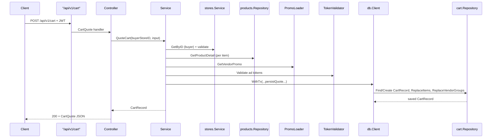

# CART — Current Implementation State

## 0) Summary
- Buyers can quote a cart (POST `/api/v1/cart`) and fetch the current active quote (GET `/api/v1/cart`); the service validates the buyer store, loads product/inventory details, aggregates vendor groups, and persists a `cart_records` snapshot with `cart_items`/`cart_vendor_groups` inside a single transaction before returning `CartQuote` JSON (see `internal/cart/service.go:79`, `internal/cart/quote_preprocess.go:45`, `internal/cart/service.go:216`).
- The API surface is protected by `middleware.Auth` + `StoreContext`, and `CartQuote` echoes the quoted snapshot through `cartcontrollers.CartQuote` while `CartFetch` simply proxies `GetActiveCart` (see `api/routes/router.go:127`, `api/controllers/cart/handlers.go:17`, `api/controllers/cart/handlers.go:55`).
- Stubbed pieces: the default `cart.NoopPromoLoader` always returns `nil`, so every promo request builds an “invalid_promo” warning but never reduces `discounts_cents` or vendor totals (see `internal/cart/vendor_promo.go:30`, `internal/cart/quote_preprocess.go:69`, `internal/cart/service.go:112`), and `productMaxQty` is TODO so the stored `max_qty` column is never set (see `internal/cart/quote_preprocess.go:202`).

## 1) Inventory (Files + Modules)
- `pkg/migrate/migrations/20260124000003_create_cart_records.sql` — bootstrap `cart_records` and `cart_items` tables plus the `cart_status` enum (see `pkg/migrate/migrations/20260124000003_create_cart_records.sql:4`, `pkg/migrate/migrations/20260124000003_create_cart_records.sql:28`).
- `pkg/migrate/migrations/20260306000000_cart_modifications.sql` — rewrites `cart_records`, migrates `cart_items`, adds enums for warnings/statuses, and creates `cart_vendor_groups` (see `pkg/migrate/migrations/20260306000000_cart_modifications.sql:8`, `pkg/migrate/migrations/20260306000000_cart_modifications.sql:73`, `pkg/migrate/migrations/20260306000000_cart_modifications.sql:139`).
- `pkg/migrate/migrations/20260501000000_cart_record_checkout_fields.sql` — adds `payment_method`, `shipping_line`, and `converted_at` columns that checkout writes when it finalizes a cart (see `pkg/migrate/migrations/20260501000000_cart_record_checkout_fields.sql:1`).
- `pkg/db/models/cart_record.go` — GORM struct for the buyer-scoped snapshot, wiring enums, `types.Address`, `types.ShippingLine`, and arrays (see `pkg/db/models/cart_record.go:13`).
- `pkg/db/models/cart_item.go` — cart item snapshot containing `warnings`, `applied_volume_discount`, and `cart_item_status` (see `pkg/db/models/cart_item.go:12`).
- `pkg/db/models/cart_vendor_group.go` — vendor aggregate snapshot owned by a cart (see `pkg/db/models/cart_vendor_group.go:12`).
- `pkg/types/cart_quote_types.go` — JSON serialization helpers for warnings, volume discounts, and promos (see `pkg/types/cart_quote_types.go:11`).
- `internal/cart/service.go` — entry point for quoting + fetching carts, validator wiring, and transactional persistence (see `internal/cart/service.go:34`).
- `internal/cart/quote_preprocess.go` — pipeline that validates vendors/products, normalizes quantity, applies volume tiers, tracks warnings, and aggregates vendor groups (see `internal/cart/quote_preprocess.go:19`).
- `internal/cart/interfaces.go` — repository interface required by the service (see `internal/cart/interfaces.go:12`).
- `internal/cart/repo.go` + `cart_record_repo.go`, `cart_item_repo.go`, `cart_vendor_group_repo.go` — compose the persistence stack with `Replace` helpers (see `internal/cart/repo.go:12`, `internal/cart/cart_record_repo.go:48`, `internal/cart/cart_item_repo.go:30`, `internal/cart/cart_vendor_group_repo.go:29`).
- `internal/cart/quote_input.go` — domain DTO that the controller maps request data into (see `internal/cart/quote_input.go:5`).
- `internal/cart/vendor_promo.go` — promo loader interface and the default `NoopPromoLoader` (see `internal/cart/vendor_promo.go:30`).
- `internal/cart/token_validator.go` — JWT-based validator for attribution tokens stored on the cart (see `internal/cart/token_validator.go:21`).
- `api/controllers/cart/handlers.go` — request/response handlers that extract the buyer store context, decode JSON, and surface service errors (see `api/controllers/cart/handlers.go:17`).
- `api/controllers/cart/request.go` + `response.go` — mappers between controller DTOs and `internal/cart` types (see `api/controllers/cart/request.go:8`, `api/controllers/cart/response.go:8`).
- `api/controllers/cart/dto/quote_request.go` — JSON schema for quote submissions with validator tags (see `api/controllers/cart/dto/quote_request.go:5`).
- `api/controllers/cart/dto/cart_quote.go` — response schema that mirrors `CartRecord`, vendor groups, and items (see `api/controllers/cart/dto/cart_quote.go:12`).
- `api/routes/router.go` — registers `/api/v1/cart` routes under `middleware.Auth`, `Idempotency`, `RateLimit`, and `StoreContext` (see `api/routes/router.go:127`, `api/routes/router.go:181`).
- `cmd/api/main.go` — wires `cart.Repository`, `cart.NewJWTAttributionTokenValidator`, `cart.NoopPromoLoader`, and the service into the router (see `cmd/api/main.go:173`).
- `api/middleware/auth.go` — JWT validation that populates the store/user claims used by `StoreContext` (see `api/middleware/auth.go:16`).
- `api/middleware/store.go` — guards routes that require `StoreID` in context (see `api/middleware/store.go:11`).
- `api/middleware/idempotency.go` — `Idempotency-Key` tracking that is applied globally but only enabled for specific routes (see `api/middleware/idempotency.go:37`).
- `pkg/db/client.go` — `db.Client.WithTx` implements the `txRunner` used by `cart.Service` (see `pkg/db/client.go:116`).
- `internal/checkout/service.go` — consumes `cart.Repository` to validate the quote, reserve inventory, and mark the cart `converted` (see `internal/checkout/service.go:124`).
- `pkg/enums/` (`cart_status.go`, `cart_item_status.go`, `cart_item_warning_type.go`, `vendor_group_status.go`, `vendor_group_warning_type.go`, `payment_method.go`, `currency.go`) — declare every enum that the cart tables and DTOs store (see `pkg/enums/cart_status.go:5`, `pkg/enums/cart_item_status.go:5`, `pkg/enums/cart_item_warning_type.go:5`, `pkg/enums/vendor_group_status.go:5`, `pkg/enums/vendor_group_warning_type.go:5`, `pkg/enums/payment_method.go:5`, `pkg/enums/currency.go:5`).

## 2) Data Model (DB Source of Truth)
### 2.1 Tables
#### `cart_records`
- Columns:
  - `id` uuid primary key, `buyer_store_id` referencing `stores(id)` and scoped to the buyer (initial migration `cart_records` definition; see `pkg/migrate/migrations/20260124000003_create_cart_records.sql:28`).
  - `status` uses the `cart_status` enum (`active|converted`) introduced in the same migration (`pkg/migrate/migrations/20260124000003_create_cart_records.sql:28`).
  - `shipping_address` uses the `address_t` composite and is filled from the buyer store (see `pkg/migrate/migrations/20260124000003_create_cart_records.sql:33` and `internal/cart/service.go:118`).
  - Added in `202603...`: `checkout_group_id`, `currency` (default `USD`), `valid_until` (15-minute expiry), `discounts_cents`, and `ad_tokens` (text array) plus a new FK index on `checkout_group_id` (`pkg/migrate/migrations/20260306000000_cart_modifications.sql:73`).
  - Added in `202605...`: checkout metadata `payment_method`, `shipping_line`, and `converted_at` that `checkout` sets before handing off to orders (`pkg/migrate/migrations/20260501000000_cart_record_checkout_fields.sql:1`).
- Indexes:
  - `idx_cart_records_buyer_status` on `(buyer_store_id, status)` for `FindActiveByBuyerStore` (see `pkg/migrate/migrations/20260124000003_create_cart_records.sql:44`).
  - `idx_cart_records_checkout_group` speeds lookup by `checkout_group_id` (see `pkg/migrate/migrations/20260306000000_cart_modifications.sql:90`).
- Constraints/FKs:
  - `buyer_store_id` references `stores(id)` cascading deletes (see `pkg/migrate/migrations/20260124000003_create_cart_records.sql:41`).

#### `cart_items`
- Columns:
  - `cart_id`, `product_id`, `vendor_store_id` plus `quantity` (renamed from `qty`) to capture item counts (see `pkg/migrate/migrations/20260306000000_cart_modifications.sql:97`).
  - `unit_price_cents` and `line_subtotal_cents` (renamed from `sub_total_price`); `MOQ`, optional `max_qty`, `applied_volume_discount` (jsonb), `status` (enum `ok|not_available|invalid`), and `warnings` (jsonb) were added for authoritative quote persistence (`pkg/migrate/migrations/20260306000000_cart_modifications.sql:101`).
  - Legacy UI columns (`product_sku`, `unit`, `compare_at_unit_price_cents`, etc.) were dropped to keep the table lean (see `pkg/migrate/migrations/20260306000000_cart_modifications.sql:108`).
- Indexes:
  - `idx_cart_items_cart_id`, `idx_cart_items_vendor_store`, `idx_cart_items_product_id` support lookups by cart, vendor, and product (see `pkg/migrate/migrations/20260124000003_create_cart_records.sql:72` and `pkg/migrate/migrations/20260306000000_cart_modifications.sql:132`).
- Constraints:
  - `cart_id` references `cart_records(id)` cascade delete, `product_id` references `products(id)` restrict, and `vendor_store_id` references `stores(id)` restrict (see `pkg/migrate/migrations/20260124000003_create_cart_records.sql:67`).

#### `cart_vendor_groups`
- Columns track vendor aggregates: `subtotal_cents`, optional `warnings`, optional `promo` JSON, `total_cents`, `status` (`ok|invalid`), timestamps, and FK links back to `cart_records`/`stores` (see `pkg/migrate/migrations/20260306000000_cart_modifications.sql:139`).
- Indexes:
  - `idx_cart_vendor_groups_cart_id` and `idx_cart_vendor_groups_vendor_store_id` (see `pkg/migrate/migrations/20260306000000_cart_modifications.sql:153`).
- Constraints:
  - Unique constraint on `(cart_id, vendor_store_id)` prevents duplicate vendor rows (see `pkg/migrate/migrations/20260306000000_cart_modifications.sql:150`).

### 2.2 Persistence Code
- Models:
  - `CartRecord` uses the columns above plus GORM relations to `CartItem` and `CartVendorGroup` (`pkg/db/models/cart_record.go:13`).
  - `CartItem` captures normalized quantity, warnings, applied volume discounts, and item status (`pkg/db/models/cart_item.go:12`).
  - `CartVendorGroup` keeps vendor status, warnings, promo data, and totals (`pkg/db/models/cart_vendor_group.go:12`).
  - JSON helpers (`types.CartItemWarnings`, `types.AppliedVolumeDiscount`, `types.VendorGroupWarnings`, `types.VendorGroupPromo`) live in `pkg/types/cart_quote_types.go` (`pkg/types/cart_quote_types.go:11`).
- Repositories/queries:
  - `internal/cart/repo.go` glues together the `CartRecord`, `CartItem`, and `CartVendorGroup` repositories and exposes `Create`, `Update`, `FindActiveByBuyerStore`, `ReplaceItems`, and `ReplaceVendorGroups` (`internal/cart/repo.go:12`).
  - `CartRecordRepository` preloads `Items`/`VendorGroups`, enforces buyer scoping, and offers `SaveAuthoritativeSnapshot` in case other callers want to upsert the active quote (`internal/cart/cart_record_repo.go:48`, `internal/cart/cart_record_repo.go:104`).
  - `CartItemRepository.ReplaceForCart` deletes all rows for a cart and reinserts the new snapshot (`internal/cart/cart_item_repo.go:30`).
  - `CartVendorGroupRepository.ReplaceForCart` mirrors the same delete+insert behavior for vendor aggregates (`internal/cart/cart_vendor_group_repo.go:29`).
  - Helper methods `ListItems` and `DeleteByBuyerStore` exist for other services to inspect or clean up carts (`internal/cart/repo.go:78`).
- Transactions:
  - `txRunner` is satisfied by `db.Client.WithTx`, so `QuoteCart` runs the entire persistence flow inside a single transaction that rolls back on errors (`internal/cart/service.go:22`, `pkg/db/client.go:116`).

## 3) API (HTTP)
### 3.1 Endpoints
#### `GET /api/v1/cart`
- Auth: `middleware.Auth` + `StoreContext` ensure the request carries a JWT with an `activeStoreId`; `StoreContext` rejects requests without a store (see `api/routes/router.go:127`, `api/middleware/auth.go:16`, `api/middleware/store.go:11`).
- Request DTO: none.
- Response DTO: `CartQuote` (see `api/controllers/cart/dto/cart_quote.go:12`), filled by `newCartQuote` after `GetActiveCart` loads `cart_records` with `Items`/`VendorGroups` (see `api/controllers/cart/response.go:8`, `internal/cart/service.go:351`).
- Status codes: `200` when an active cart exists; `404` when `GetActiveCart` returns `pkgerrors.CodeNotFound` because no active quote exists (`internal/cart/service.go:361`).
- Pagination/filtering: not supported.
- Idempotency: this GET route never hits the `Idempotency-Key` branch because only specific POST/PUT rules are registered in `api/middleware/idempotency.go:37`.

#### `POST /api/v1/cart`
- Auth: same stack as above (`api/routes/router.go:127`, `api/middleware/auth.go:16`).
- Request DTO: `QuoteCartRequest` with `buyer_store_id` (required), `items` (required min 1), optional `vendor_promos`, and optional `ad_tokens` (see `api/controllers/cart/dto/quote_request.go:5`).
```json
{
  "buyer_store_id": "<buyer-store-uuid>",
  "items": [
    {"product_id": "<product>", "vendor_store_id": "<vendor>", "quantity": 2}
  ],
  "vendor_promos": [{"vendor_store_id": "<vendor>", "code": "PROMO"}],
  "ad_tokens": ["<token>"]
}
```
- Validation: JSON decoding uses `validators.DecodeJSONBody`, which disallows unknown fields and runs `go-playground/validator` on the request tags (see `api/validators/body.go:29`).
- Response DTO: the same `CartQuote` schema as GET (`api/controllers/cart/dto/cart_quote.go:12`).
- Status codes: `200` on success; `400`/`422` for JSON/validation failures; `403` if the buyer store context is missing; `409`/`404` if products or vendors cannot be loaded (`api/controllers/cart/handlers.go:17`, `internal/cart/service.go:88`).
- Idempotency: the middleware is mounted, but the configured rules only match `PUT /api/v1/cart`, so this POST does not enforce an `Idempotency-Key` header even though callers may expect dedup behavior (`api/routes/router.go:181`, `api/middleware/idempotency.go:37`).

## 4) DTOs & Validation
- `QuoteCartRequest`/`QuoteCartItem`/`QuoteVendorPromo` describe the incoming payload and declare required fields (`buyer_store_id`, `product_id`, `vendor_store_id`, `quantity > 0`, `code`). The validator tags are enforced via `validators.DecodeJSONBody`, which also fails on unknown fields (`api/controllers/cart/dto/quote_request.go:5`, `api/validators/body.go:29`).
- `toQuoteCartInput` copies the DTO into `QuoteCartInput`, keeping the list of `items`, `vendor_promos`, and `ad_tokens` for the domain service (`api/controllers/cart/request.go:8`).
- `CartQuote` (response) includes the cart metadata, vendor groups, and each `CartQuoteItem` with warnings + applied volume discounts, so clients can show the authoritative quote (`api/controllers/cart/dto/cart_quote.go:12`).

## 5) Flows
- **QuoteCart flow:** the POST handler extracts the buyer store ID from `StoreContext`, decodes/validates `QuoteCartRequest`, and calls `cart.Service.QuoteCart` (see `api/controllers/cart/handlers.go:17`, `internal/cart/service.go:79`). The service validates that the buyer store is a verified buyer and normalizes its state (`internal/cart/service.go:138`), loads existing prices, runs `preprocessQuoteInput` (validates vendors via `checkouthelpers.ValidateVendorStore`, loads product details, normalizes quantities, applies volume tiers, generates warnings, and keeps promo metadata), then aggregates vendor groups, recomputes totals, filters/validates attribution tokens, and passes a `cartRecordPayload` to `persistQuote` (see `internal/cart/quote_preprocess.go:45`, `internal/cart/service.go:79`, `internal/cart/service.go:216`). Inside `persistQuote`, a `txRunner` (the shared `db.Client`) starts a transaction, the repository finds or creates the active cart, stamps totals/ad tokens/valid-until, and calls `ReplaceItems` + `ReplaceVendorGroups` to delete existing rows and insert the new snapshot before reloading the saved record for the response (see `internal/cart/service.go:216`, `internal/cart/cart_item_repo.go:30`, `internal/cart/cart_vendor_group_repo.go:29`).
- **GetActiveCart flow:** the GET handler pulls the buyer store ID from context and calls `GetActiveCart`, which reuses the same store validation before delegating to `repo.FindActiveByBuyerStore` that preloads items/vendor groups (`internal/cart/service.go:351`, `internal/cart/cart_record_repo.go:48`).
- **Checkout interplay:** `internal/checkout/service.go` calls `cart.Repository` to fetch the cart, runs `validateCartForCheckout` (ensuring status `active`, the quote is still fresh, and at least one item is `ok`), and on success `finalizeCart` sets `shipping_address`, `shipping_line`, `payment_method`, `converted_at`, and `status=converted` before persisting (`internal/checkout/service.go:492`, `internal/checkout/service.go:515`).



```mermaid
flowchart TB
  Active[CartRecord status=active]
  Converted[CartRecord status=converted]
  Active -->|Checkout finalizes cart| Converted
  Active -->|QuoteCart refreshes ValidUntil (15m) and overwrites snapshot| Active
  subgraph ItemStatus
    CI_OK[CartItemStatus=ok]
    CI_NA[CartItemStatus=not_available]
    CI_INV[CartItemStatus=invalid]
  end
  CI_OK -->|any OK items| VendorOK[VendorGroupStatus=ok]
  CI_NA --> VendorInvalid[VendorGroupStatus=invalid]
  CI_INV --> VendorInvalid
  VendorInvalid -.->|no orderable items → checkout rejects| Active
```

## 6) Enums & State
- `CartStatus` (`active`, `converted`) governs whether a cart can still be quoted or must be rehydrated by checkout (`pkg/enums/cart_status.go:5`).
- `CartItemStatus` (`ok`, `not_available`, `invalid`) records inventory/vendor validation, so `validateCartForCheckout` can ignore non-OK lines (`pkg/enums/cart_item_status.go:5`).
- `CartItemWarningType` enumerates warning reasons like MOQ clamping, price changes, invalid/price mismatch, and invalid promos (`pkg/enums/cart_item_warning_type.go:5`).
- `VendorGroupStatus` (`ok`, `invalid`) is derived in `aggregateVendorGroups` and used by analytics/checkout to know whether a vendor can contribute to an order (`pkg/enums/vendor_group_status.go:5`, `internal/cart/quote_preprocess.go:238`).
- `VendorGroupWarningType` stores reasons such as invalid vendor, license issues, or promo failures (`pkg/enums/vendor_group_warning_type.go:5`).
- `Currency` (`USD`, `BTC`, `ETH`) defaults to `USD` inside `QuoteCart` and is stored on `cart_records` (`pkg/enums/currency.go:5`, `internal/cart/service.go:122`).
- `PaymentMethod` (`cash`, `ach`) is set on the cart when checkout finalizes and survives in `cart_records` (`pkg/enums/payment_method.go:5`, `internal/checkout/service.go:515`).

## 7) Dependencies
- PostgreSQL (via GORM) stores `cart_records`, `cart_items`, and `cart_vendor_groups`; the migrations described above (`pkg/migrate/migrations/...`) create the enums, indexes, and constraints that the service relies on.
- `db.Client` (`pkg/db/client.go:116`) provides the `WithTx` implementation that makes the whole quote and persist flow atomic.
- Redis (`cmd/api/main.go:67`, `api/routes/router.go:127`) powers `middleware.Idempotency` and session rate limiting, letting the cart routes share the same `redisClient` used elsewhere for `AuthRateLimit`.
- JWT configuration (`cmd/api/main.go:67-183`, `api/middleware/auth.go:16`): the same `cfg.JWT` is passed to `middleware.Auth` and to `cart.NewJWTAttributionTokenValidator` so attribution tokens and auth tokens share secrets/issuer (`internal/cart/token_validator.go:21`).
- `stores.Service` supplies buyer and vendor store metadata used by `validateBuyerStore`/`ensureVendor`; missing or unverified stores raise errors before any DB work occurs (`internal/cart/service.go:138`, `internal/stores/service.go:152`).
- `products.Repository` is passed into `CartService` so `GetProductDetail` can preload inventory, discounts, and vendor summary before any pricing logic runs (`internal/cart/quote_preprocess.go:100`, `internal/products/repository.go:134`).
- Promo loader abstraction (`internal/cart/vendor_promo.go:30`) currently resolves to the `NoopPromoLoader` wired in `cmd/api/main.go:181`, so promo lookups always return nil (a stubbed dependency).
- `internal/checkout/service.go` reads from the same `cart.Repository`, validates the stored quote (`validateCartForCheckout`), and marks the cart `converted` with shipping/payment metadata before emitting orders (`internal/checkout/service.go:124`, `internal/checkout/service.go:492`).
- `visibility.EnsureVendorVisible` (via `internal/checkout/helpers/validation.go:32`) is indirectly used when verifying vendors so that suspended or out-of-state vendors are rejected from the cart.

## 8) Edge Cases & Gaps
- The service rejects empty carts, zero/negative quantities, or buyers missing a verified address state before touching the DB (`internal/cart/service.go:79`, `internal/cart/service.go:138`).
- `preprocessQuoteInput` will reject missing vendors/products, clamp quantities to MOQ/max, flag inventory/price changes, and append warnings for each vendor+item before any mutation occurs (`internal/cart/quote_preprocess.go:45`, `internal/cart/quote_preprocess.go:135`).
- `persistQuote` clamps negative totals, defaults invalid currencies to `USD`, and wraps `FindActive`, `Update/Create`, `ReplaceItems`, `ReplaceVendorGroups`, and `FindByIDAndBuyerStore` inside a single `db.Client.WithTx` so the snapshot is consistent or fully rolled back (`internal/cart/service.go:112`, `internal/cart/service.go:216`, `pkg/db/client.go:116`).
- Checkout rejects carts whose `valid_until` has expired, whose status is no longer `active`, or that no longer contain any `CartItemStatus=ok` rows, preventing stale quotes from converting (`internal/checkout/service.go:492`).
- Vocabulary futures: `NoopPromoLoader` currently returns `nil`, so every promo request is treated as invalid and recorded under `VendorGroupWarningTypeInvalidPromo` while no discount is applied (`internal/cart/vendor_promo.go:30`, `internal/cart/quote_preprocess.go:69`).
- The `max_qty` column stays `NULL` because `productMaxQty` returns `nil` (TODO), so the cart never enforces upper quantity limits (`internal/cart/quote_preprocess.go:202`).
- Totals do not incorporate promo amounts: `discounts_cents` stays zero and each `CartVendorGroup.TotalCents` equals its `subtotal_cents`, even if `VendorGroupPromo` exists, so clients cannot rely on persisted discounts (`internal/cart/service.go:108`, `internal/cart/quote_preprocess.go:238`).
- The POST route lives under the global idempotency middleware, but only `PUT /api/v1/cart` is registered, so `POST /api/v1/cart` does not require an `Idempotency-Key` and will not replay stored responses even though other write routes do (`api/routes/router.go:181`, `api/middleware/idempotency.go:37`).
- `filterAdTokens` silently drops empty or invalid JWT tokens, so only validated attribution tokens survive on the cart (`internal/cart/service.go:122`, `internal/cart/service.go:388`, `internal/cart/token_validator.go:21`).
- When cart items change price between quotes, a warning is persisted so UI layers can surface the delta (`internal/cart/service.go:93`, `internal/cart/quote_preprocess.go:139`).
